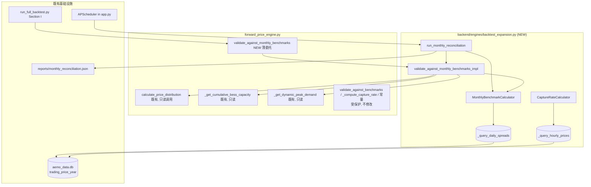
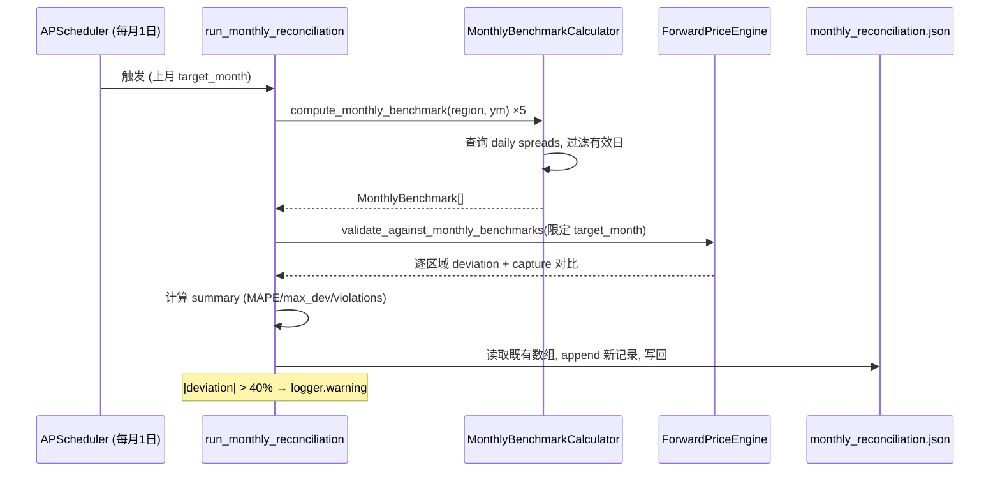

# Design Document: Backtest Expansion MVP

## Overview

本设计文档描述将 Forward Price Engine 回测框架从 16 个 Modo Energy 基准时段扩展到 96+ 个月度数据点的方案。扩展数据源为本地 `data/aemo_data.db`（247 万行 AEMO 5 分钟级交易价格数据），覆盖三个核心能力：

- **(A) 月度 mean_spread 基准重构**：从 AEMO 实测数据按"月 × 区域"聚合，计算月度日内价差基准（Req 1、2）。
- **(D) 独立完美预见 capture rate 直算**：基于 4 小时电池完美预见策略，从实测数据直接算出理论最优套利效率，作为模型 capture rate 的独立 ground truth（Req 3、4）。
- **(H) 月度自动 reconciliation 调度**：复用 `backend/app.py` 既有 APScheduler，每月 1 日自动对账上月实测与模型预测（Req 5、6）。

**设计原则：**

- **零侵入既有引擎**：所有新增逻辑落位独立模块 `backend/engines/backtest_expansion.py`，**不修改** `validate_against_benchmarks`、`_compute_capture_rate`、`SEASONAL_CAPTURE_MULTIPLIER`、`REGIONAL_VOLATILITY_FACTOR`（Req 8.1）。引擎仅新增一个**薄委托方法** `validate_against_monthly_benchmarks`，把重活转交新模块。新增方法不触碰任何受保护成员。
- **补充而非替换**：月度验证作为叠加层与 Modo 16 时段验证并存，互不影响（Req 2.6、8.3）。
- **优雅降级**：数据库不可达、表缺失、月数据不足、查询超时等异常均不抛出，记录日志后跳过（Req 9）。
- **可测性优先**：纯计算逻辑（价差聚合、完美预见、偏差指标、封顶、追加写）通过 Hypothesis 属性测试保证正确性；I/O 与调度接线用示例 / 集成测试覆盖。

**影响范围：**

- `backend/engines/backtest_expansion.py` — **新增**模块（Monthly_Benchmark_Calculator、Capture_Rate_Calculator、Reconciliation 入口）。
- `backend/engines/forward_price_engine.py` — **仅新增** `validate_against_monthly_benchmarks` 委托方法，不改既有代码。
- `backend/app.py` — APScheduler 新增一个 cron job（每月 1 日），复用既有 `_cron_hour` / `_env_flag` 辅助函数。
- `scripts/run_full_backtest.py` — 新增 "I. 月度 AEMO 基准验证" section。
- `reports/monthly_reconciliation.json` — **新增**对账历史归档文件（运行期生成）。

**关键数据源勘误（重要设计决策）：**

需求文档中将区域列写为 `region`，但实测 `data/aemo_data.db` 的 `trading_price_{year}` 表实际列名为 **`region_id`**（已通过 schema 核验）。本设计统一以 `region_id` 为准。表结构核验结果：

| 列名 | 类型 | 说明 |
|------|------|------|
| `settlement_date` | TEXT | 形如 `2024-01-01 00:05:00`（AEST，5 分钟粒度） |
| `region_id` | TEXT | `NSW1` / `QLD1` / `SA1` / `TAS1` / `VIC1`（2026 表额外含 `WEM`，需排除） |
| `rrp_aud_mwh` | REAL | 区域参考价（可为负，保留为有效值） |

数据范围核验：`trading_price_2024`（527,040 行）与 `trading_price_2025`（525,600 行）为完整年度 5 分钟数据；`trading_price_2026` 截至 `2026-05-25 07:30:00`。故"最新完整月"为 **2026-04**，2024-01 至 2026-04 共 **28 个月 × 5 区域 = 140** 个潜在数据点，满足 96+ 目标。

## Architecture

### 模块关系



### 月度对账数据流



### 接口边界设计（Req 8.5）

`backtest_expansion.py` 与 `ForwardPriceEngine` 之间是**单向依赖**：新模块只**读取调用**引擎的公开 / 既有方法（`calculate_price_distribution`、`_get_cumulative_bess_capacity`、`_get_dynamic_peak_demand`），引擎侧仅暴露一个委托入口。引擎对新模块**零硬依赖**——`validate_against_monthly_benchmarks` 内部用延迟 import（函数体内 `from engines.backtest_expansion import ...`），保证即使新模块缺失，引擎其余功能（生产路径）也不受影响。

## Components and Interfaces

### 1. MonthlyBenchmarkCalculator（Req 1、9）

负责从 AEMO 实测数据聚合月度 mean_spread 基准。

```python
class MonthlyBenchmarkCalculator:
    NEM_REGIONS = ("NSW1", "QLD1", "SA1", "TAS1", "VIC1")  # 排除 WEM (Req 1.2)
    MIN_INTERVALS_PER_DAY = 200   # 单日有效阈值 (Req 1.5)
    MIN_VALID_DAYS = 20           # 月有效阈值 (Req 1.5)
    QUERY_TIMEOUT_SECONDS = 30    # 单 region-month 超时 (Req 9.5)
    START_MONTH = "2024-01"       # 起始月 (Req 1.4)

    def __init__(self, db_path: str | None = None) -> None: ...

    def compute_monthly_benchmark(
        self, region: str, year_month: str
    ) -> MonthlyBenchmark | None:
        """计算单个 region-month 的 mean_spread 基准。

        - 解析 year_month -> year, 选择 trading_price_{year} 表。
        - 按 DATE(settlement_date) 分组取每日 max(rrp)-min(rrp) 与 interval 计数。
        - 仅保留 interval >= 200 的有效日; 月有效日 < 20 -> data_quality_flag
          ="insufficient_data" 且不参与对比 (Req 1.5)。
        - 无数据 / 表缺失 / 超时 -> 返回 None 并记录日志 (Req 9.2/9.3/9.5)。
        """

    def compute_all_benchmarks(
        self, end_month: str | None = None
    ) -> list[MonthlyBenchmark]:
        """遍历 2024-01 至 end_month(默认最新完整月)×5 区域。"""

    def latest_complete_month(self) -> str | None:
        """探测 AEMO_Database 中最新的完整日历月(数据覆盖到月末)。"""
```

**核心 SQL（参照既有 `bess_backtest.analyze_daily_spreads`，统一用 `region_id`）：**

```sql
SELECT DATE(settlement_date) AS day,
       MAX(rrp_aud_mwh) - MIN(rrp_aud_mwh) AS spread,
       COUNT(*) AS intervals
FROM trading_price_{year}
WHERE region_id = ? AND substr(settlement_date, 1, 7) = ?  -- 'YYYY-MM'
GROUP BY DATE(settlement_date)
```

`mean_spread_aud_mwh = mean(spread for day in valid_days)`，其中 `valid_days = [d for d in days if d.intervals >= 200]`。负电价不做任何过滤或截断，直接进入 `MIN`/`MAX`（Req 9.4）。

**30 秒超时实现：** 用 `sqlite3.Connection.set_progress_handler` 注册一个回调，回调内对比 `time.monotonic()` 起始时刻，超过 30s 返回非零值触发 `OperationalError`，捕获后记录 warning 并返回 None，继续下一 region-month（Req 9.5）。该方案不依赖线程，纯标准库实现。

### 2. CaptureRateCalculator（Req 3、4）

基于完美预见策略直算理论最优 capture rate。

```python
class CaptureRateCalculator:
    RTE = 0.87                    # round-trip efficiency (与 bess_backtest 一致)
    BATTERY_HOURS = 4             # 4 小时电池 (Req 3.1)
    VIOLATION_MARGIN = 0.05       # 越界容差 (Req 3.6/4.1)
    LOW_EFFICIENCY_THRESHOLD = 0.40  # 低效率告警阈值 (Req 4.4)

    def compute_perfect_foresight(
        self, region: str, year_month: str
    ) -> CaptureRateResult | None:
        """对每一天: 把 5 分钟价格聚合到 24 个小时均价, 选 4 个最高价小时
        放电、4 个最低价小时充电:

            daily_revenue = Σ(discharge_price × 1MW × 1h)
                          - Σ(charge_price × 1MW × 1h / RTE)        (Req 3.2)

        月度:
            monthly_actual_revenue = Σ daily_revenue
            monthly_capture_rate   = monthly_actual_revenue
                / (monthly_mean_spread × days_in_month × 4h × RTE)  (Req 3.3)

        capture_rate > 1.0 -> 封顶 1.0 且 capped=True (Req 3.5)。
        """

    def compare_with_model(
        self, model_capture_rate: float, perfect_foresight_rate: float
    ) -> CaptureRateComparison:
        """Req 3.6 / 4.1 / 4.3 / 4.4:
        - violation = model > perfect_foresight + 0.05
        - 非越界时 efficiency_ratio = model / perfect_foresight
        - efficiency_ratio < 0.40 -> logger.warning
        """

    def validate_all(
        self, engine, end_month: str | None = None
    ) -> CaptureRateValidationReport:
        """逐 region-month 对比模型 capture rate 与完美预见值,
        汇总 violation_count 与越界明细 (Req 4.2)。

        模型 capture rate 取数: 调用引擎既有 _compute_capture_rate(只读不改,
        Req 8.1) 获取 model_capture_rate, 再交 compare_with_model 判定。
        """
```

**小时聚合说明：** 5 分钟价格先按小时取算术平均得到 24 个小时价（`HH = substr(settlement_date, 12, 2)` 分组），再选 top-4 / bottom-4。这样"4 小时放电 / 4 小时充电"对应电池连续 4h 充放，与 4 小时电池物理时长一致。

### 3. ForwardPriceEngine 扩展（Req 2）

仅新增一个委托方法，**不改动**既有代码：

```python
# forward_price_engine.py 内新增(追加在类尾部, 不触碰既有方法)
def validate_against_monthly_benchmarks(
    self, end_month: str | None = None, target_month: str | None = None
) -> Dict:
    """对比模型 mean_spread 预测与 AEMO 月度基准 (Req 2.1-2.5)。

    薄委托: 延迟 import 后转交 backtest_expansion 实现, 引擎本体零硬依赖。
    target_month 给定时只验证该月(供月度 reconciliation 复用)。
    """
    from engines.backtest_expansion import validate_against_monthly_benchmarks_impl
    return validate_against_monthly_benchmarks_impl(
        engine=self, end_month=end_month, target_month=target_month
    )
```

**实现侧 `validate_against_monthly_benchmarks_impl`（在新模块内）逻辑：**

1. 用 `MonthlyBenchmarkCalculator.compute_all_benchmarks()` 取所有基准，过滤掉 `insufficient_data` 月（Req 1.5、2.2）。
2. 对每个有效 region-month，调用引擎既有 `calculate_price_distribution(region, ScenarioType.CENTRAL, year, bess_ratio)` 取 `mean_spread`；`bess_ratio` 通过既有 `_get_cumulative_bess_capacity` / `_get_dynamic_peak_demand`（reference_date = 该月月末）计算，与 `validate_against_benchmarks` 同源（Req 2.2）。
3. `deviation_pct = (model_mean_spread - benchmark_mean_spread) / benchmark_mean_spread × 100`（Req 2.3）。
4. 聚合 MAPE、RMSE、Bias、Hit Rate（|deviation| ≤ 30% 占比）（Req 2.4）。
5. 返回与 `validate_against_benchmarks` 兼容的结构（Req 2.5）。

**模型粒度说明（设计取舍）：** `calculate_price_distribution` 是**年度**粒度，对同一年内各月返回同一 `mean_spread`（仅随容量参考日略变）。因此月度验证度量的是"年度模型预测 vs 各月实测"的偏差，能暴露模型缺失的季节性。此为已知限制，在 Section I 报告中注明。

### 4. Reconciliation 调度入口（Req 5、6）

```python
# backtest_expansion.py
def run_monthly_reconciliation(target_month: str | None = None) -> dict:
    """月度对账主入口。target_month 缺省 = 上一个完整日历月。

    流程: 算上月 5 区域基准 -> 调 validate_against_monthly_benchmarks(target_month)
    -> 逐区域附 capture rate 对比 -> 计算 summary -> append 写 JSON 归档。
    |deviation| > 40% -> logger.warning(region, month, model, actual, dev%)。
    返回写入的 reconciliation 记录(供测试断言)。
    """
```

**APScheduler 接线（`backend/app.py` lifespan 内，复用既有模式）：**

```python
def _reconciliation_enabled() -> bool:
    return _env_flag("AUS_ELE_RECONCILIATION_ENABLED", True)

# 在 if _scheduler_enabled(): 块内追加
if _reconciliation_enabled():
    rh = _cron_hour("AUS_ELE_RECONCILIATION_HOUR", 3)   # 默认 03:00 (Req 5.1/5.6)
    from engines.backtest_expansion import run_monthly_reconciliation
    scheduler.add_job(
        run_monthly_reconciliation, "cron", day=1, hour=rh,
        id="monthly-reconciliation", max_instances=1,
        coalesce=True, misfire_grace_time=3600,
    )
```

调度器时区沿用既有 `_scheduler_timezone()`（默认 UTC，对应 Req 5.1 的 "03:00 UTC"）。

### 5. 回测脚本扩展（Req 7）

在 `scripts/run_full_backtest.py` 的 H section 之后、总结之前插入：

```python
# === I. 月度 AEMO 基准验证 ===
section("I. 月度 AEMO 基准验证 (AEMO 实测数据)")
monthly = engine.validate_against_monthly_benchmarks()
m_results = monthly["results"]
# 逐 region-month 打印 + 计算 MAPE/RMSE/Bias/Hit Rate(复用 A section 度量风格)
# 报告验证点总数(目标 96+); 用与 A 相同阈值(MAPE<=30, Hit Rate>=75)累加 pass/fail
```

该 section 独立累加 `pass_count`/`fail_count`，对 A–H 既有统计零影响（Req 7.4、8.3）。

## Data Models

新增数据模型用 `@dataclass`，置于 `backtest_expansion.py`（或 `models/` 下，遵循既有约定）。

```python
@dataclass(frozen=True)
class MonthlyBenchmark:
    """月度 mean_spread 基准数据点 (Req 1.6)。"""
    region: str                  # NSW1 / QLD1 / SA1 / TAS1 / VIC1
    year_month: str              # 'YYYY-MM'
    mean_spread_aud_mwh: float   # 有效日 (max-min) 均值, 可因负价更大
    sample_days: int             # 有效日计数 (interval>=200 的天数)
    data_quality_flag: str       # 'ok' | 'insufficient_data'

@dataclass(frozen=True)
class CaptureRateResult:
    """完美预见 capture rate 直算结果 (Req 3)。"""
    region: str
    year_month: str
    monthly_actual_revenue: float
    perfect_foresight_capture_rate: float  # 已封顶 [0, 1.0]
    capped: bool                           # 原始值 > 1.0 时为 True (Req 3.5)
    sample_days: int

@dataclass(frozen=True)
class CaptureRateComparison:
    """模型 vs 完美预见对比 (Req 4)。"""
    region: str
    year_month: str
    model_capture_rate: float
    perfect_foresight_capture_rate: float
    efficiency_ratio: float | None   # 非越界时 = model / pf (Req 4.3)
    violation: bool                  # model > pf + 0.05 (Req 4.1)
    low_efficiency_warning: bool     # efficiency_ratio < 0.40 (Req 4.4)

@dataclass(frozen=True)
class MonthlyValidationResult:
    """单 region-month 月度验证结果 (Req 2.5 兼容字段)。"""
    region: str
    year_month: str
    model_mean_spread: float
    benchmark_mean_spread: float
    deviation_pct: float
```

**Reconciliation JSON 归档结构（Req 6.1、6.3）：** `reports/monthly_reconciliation.json` 是一个 JSON 数组，每个元素：

```json
{
  "run_date": "2026-05-01T03:00:00+00:00",
  "target_month": "2026-04",
  "results": [
    {
      "region": "NSW1",
      "model_mean_spread": 118.4,
      "actual_mean_spread": 132.1,
      "deviation_pct": -10.4,
      "capture_rate_comparison": {
        "model": 0.41, "perfect_foresight": 0.78,
        "efficiency_ratio": 0.53, "violation": false
      },
      "alert_triggered": false
    }
  ],
  "summary": { "mape": 12.3, "max_deviation": 28.7, "violation_count": 0 }
}
```

文件不存在时初始化为空数组 `[]`，新记录始终 append（Req 6.2、6.4）。

## Correctness Properties

*属性（property）是指在系统所有有效执行中都应成立的特征或行为——它是关于"系统应当做什么"的形式化陈述。属性是连接人类可读规范与机器可验证正确性保证之间的桥梁。*

本特性的核心计算逻辑（价差聚合、完美预见套利、偏差指标、封顶、追加写归档、负价保留）都是纯函数或对大范围输入成立的不变量，非常适合属性测试。以下属性由验收标准经 prework 分析推导而来，去除了逻辑冗余后保留 12 条。基础设施接线（APScheduler、SQL 分组、脚本渲染）与源码不变性约束（非回归）改用集成测试 / 示例测试覆盖，见 Testing Strategy。

### Property 1: 月度 mean_spread 聚合正确性

*对任意* region-month 的一组逐日 5 分钟价格序列，`compute_monthly_benchmark` 返回的 `mean_spread_aud_mwh` 应等于所有有效日（interval ≥ 200）的每日价差 `max(rrp) - min(rrp)` 的算术平均值。

**Validates: Requirements 1.1, 1.3**

### Property 2: 负电价保留不被过滤或截断

*对任意* 含负电价（rrp < 0）的每日价格序列，该日价差应使用真实的 `min`（包含负值）与 `max` 计算，负价既不被剔除也不被截断为 0；当某日存在负价时其价差严格大于忽略负价时的价差。

**Validates: Requirements 9.4**

### Property 3: 月份枚举范围连续且区域齐全

*对任意* 合法的截止月 `end_month`（≥ 2024-01），`compute_all_benchmarks` 枚举的 `(region, year_month)` 集合应从 2024-01 起连续覆盖到 `end_month`、月份无遗漏无越界，且每个月都包含全部五个 NEM 区域（NSW1、QLD1、SA1、TAS1、VIC1）而不含 WEM。

**Validates: Requirements 1.2, 1.4**

### Property 4: 数据不足月标记与排除

*对任意* 有效日计数 `sample_days`，当 `sample_days < 20` 时该 region-month 的 `data_quality_flag` 应为 `"insufficient_data"` 且不进入验证对比集合；当 `sample_days ≥ 20` 时 flag 应为 `"ok"` 且进入对比。

**Validates: Requirements 1.5**

### Property 5: deviation_pct 计算公式正确性

*对任意* 模型预测值 `model` 与非零基准值 `benchmark`，`deviation_pct` 应等于 `(model - benchmark) / benchmark × 100`，且当 `model > benchmark` 时符号为正、`model < benchmark` 时符号为负。

**Validates: Requirements 2.3**

### Property 6: 聚合指标数学不变量

*对任意* deviation 列表，聚合指标应满足：`MAPE = mean(|d|) ≥ 0`、`RMSE = sqrt(mean(d²)) ≥ |Bias|`、`Bias = mean(d)`、`Hit Rate ∈ [0, 100]` 且等于 `|d| ≤ 30` 的元素占比百分比。

**Validates: Requirements 2.4**

### Property 7: 完美预见日收入最优性与公式正确性

*对任意* 一天的 24 个小时价格，`compute_perfect_foresight` 选出的 4 个放电小时应是价格最高的 4 个、4 个充电小时应是价格最低的 4 个（任一放电小时价 ≥ 任一未选小时价 ≥ 任一充电小时价），且当日收入应等于 `Σ(top4_price) - Σ(bottom4_price) / RTE`（RTE = 0.87）。

**Validates: Requirements 3.1, 3.2**

### Property 8: monthly_capture_rate 公式正确性

*对任意* 月度实际收入 `actual`、月度 `mean_spread > 0`、当月天数 `days`，封顶前的 `monthly_capture_rate` 应等于 `actual / (mean_spread × days × 4 × RTE)`。

**Validates: Requirements 3.3**

### Property 9: capture_rate 封顶有界与标记

*对任意* 封顶前的 capture rate 原始值，输出值应满足 `≤ 1.0`：当原始值 > 1.0 时输出为 1.0 且 `capped = True`，否则输出等于原始值且 `capped = False`。该封顶操作幂等。

**Validates: Requirements 3.5**

### Property 10: 越界判定与 efficiency_ratio

*对任意* 模型 capture rate `model` 与完美预见 capture rate `pf`，`violation` 为真当且仅当 `model > pf + 0.05`；当 `violation` 为假时 `efficiency_ratio` 应等于 `model / pf`，且当 `efficiency_ratio < 0.40` 时 `low_efficiency_warning` 为真。

**Validates: Requirements 3.6, 4.1, 4.3, 4.4**

### Property 11: violation_count 与明细一致性

*对任意* region-month 对比结果集合，报告的 `violation_count` 应等于越界明细列表的长度，且明细列表中每一项的 `violation` 均为真、非明细项均为假。

**Validates: Requirements 4.2**

### Property 12: reconciliation 归档 append 不变量

*对任意* `monthly_reconciliation.json` 中已有的历史记录数组（含空数组起点）与一条新对账记录，写入后的数组应等于"原数组 + [新记录]"：长度恰好加一、所有历史记录按原顺序原值保留、新记录追加在末尾。

**Validates: Requirements 5.4, 6.2, 6.4**

## Error Handling

所有数据访问路径遵循"记录日志 + 优雅降级、绝不向上抛出"原则（Req 9），保证部分数据缺失不会中断整条验证 / 调度流水线。

| 场景 | 检测方式 | 处理 | 日志级别 | 需求 |
|------|----------|------|----------|------|
| 数据库文件不可达 | 连接前 `Path.exists()` 检查 / `sqlite3.connect` 异常 | 返回空结果集 `[]`，不抛异常 | `warning` | 9.1 |
| `trading_price_{year}` 表不存在 | 查 `sqlite_master` 或捕获 `OperationalError: no such table` | 跳过该年，继续其余 | `info` | 9.2 |
| 区域-月零行 | 查询结果为空 | 排除该 region-month | `debug` | 9.3 |
| 负电价 | 不做任何过滤 | 直接进入 min/max（见 Property 2） | — | 9.4 |
| 单查询 > 30s | `set_progress_handler` 超时回调触发 `OperationalError` | 中止该 region-month，继续其余 | `warning` | 9.5 |
| 月有效日 < 20 | `sample_days < MIN_VALID_DAYS` | 标 `insufficient_data`，排除对比 | `info` | 1.5 |
| 引擎 `calculate_price_distribution` 抛错 | try/except 包裹单点 | 跳过该点，继续聚合 | `warning` | 2.x |
| capture rate 越界（model > pf+0.05） | 比较逻辑 | 记入 violation 明细 | `warning` | 4.1 |
| 月偏差 > 40% | reconciliation 比较 | `alert_triggered = True` | `warning` | 5.5 |
| 归档文件不存在 | 写前 `Path.exists()` | 初始化为 `[]` 再 append | — | 6.4 |
| 归档文件 JSON 损坏 | `json.load` 抛 `JSONDecodeError` | 记录 warning，以空数组重建（保护性，不丢失新记录） | `warning` | 6.2 |

**超时实现细节：** 采用 `sqlite3.Connection.set_progress_handler(callback, n)`，回调每执行 `n` 条 VM 指令调用一次；回调内比较 `time.monotonic() - start > 30`，超时返回非零值令 SQLite 抛 `OperationalError`。此方案纯标准库、无需额外线程，便于在测试中通过短超时阈值稳定触发（Req 9.5）。

## Testing Strategy

采用**双层测试**：属性测试覆盖纯计算不变量，示例 / 集成测试覆盖接线、配置、错误处理与非回归约束。

### 属性测试（Property-Based Tests）

- **库选型**：复用项目既有的 **Hypothesis**（与 `tests/test_forward_model_properties.py` 一致），不自行实现属性测试框架。
- **新增文件**：`tests/test_backtest_expansion_properties.py`，与既有 20 个 PBT 完全隔离，互不影响（Req 8.4）。
- **迭代次数**：每个属性测试 `@settings(max_examples=100)`，至少 100 次随机迭代。
- **标签约定**（与既有 PBT 一致）：每个测试 docstring / 注释标注
  `Feature: backtest-expansion-mvp, Property {N}: {property_text}`。
- **覆盖映射**：Property 1–12 各由**单个**属性测试实现。
  - 生成器要点：价格用 `st.floats(min_value=-1000, max_value=16000, allow_nan=False, allow_infinity=False)`，**显式包含负价区间**以覆盖 Property 2 与 Req 9.4 的边界；有效日计数用 `st.integers(0, 31)` 覆盖 Property 4 的 19/20 边界；deviation 列表、capture rate 用对应范围浮点生成。
  - 完美预见 / 聚合等纯函数从 DB I/O 解耦（接收价格列表参数），便于无数据库随机测试。

### 单元测试（示例 / 边界）

聚焦具体行为与边界，避免与属性测试重复铺量：

- **schema 与接口存在性**（Req 1.6、2.1、2.5、6.1、6.3、8.5）：断言 `MonthlyBenchmark` 等 dataclass 字段齐全、引擎含 `validate_against_monthly_benchmarks`、归档记录顶层与 per-region 字段完整、`backtest_expansion.py` 模块存在。
- **常量配置**（Req 1.2、5.6）：`NEM_REGIONS` 五区域不含 WEM；`_cron_hour` / `_reconciliation_enabled` 正确读取环境变量。
- **错误处理边界**（Req 9.1、9.2、9.3、9.5、6.4）：不存在的 db 路径返回 `[]`；缺表年份跳过；空 region-month 排除；注入慢查询触发超时中止且继续；缺失归档文件初始化空数组。
- **告警边界**（Req 4.4、5.5）：efficiency_ratio 跨 0.40、deviation 跨 40% 时标志与日志正确。

### 集成测试

- **真实 DB 验证**（Req 7.3）：对 `data/aemo_data.db` 跑 `compute_all_benchmarks`，断言有效验证点 ≥ 96；断言单日 interval 计数接近 288（Req 1.3）。
- **调度接线**（Req 5.1、5.2、5.3）：mock `MonthlyBenchmarkCalculator` 与验证方法，断言 cron job 以 `day=1, hour=cfg` 注册、时区 UTC、触发后对上月 5 区域各调一次。
- **脚本扩展**（Req 7.1、7.2、7.4、7.5）：运行 `run_full_backtest.py`，断言报告含 "I. 月度 AEMO 基准验证" 段、含 MAPE/RMSE/Bias/Hit Rate、Section I 用 MAPE ≤ 30 / Hit Rate ≥ 75 阈值累加、且 A–H 的 pass/fail 计数与扩展前一致。

### 非回归验证（Req 8）

- **既有回测**：运行 `run_full_backtest.py` 的 A–H section，断言 33/33 通过且各点数值与扩展前完全一致（Req 8.3）。
- **既有 PBT**：运行 `tests/test_forward_model_properties.py`，断言 20 个测试无修改通过（Req 8.4）。
- **源码不变性**：通过代码审查 / git diff 确认 `validate_against_benchmarks`、`_compute_capture_rate`、`SEASONAL_CAPTURE_MULTIPLIER`、`REGIONAL_VOLATILITY_FACTOR` 未被改动，`data/capacity_data.json`、`data/financial_evidence.json` 未被新模块写入（Req 8.1、8.2）。新增的 `validate_against_monthly_benchmarks` 仅以延迟 import 委托新模块，对受保护符号只读不写（Req 8.5）。
