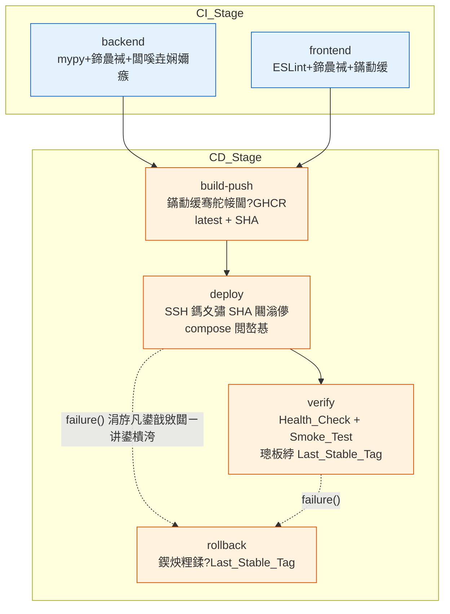
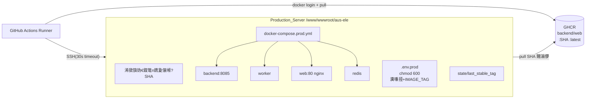

# 璁捐鏂囨。锛欳I/CD 娴佹按绾?

## Overview

鏈璁″湪鐜版湁 `.github/workflows/ci.yml` 鐨?CI 鍩虹涓婏紝琛ュ叏瀹屾暣鐨勬寔缁氦浠橈紙CD锛夎兘鍔涳紝骞朵慨澶嶆棦鏈?CI 寮辩偣銆傜洰鏍囨槸瀹炵幇锛歮ain 鍒嗘敮 push 鍚庤嚜鍔ㄥ畬鎴愩€岃川閲忛棬 鈫?闀滃儚鏋勫缓鎺ㄩ€?鈫?SSH 杩滅▼閮ㄧ讲 鈫?閮ㄧ讲鍚庨獙璇?鈫?澶辫触鑷姩鍥炴粴銆嶇殑绔埌绔祦姘寸嚎锛屽叏绋嬪瘑閽ュ畨鍏ㄦ敞鍏ャ€侀樁娈电姸鎬佸彲瑙傛祴銆?

璁捐閬靛惊浠ヤ笅鏃㈠畾涓婁笅鏂囷細

- **閮ㄧ讲褰㈡€?*锛氳嚜鎵樼鍗曟満銆侴itHub Actions runner 閫氳繃 SSH 杩炴帴 Production_Server锛屾媺鍙?GHCR 棰勬瀯寤洪暅鍍忥紝鐢?docker-compose 閲嶅惎鏈嶅姟銆?
- **鐜鍒嗗眰**锛氫粎鍗曚竴 production 鐜锛宮ain push 鑷姩閮ㄧ讲锛屾棤浜哄伐瀹℃壒闂ㄦ帶銆?
- **鏍稿績鐭涚浘涓庤В娉?*锛氬綋鍓?`docker-compose.yml` 浣跨敤 `build: context` **鏈湴鏋勫缓**闀滃儚锛屼笉閫傚悎鐢熶骇鎷夊彇宸叉瀯寤洪暅鍍忋€傝璁″紩鍏ョ嫭绔嬬殑 `docker-compose.prod.yml`锛屾敼鐢?`image: ghcr.io/<repo>/<svc>:${IMAGE_TAG}` **鎸?commit SHA 鎷夊彇**锛屼笌 CI 鎺ㄩ€佺殑闀滃儚鏍囩瀵归綈銆?

### 鍏抽敭璁捐鍐崇瓥涓庣悊鐢?

| 鍐崇瓥 | 閫夋嫨 | 鐞嗙敱 |
|------|------|------|
| 鐢熶骇缂栨帓鏂囦欢 | 鏂板鐙珛 `docker-compose.prod.yml`锛堣€岄潪 override 鍚堝苟锛?| 鐢熶骇璇箟涓庢湰鍦板畬鍏ㄤ笉鍚岋紙pull vs build銆佹棤婧愮爜鎸傝浇锛夛紝鐙珛鏂囦欢姣?`-f base -f override` 鍚堝苟鏇存竻鏅般€佸彲瀹¤锛岄伩鍏嶆湰鍦伴厤缃鍏ョ敓浜?|
| 闀滃儚鏍囩瀵诲潃 | `IMAGE_TAG` 鐜鍙橀噺椹卞姩 compose 鐨?`image:` | 璁╁悓涓€浠界敓浜?compose 鍙寚鍚戜换鎰?commit SHA 闀滃儚锛岄儴缃蹭笌鍥炴粴浠呭垏鎹?`IMAGE_TAG` 鍗冲彲锛屾弧瓒?R4.2 / R7.1 |
| SSH 鎵ц鏂瑰紡 | `appleboy/ssh-action`锛堝懡浠ゆ墽琛岋級+ 鏈嶅姟鍣ㄤ晶 `git` 妫€鍑洪儴缃茶剼鏈?| Action 鍘熺敓鏀寔杩炴帴瓒呮椂銆乪nv 娉ㄥ叆涓?Secret 灞忚斀锛圧4.1 / R5.3锛夛紱鏈嶅姟鍣ㄤ繚鐣欐寜 SHA 妫€鍑虹殑浠撳簱鍓湰锛屼娇 `docker-compose.prod.yml` 涓庨儴缃茶剼鏈殢鍙戝竷鐗堟湰涓€鑷?|
| 閮ㄧ讲/楠岃瘉/鍥炴粴閫昏緫 | 鎶藉彇涓烘湇鍔″櫒渚?Python 绾嚱鏁版ā鍧?+ 钖?shell 灏佽 | 绾嚱鏁帮紙閲嶈瘯鍒ゅ畾銆丼HA 鏍￠獙銆丼ecret 鏍￠獙銆佺粨鏋滆瘎浼帮級鍙灞炴€ф祴璇曡鐩栵紙瑙?Correctness Properties锛夛紝閬垮厤閫昏緫钘忓湪涓嶅彲娴嬬殑 YAML/bash 涓紙閬靛惊 Fail-Fast銆侀浂鎶€鏈€哄師鍒欙級 |
| Last_Stable_Tag 瀛樺偍 | 鏈嶅姟鍣ㄤ晶鏂囦欢 `/www/wwwroot/aus-ele/state/last_stable_tag` | 鍗曟満閮ㄧ讲鏃犻渶澶栭儴鐘舵€佸瓨鍌紱鏂囦欢璇诲啓绠€鍗曘€佸彲鍋?round-trip 鏍￠獙锛屾弧瓒?R6.5 / R7.1 / R7.3 |
| Python 鏉冨▉鐗堟湰 | 缁熶竴 3.11锛圕I env銆乣Dockerfile.backend`銆佹枃妗ｏ級 | `Dockerfile.backend` 宸蹭负 `python:3.11-slim`锛孋I `PYTHON_VERSION` 宸蹭负 3.11锛涙湰璁捐灏嗗叾鍥哄寲涓哄敮涓€鏉冨▉鐗堟湰骞跺湪鏂囨。澹版槑锛圧1.5 / R8.2锛?|

## Architecture

### 娴佹按绾夸綔涓氭嫇鎵?

鏁翠綋鐢?6 涓?GitHub Actions Job 缁勬垚锛岄€氳繃 `needs:` 寤虹珛渚濊禆銆侀€氳繃 `if:` 鎺у埗 CD 浠呭湪 main push 瑙﹀彂銆?



**浣滀笟瑙﹀彂涓庨棬鎺ц鍒欙細**

- `backend`銆乣frontend`锛氬湪 push锛坢ain/develop锛変笌 PR锛坢ain/develop锛夋椂鍧囪繍琛岋紙R1.1/1.2銆丷2.1/2.2锛夈€?
- `build-push`锛歚needs: [backend, frontend]` + `if: github.ref == 'refs/heads/main' && github.event_name == 'push'`锛圧3.1銆丷3.4銆丷4.6锛夈€?
- `deploy`锛歚needs: [build-push]`锛岀户鎵垮悓鏍风殑 main-push 鏉′欢锛圧4.6锛夈€?
- `verify`锛歚needs: [deploy]`銆?
- `rollback`锛歚needs: [deploy, verify]` + `if: failure() && needs.deploy.outputs.deploy_attempted == 'true'`銆俙deploy_attempted` 杈撳嚭浠呭湪 SSH 杩炴帴鎴愬姛涓斿紑濮嬫墽琛岄暅鍍忔媺鍙?閲嶅惎鍚庣疆涓?`true`锛岀‘淇?R4.4锛圫SH 瀹屽叏涓嶅彲杈俱€佹湭鏀瑰姩鏈嶅姟锛夋椂**涓嶈Е鍙戝洖婊?*锛岃€?R4.5锛堟媺鍙?閲嶅惎瓒呮椂锛変笌 R6 楠岃瘉澶辫触鏃?*瑙﹀彂鍥炴粴**銆?

### 閮ㄧ讲鐩爣鎷撴墤锛圥roduction_Server锛?



Runner 涓嶇洿鎺ユ瀯寤虹敓浜ч暅鍍忎簬鏈嶅姟鍣紱鏈嶅姟鍣ㄤ粎 `docker pull` GHCR 涓敱 `build-push` 闃舵棰勬瀯寤虹殑 SHA 鏍囩闀滃儚锛屽啀鐢?`docker-compose.prod.yml` 閲嶅惎銆?

## Components and Interfaces

### 1. CI Jobs锛堜慨澶嶅悗锛?

**`backend` job**锛圧1銆丷8.2锛?
- 缁存寔 `PYTHON_VERSION: "3.11"`锛屼綔涓轰笌 `Dockerfile.backend` 瀵归綈鐨勬潈濞佺増鏈€?
- 姝ラ椤哄簭锛歴etup-python(3.11) 鈫?瀹夎渚濊禆 鈫?mypy 鈫?鍗曞厓娴嬭瘯 鈫?闆嗘垚娴嬭瘯銆備换涓€姝ラ闈為浂閫€鍑哄嵆浣滀笟澶辫触锛圧1.3/1.4锛夛紝闃绘柇涓嬫父 CD銆?

**`frontend` job**锛圧2銆丷8.1锛?
- 鍏抽敭淇锛氬皢 `node --test src/lib/*.test.js || true` 鏀逛负 `node --test src/lib/*.test.js`锛岀Щ闄?`|| true`锛屼娇娴嬭瘯澶辫触鐪熷疄浼犳挱锛圧2.3銆丷8.1锛夈€?
- ESLint锛歚npm run lint` 榛樿瀵?error 绾ц繚瑙勮繑鍥為潪闆讹紱warning 涓嶉樆濉烇紙R2.4/2.5锛夈€傚闇€淇濊瘉 warning 涓嶈嚧澶辫触锛岀害瀹?lint 鑴氭湰涓嶄娇鐢?`--max-warnings=0`銆?
- 鏋勫缓锛歚npm run build` 澶辫触鎴栨棤浜х墿鍗充綔涓氬け璐ワ紙R2.6锛夈€?

### 2. `build-push` job锛圛mage_Builder锛孯3锛?

鎺ュ彛锛堟部鐢ㄧ幇鏈?`docker/build-push-action@v6`锛屽寮烘爣绛句笌鍐茬獊淇濇姢锛夛細

| 鍏虫敞鐐?| 璁捐 |
|--------|------|
| 鏍囩 | 姣忛暅鍍忓悓鏃舵墦 `latest` 涓庡畬鏁?40 浣?`${{ github.sha }}`锛圧3.2锛?|
| 璁よ瘉 | `docker/login-action` 浣跨敤 `GITHUB_TOKEN`锛坄packages: write`锛夛紙R3.5锛夛紝澶辫触涓嶅洖鏄惧嚟璇侊紙R3.9锛孉ction 榛樿灞忚斀锛?|
| 涓嶅彲鍙樻爣绛句繚鎶?| 鎺ㄩ€佸墠鏂板 **preflight 姝ラ**锛氳皟鐢?GHCR registry API锛堟垨 `docker manifest inspect ghcr.io/<repo>/<svc>:<sha>`锛夋煡璇㈣ SHA 鏍囩鏄惁宸插瓨鍦紱瀛樺湪鍒欎綔涓氬け璐ワ紝涓嶈鐩栵紙R3.6锛?|
| 鎺ㄩ€侀噸璇?| 鎺ㄩ€佹楠ゅ寘瑁归噸璇曢€昏緫锛氭渶澶?3 娆°€佹瘡娆￠棿闅?鈮?0s锛圧3.8锛?|
| 澶辫触璇箟 | 鏋勫缓澶辫触鍒欎笉鎺ㄩ€佷换浣曢暅鍍忓苟鎶ュ憡澶辫触闀滃儚锛圧3.7锛?|

### 3. `deploy` job锛圖eployer锛孯4 / R5锛?

浣跨敤 `appleboy/ssh-action`锛岄€氳繃 `envs:` 娉ㄥ叆瀵嗛挜涓?`IMAGE_TAG=${{ github.sha }}`锛?

- **鍓嶇疆 Secret 鏍￠獙**锛圧5.5锛夛細浣滀笟绗竴姝ュ湪 runner 涓婅繍琛?`validate_env`锛岀‘璁?`AUS_ELE_JWT_SECRET`銆乣FINGRID_API_KEY`銆丼SH 鍑瘉锛坔ost/user/key锛夊潎瀛樺湪涓旈潪绌猴紱浠讳竴缂哄け绔嬪嵆澶辫触锛屼粎鎶ュ憡缂哄け**鍚嶇О**涓嶈緭鍑哄€硷紝涓斿湪浠讳綍 SSH / 鎷夊彇 / 閲嶅惎涔嬪墠缁撴潫銆?
- **SSH 杩炴帴**锛氬崟娆¤繛鎺ヨ秴鏃?30s锛屾渶澶?3 娆″皾璇曪紙R4.1銆丷4.4锛夈€?
- **鏈嶅姟鍣ㄤ晶鍔ㄤ綔**锛堣皟鐢?`deploy/scripts/deploy.sh`锛夛細
  1. 灏嗗瘑閽ヤ笌 `IMAGE_TAG` 鍐欏叆鏈嶅姟鍣?`/www/wwwroot/aus-ele/.env.prod`锛坄chmod 600`锛岄潪浠撳簱杩借釜銆侀潪 runner 鎸佷箙纾佺洏锛夈€?
  2. `git fetch && git checkout <SHA>`锛堝悓姝?`docker-compose.prod.yml` 涓庤剼鏈埌閮ㄧ讲鐗堟湰锛夈€?
  3. `docker login ghcr.io` 鈫?`docker compose -f docker-compose.prod.yml --env-file .env.prod pull`锛?00s 瓒呮椂锛孯4.2锛夈€?
  4. `docker compose ... up -d` 鈫?鍦?120s 鍐呰疆璇㈢‘璁?backend/worker/web/redis 鍥涙湇鍔¤繘鍏?running锛圧4.3锛夈€?
- **杈撳嚭**锛歚deploy_attempted`锛堝紑濮嬫媺鍙?閲嶅惎鍗?`true`锛夈€乣image_tag`锛屼緵 `verify` 涓?`rollback` 浣跨敤銆?
- 鎷夊彇瓒呮椂鎴栧洓鏈嶅姟鏈湪 120s 鍐?running 鈫?浣滀笟澶辫触骞惰Е鍙戝洖婊氾紙R4.5锛夈€?

### 4. `verify` job锛圥ost_Deploy_Verification锛孯6 / R8.3锛?

- 缁?SSH 鍦ㄦ湇鍔″櫒涓婃墽琛?`deploy/scripts/verify.sh`锛?
  - **Health_Check**锛氬 `http://127.0.0.1:<API_HOST_PORT>/api/health` 鎺㈡祴锛屽崟娆¤秴鏃?10s銆佹渶澶?10 娆°€侀棿闅?5s銆佹€荤獥鍙?60s锛圧6.1锛夈€?
  - Health 鎴愬姛鍚庤繍琛?**Smoke_Test**锛氭墽琛屾牴鐩綍 `smoke_test_api.py`锛圧6.2銆丷8.3锛夈€傝剼鏈?`BASE` 闇€鍙傛暟鍖栦负鐢熶骇鍦板潃锛堣 Data Models 鐨勮剼鏈敼閫狅級銆?
  - 璇勪及锛氭墍鏈夎娴嬬鐐瑰潎鏃?500銆佹棤杩炴帴澶辫触 鈫?楠岃瘉閫氳繃锛圧6.4锛夈€?
- 楠岃瘉閫氳繃 鈫?璋冪敤 `record_stable.sh` 灏嗘湰娆?SHA 鍐欏叆 `state/last_stable_tag`锛圧6.5锛夈€?
- Health 澶辫触锛圧6.3锛夋垨 Smoke 鍑虹幇 500/杩炴帴澶辫触锛圧6.4锛夆啋 浣滀笟澶辫触锛岃Е鍙?`rollback`銆?

### 5. `rollback` job锛圧7 / R9.3 / R9.4锛?

`if: failure() && needs.deploy.outputs.deploy_attempted == 'true'`锛?

- 璇诲彇 `state/last_stable_tag`锛?
  - **涓嶅瓨鍦?*锛堥娆￠儴缃诧級鈫?璺宠繃鍥炴粴銆佷綔涓氬け璐ャ€佹姤鍛娿€屾棤鍙洖婊氱増鏈€嶏紙R7.3銆丷9.4锛夈€?
  - **瀛樺湪** 鈫?浠ヨ SHA 璁句负 `IMAGE_TAG`锛宍docker compose ... pull && up -d` 閲嶅惎 backend/worker/web锛圧7.1锛夈€?
- 鍥炴粴鍚?Health_Check锛氭渶澶?5 娆°€侀棿闅?10s銆佹€荤獥鍙?60s锛圧7.2锛夈€?
  - 鎴愬姛 鈫?娴佹按绾夸互澶辫触缁撴潫骞舵姤鍛娿€屽凡鍥炴粴鍒?`<Last_Stable_Tag>`銆嶏紙R7.4锛夈€?
  - 澶辫触 鈫?娴佹按绾夸互澶辫触缁撴潫銆佹姤鍛娿€屽洖婊氬け璐ラ渶浜哄伐浠嬪叆銆嶃€佷繚鐣欏綋鍓嶇姸鎬侊紙R7.5锛夈€?
- 鏃ュ織璁板綍瑙﹀彂鍥炴粴鐨勫け璐ラ」锛圚ealth 鎴?Smoke锛変笌鍥炴粴鐩爣 SHA锛圧9.3锛夈€?

### 6. 鍙娴嬫€э紙R9锛?

- 姣忎釜 Job 鏈熬鍚?`$GITHUB_STEP_SUMMARY` 鍐欏叆闃舵鐘舵€侊紝鐢?`鎴愬姛 / 澶辫触 / 璺宠繃` 涓夋€佹爣璇嗭紙R9.2銆丷9.5锛夈€?
- 澶辫触姝ラ鍚嶄笌閿欒淇℃伅杈撳嚭鍒拌 Stage 鏃ュ織锛汫itHub Actions 鏃ュ織榛樿淇濈暀 鈮?0 澶╋紙R9.1锛夈€?
- 鍥炴粴鐩稿叧浜嬩欢锛堣Е鍙戦」銆佺洰鏍?SHA銆佹垨璺宠繃鍘熷洜锛夊啓鍏ユ棩蹇楋紙R9.3銆丷9.4锛夈€?

### 鏈嶅姟鍣ㄤ晶鑴氭湰鎺ュ彛

| 鑴氭湰 | 鑱岃矗 | 鍏抽敭绾嚱鏁帮紙鍙祴锛?|
|------|------|----------------------|
| `deploy/scripts/deploy.sh` | 鍐?env銆佹鍑恒€乸ull銆乽p銆佺‘璁?running | `services_all_running(ps_output, required)` |
| `deploy/scripts/verify.sh` | Health 閲嶈瘯 + Smoke | `health_retry_succeeds(outcomes, cfg)`銆乣evaluate_smoke(results)` |
| `deploy/scripts/rollback.sh` | 璇诲彇绋冲畾鏍囩骞堕噸閮ㄧ讲 | `decide_rollback(last_stable)` |
| `deploy/scripts/lib/stable_tag.py` | 璇诲啓 Last_Stable_Tag | `write_stable_tag` / `read_stable_tag`锛坮ound-trip锛?|
| `deploy/scripts/lib/validate.py` | SHA 涓?Secret 鏍￠獙 | `is_valid_sha(s)`銆乣validate_secrets(mapping, required)` |
| `deploy/scripts/lib/status.py` | 闃舵鐘舵€佸綊绫?| `classify_stage(outcome)` |

## Data Models

### IMAGE_TAG 涓庨暅鍍忓鍧€

- `IMAGE_TAG`锛氬畬鏁?40 浣嶅皬鍐欏崄鍏繘鍒?commit SHA锛堥儴缃叉椂涓?`github.sha`锛屽洖婊氭椂涓?Last_Stable_Tag锛夈€?
- 闀滃儚寮曠敤锛歚${REGISTRY}/${IMAGE_PREFIX}/<service>:${IMAGE_TAG}`锛屽叾涓?`REGISTRY=ghcr.io`銆乣IMAGE_PREFIX=<owner>/<repo>`銆?

### `docker-compose.prod.yml`锛堟柊澧烇紝浠撳簱杩借釜锛?

涓?`docker-compose.yml` 鏈嶅姟闆嗕竴鑷达紝浣?backend/worker/web 鏀逛负 `image:` 鎷夊彇锛岀Щ闄?`build:` 涓庢簮鐮佹寕杞斤紝淇濈暀鏁版嵁鍗蜂笌杩愯鏃剁幆澧冨彉閲忓崰浣嶏細

```yaml
services:
  backend:
    image: ${REGISTRY:-ghcr.io}/${IMAGE_PREFIX}/backend:${IMAGE_TAG}
    restart: unless-stopped
    environment:
      AUS_ELE_JWT_SECRET: ${AUS_ELE_JWT_SECRET:?required}
      FINGRID_API_KEY: ${FINGRID_API_KEY:-}
      # ...鍏朵綑涓庣幇鏈?compose 涓€鑷?
    volumes: [ ./data:/app/data, ./logs:/app/logs, ./output:/app/output ]
    ports: [ "${API_HOST_PORT:-18085}:8085" ]
    depends_on: [ redis ]
  worker:
    image: ${REGISTRY:-ghcr.io}/${IMAGE_PREFIX}/backend:${IMAGE_TAG}
    # worker 璋冨害绫荤幆澧冨彉閲忎笌鐜版湁涓€鑷?
  web:
    image: ${REGISTRY:-ghcr.io}/${IMAGE_PREFIX}/web:${IMAGE_TAG}
    ports: [ "${WEB_HOST_PORT:-18080}:80" ]
    depends_on: [ backend ]
  redis:
    image: redis:7-alpine
    volumes: [ redis_data:/data ]
volumes: { redis_data: {} }
```

### `/www/wwwroot/aus-ele/.env.prod`锛堟湇鍔″櫒渚э紝**涓嶈拷韪?*锛宑hmod 600锛?

鎵胯浇 compose 鍙橀噺鏇挎崲鎵€闇€鐨勮繍琛屾椂鍊硷細`REGISTRY`銆乣IMAGE_PREFIX`銆乣IMAGE_TAG`銆乣API_HOST_PORT`銆乣WEB_HOST_PORT`銆乣AUS_ELE_JWT_SECRET`銆乣FINGRID_API_KEY` 绛夈€備粨搴撳唴 `.gitignore` 椤荤‘淇?`.env*`锛堢ず渚嬫枃浠堕櫎澶栵級涓嶈杩借釜锛圧5.1銆丷5.4锛夈€?

### Last_Stable_Tag 鐘舵€佹枃浠?`/www/wwwroot/aus-ele/state/last_stable_tag`

- 鍐呭锛氬崟琛?40 浣?commit SHA銆?
- 鍐欏叆鏃舵満锛歚verify` 閫氳繃鍚庯紙R6.5锛夈€?
- 璇诲彇鏃舵満锛歚rollback`锛圧7.1/7.3锛夈€?
- 涓嶅瓨鍦?= 灏氭棤绋冲畾鐗堟湰锛堥娆￠儴缃诧級銆?

### Smoke_Test 缁撴灉妯″瀷锛坄smoke_test_api.py` 鏀归€狅級

鑴氭湰灏?`BASE` 鏀逛负鍙敱鐜鍙橀噺锛堝 `SMOKE_BASE_URL`锛夎鐩栵紝榛樿鎸囧悜鐢熶骇 `http://127.0.0.1:<API_HOST_PORT>`锛涘苟浠?*杩涚▼閫€鍑虹爜**琛ㄨ揪缁撹锛氬瓨鍦ㄤ换涓€ 500 鎴栬繛鎺ュけ璐?鈫?闈為浂閫€鍑猴紙渚?`verify` 鍒ゅ畾锛孯6.4锛夈€傛瘡绔偣缁撴灉涓?`(desc, method, path, status_code, elapsed, result, error)`锛屾暣浣撶粨璁虹敱 `evaluate_smoke(results)` 娲剧敓銆?

### Health 閲嶈瘯閰嶇疆妯″瀷

缁熶竴鐨勯噸璇曢厤缃?`RetryConfig { max_retries, interval_s, timeout_s, window_s }`锛?
- 閮ㄧ讲鍚庨獙璇侊細`{10, 5, 10, 60}`锛圧6.1锛夈€?
- 鍥炴粴鍚庨獙璇侊細`{5, 10, 10, 60}`锛圧7.2锛夈€?

## Correctness Properties

*灞炴€э紙property锛夋槸鎸囧湪绯荤粺鎵€鏈夊悎娉曟墽琛屼腑閮藉簲鎴愮珛鐨勭壒寰佹垨琛屼负鈥斺€斿嵆瀵广€岀郴缁熷簲褰撳仛浠€涔堛€嶇殑褰㈠紡鍖栭檲杩般€傚睘鎬ф槸浜虹被鍙瑙勭害涓庢満鍣ㄥ彲楠岃瘉姝ｇ‘鎬т繚璇佷箣闂寸殑妗ユ銆?

鏈壒鎬х殑娴佹按绾跨紪鎺掑眰锛圙itHub Actions YAML銆丼SH 杩炴帴銆乨ocker pull/up銆丟HCR 鎺ㄩ€併€佹棩蹇楀睆钄斤級灞炰簬鍩虹璁炬柦涓庡閮ㄦ湇鍔′氦浜掞紝**涓嶉€傚悎灞炴€ф祴璇?*锛屽皢浠ラ泦鎴愭祴璇曚笌鍐掔儫/閰嶇疆妫€鏌ヨ鐩栵紙瑙?Testing Strategy锛夈€備笅鍒楀睘鎬т粎閽堝鏈嶅姟鍣ㄤ晶鎶藉彇鐨?*绾嚱鏁拌緟鍔╅€昏緫**锛岃繖浜涘嚱鏁板闅忔満杈撳叆鏈夋槑纭殑杈撳叆/杈撳嚭鍏崇郴锛岄€傚悎灞炴€ф祴璇曘€?

### Property 1: Commit SHA 鏍囩鏍￠獙

*For any* 瀛楃涓?`s`锛宍is_valid_sha(s)` 杩斿洖鐪?*褰撲笖浠呭綋** `s` 鎭颁负 40 浣嶅皬鍐欏崄鍏繘鍒跺瓧绗︼紱骞朵笖瀵逛换鎰忓悎娉?SHA锛屾墍鐢熸垚鐨勪笉鍙彉闀滃儚鏍囩閮藉畬鏁村寘鍚 40 浣?SHA銆?

**Validates: Requirements 3.2**

### Property 2: 涓嶅彲鍙樻爣绛捐鐩栦繚鎶?

*For any* 宸插瓨鍦ㄦ爣绛鹃泦鍚?`existing` 涓庣洰鏍?commit SHA `tag`锛屾帹閫佸喅绛?`decide_push(existing, tag)` 鍏佽鎺ㄩ€?*褰撲笖浠呭綋** `tag` 涓嶅湪 `existing` 涓紱褰?`tag` 宸插瓨鍦ㄦ椂涓€寰嬫嫆缁濓紙涓嶈鐩栵級銆?

**Validates: Requirements 3.6**

### Property 3: 閫氱敤閲嶈瘯鍒ゅ畾璇箟

*For any* 鎺㈡祴缁撴灉甯冨皵搴忓垪 `outcomes` 涓庨噸璇曢厤缃?`RetryConfig{max_retries, interval_s, ...}`锛宍retry_succeeds(outcomes, cfg)` 杩斿洖鎴愬姛**褰撲笖浠呭綋**鍦ㄥ墠 `max_retries` 娆″皾璇曞唴鑷冲皯鍑虹幇涓€娆℃垚鍔燂紱涓斿疄闄呮墽琛岀殑灏濊瘯娆℃暟鎭?`鈮?max_retries`锛屽苟鍦ㄩ娆℃垚鍔熷悗鍋滄銆傝灞炴€т互涓嶅悓閰嶇疆瑕嗙洊閮ㄧ讲鍚庡仴搴锋鏌ワ紙10/5锛夈€佸洖婊氬悗鍋ュ悍妫€鏌ワ紙5/10锛変笌鎺ㄩ€侀噸璇曪紙3 娆★級銆?

**Validates: Requirements 6.1, 6.3, 7.2, 3.8**

### Property 4: Smoke_Test 缁撴灉璇勪及

*For any* 绔偣缁撴灉闆嗗悎 `results`锛屾暣浣撹瘎浼?`evaluate_smoke(results)` 鍒ゅ畾涓洪€氳繃**褰撲笖浠呭綋**鍏朵腑涓嶅瓨鍦ㄤ换浣曡繑鍥?500 鐨勭鐐逛笖涓嶅瓨鍦ㄤ换浣曡繛鎺ュけ璐ョ殑绔偣锛涘惁鍒欏垽瀹氫负澶辫触銆?

**Validates: Requirements 6.2, 6.4**

### Property 5: Last_Stable_Tag 鎸佷箙鍖栧線杩?

*For any* 鍚堟硶 commit SHA `tag`锛屽厛 `write_stable_tag(tag)` 鍐?`read_stable_tag()` 杩斿洖鐨勫€间笌 `tag` 鐩哥瓑锛坮ound-trip 鎭掔瓑锛夈€?

**Validates: Requirements 6.5, 7.1**

### Property 6: 蹇呴渶 Secret 鏍￠獙

*For any* secret 鍚嶇О鍒板€肩殑鏄犲皠 `m` 涓庡繀闇€鍚嶇О闆嗗悎 `required`锛宍validate_secrets(m, required)` 閫氳繃**褰撲笖浠呭綋** `required` 涓瘡涓悕绉板湪 `m` 涓兘瀛樺湪涓斿搴斿€间负闈炵┖瀛楃涓诧紱褰撴牎楠屽け璐ユ椂锛岃繑鍥炵殑鎶ュ憡鎭板ソ鍒楀嚭鎵€鏈夌己澶?涓虹┖鐨勫悕绉帮紝涓旀姤鍛婁腑涓嶅寘鍚换浣?secret 鐨勫€笺€?

**Validates: Requirements 5.5**

### Property 7: 鏈嶅姟杩愯鐘舵€佺‘璁?

*For any* 鏈嶅姟鍚嶅埌鐘舵€佺殑鏄犲皠 `ps` 涓庡繀闇€鏈嶅姟闆嗗悎 `required`锛坆ackend銆亀orker銆亀eb銆乺edis锛夛紝`services_all_running(ps, required)` 涓虹湡**褰撲笖浠呭綋** `required` 涓瘡涓湇鍔″湪 `ps` 涓殑鐘舵€佸潎涓?running銆?

**Validates: Requirements 4.3**

### Property 8: 鍥炴粴鐩爣鍐崇瓥

*For any* Last_Stable_Tag 鐘舵€侊紙涓嶅瓨鍦?/ 涓虹┖ / 涓哄悎娉?SHA锛夛紝`decide_rollback(last_stable)` 鍐冲畾鎵ц鍥炴粴**褰撲笖浠呭綋**瀛樺湪鍚堟硶鐨?Last_Stable_Tag锛涘惁鍒欏喅瀹氳烦杩囧苟浠ュけ璐ユ敹鍦猴紙瀵瑰簲棣栨閮ㄧ讲鏃犲彲鍥炴粴鐗堟湰锛夈€?

**Validates: Requirements 7.3**

### Property 9: 闃舵鐘舵€佸綊绫?

*For any* 闃舵鎵ц缁撴灉 `outcome`锛宍classify_stage(outcome)` 鎭板ソ杩斿洖 `鎴愬姛 / 澶辫触 / 璺宠繃` 涓夌鍙栧€间箣涓€锛屼笖璇ユ槧灏勬槸纭畾鐨勶紙鐩稿悓 `outcome` 鎬诲緱鍒扮浉鍚屽垎绫伙級銆?

**Validates: Requirements 9.2**

## Error Handling

璁捐閬靛惊 Fail-Fast锛氶敊璇敖鏃╂毚闇层€佺粷涓嶉潤榛樺悶鎺夛紙鐩存帴鍥炲簲鏃㈡湁 `|| true` 寮辩偣锛夈€?

| 澶辫触鍦烘櫙 | 澶勭悊绛栫暐 | 鍏宠仈闇€姹?|
|----------|----------|----------|
| mypy/鍗曟祴/闆嗘垚娴嬭瘯澶辫触 | 浣滀笟闈為浂閫€鍑猴紝闃绘柇涓嬫父 CD | R1.3, R1.4 |
| 鍓嶇娴嬭瘯澶辫触 | 绉婚櫎 `\|\| true`锛屽け璐ョ湡瀹炰紶鎾?| R2.3, R8.1 |
| 鍓嶇鏋勫缓澶辫触/鏃犱骇鐗?| 浣滀笟澶辫触 | R2.6 |
| 鐩爣 SHA 鏍囩宸插瓨鍦?| preflight 妫€娴嬪悗鎷掔粷鎺ㄩ€併€佷綔涓氬け璐?| R3.6 |
| 闀滃儚鏋勫缓澶辫触 | 涓嶆墽琛屼换浣曟帹閫併€佹姤鍛婂け璐ラ暅鍍?| R3.7 |
| 鎺ㄩ€佸け璐?| 閲嶈瘯 鈮? 娆★紙闂撮殧鈮?0s锛夛紝浠嶅け璐ュ垯浣滀笟澶辫触 | R3.8 |
| 蹇呴渶 Secret 缂哄け/涓虹┖ | 鍦ㄤ换浣?SSH/鎷夊彇/閲嶅惎**涔嬪墠**澶辫触锛屼粎鎶ュ憡鍚嶇О | R5.5 |
| SSH 涓嶅彲杈?| 鈮? 娆″皾璇曪紙姣忔 30s锛夛紝澶辫触鍒欐姤鍛婅繛鎺ラ敊璇笖**涓嶆敼鍔?*鏈嶅姟銆?*涓嶅洖婊?* | R4.4 |
| 闀滃儚鎷夊彇瓒呮椂锛?300s锛?| 浣滀笟澶辫触骞惰Е鍙戝洖婊?| R4.5 |
| 鏈嶅姟鏈湪 120s 鍐?running | 浣滀笟澶辫触骞惰Е鍙戝洖婊?| R4.5 |
| Health_Check 绐楀彛鍐呮湭鎴愬姛 | 楠岃瘉澶辫触骞惰Е鍙戝洖婊?| R6.3 |
| Smoke 鍑虹幇 500/杩炴帴澶辫触 | 楠岃瘉澶辫触骞惰Е鍙戝洖婊?| R6.4 |
| 鏃?Last_Stable_Tag 瑙﹀彂鍥炴粴 | 璺宠繃鍥炴粴銆佷綔涓氬け璐ャ€佹姤鍛婃棤鍙洖婊氱増鏈?| R7.3, R9.4 |
| 鍥炴粴鍚?Health 鎴愬姛 | 娴佹按绾垮け璐ュ苟鎶ュ憡銆屽凡鍥炴粴鍒?SHA銆?| R7.4 |
| 鍥炴粴鍚?Health 澶辫触 | 娴佹按绾垮け璐ャ€佹姤鍛婇渶浜哄伐浠嬪叆銆佷繚鐣欑幇鐘?| R7.5 |

**鍥炴粴瑙﹀彂鐨勭簿纭棬鎺?*锛歚rollback` 浣滀笟鏉′欢涓?`failure() && needs.deploy.outputs.deploy_attempted == 'true'`銆俙deploy_attempted` 浠呭湪 SSH 杩炴帴鎴愬姛涓斿紑濮嬫媺鍙?閲嶅惎鍚庣疆鐪燂紝浠庤€屽尯鍒?R4.4锛堟湭鏀瑰姩鏈嶅姟锛屼笉鍥炴粴锛変笌 R4.5 / R6锛堝凡閮ㄥ垎鍙樻洿锛岄渶鍥炴粴锛夈€?

## Testing Strategy

閲囩敤**鍙屽眰娴嬭瘯**锛氱函閫昏緫鐢ㄥ睘鎬ф祴璇曪紝缂栨帓涓庡閮ㄤ氦浜掔敤闆嗘垚/鍐掔儫娴嬭瘯銆?

### 灞炴€ф祴璇曪紙Property-Based Tests锛?

- **搴?*锛歅ython 浣跨敤 `hypothesis`锛堜粨搴撳凡鍦ㄧ敤锛岃 `.hypothesis/` 涓?CI 瀹夎锛夛紝**涓嶈嚜琛屽疄鐜?* PBT 妗嗘灦銆?
- **浣嶇疆**锛氭祴璇曠疆浜?`test/` 鐩綍锛堥伒寰伐浣滃尯瑙勫垯锛夈€傝娴嬬函鍑芥暟缃簬 `deploy/scripts/lib/`銆?
- **閰嶇疆**锛氭瘡涓睘鎬ф祴璇曟渶灏戣繍琛?100 娆¤凯浠ｏ紙`@settings(max_examples=100)`锛夈€?
- **鏍囨敞**锛氭瘡涓睘鎬ф祴璇曚互娉ㄩ噴寮曠敤璁捐灞炴€э紝鏍煎紡锛?
  `# Feature: cicd-pipeline, Property {number}: {property_text}`
- **瑕嗙洊**锛歅roperty 1鈥? 鍚勭敱**鍗曚釜**灞炴€ф祴璇曞疄鐜帮細
  - P1 `is_valid_sha` / 鏍囩鐢熸垚锛汸2 `decide_push`锛汸3 `retry_succeeds`锛堝 RetryConfig锛夛紱P4 `evaluate_smoke`锛汸5 `write/read_stable_tag` 寰€杩旓紙鐢?tmp 璺緞锛夛紱P6 `validate_secrets`锛汸7 `services_all_running`锛汸8 `decide_rollback`锛汸9 `classify_stage`銆?

### 鍗曞厓 / 杈圭晫娴嬭瘯锛圗xample-Based锛?

- 閽堝鍏蜂綋杈圭晫锛氱┖ `ps` 杈撳嚭銆佸叏澶у啓鎴?39/41 浣?SHA銆佺┖ secret 鏄犲皠銆丼moke 缁撴灉鍏ㄩ€氳繃 vs 鍚崟涓?500銆佺姸鎬佹枃浠朵笉瀛樺湪 vs 绌烘枃浠躲€?
- 鏁伴噺鍏嬪埗锛屼富瑕佽竟鐣屼氦鐢卞睘鎬х敓鎴愬櫒瑕嗙洊銆?

### 闆嗘垚娴嬭瘯锛圛ntegration锛?鈥? 渚嬶級

- `build-push`锛氭帹閫佸埌 GHCR 骞舵牎楠?`latest` 涓?SHA 鏍囩瀛樺湪锛涢噸澶嶆帹閫佸悓 SHA 瑙﹀彂鎷掔粷锛圧3.6锛夈€?
- `deploy`锛氬涓€鍙版祴璇曟湇鍔″櫒鎵ц SSH 閮ㄧ讲锛岀‘璁ゅ洓鏈嶅姟 running锛圧4.3锛夈€?
- `verify`锛氬杩愯涓殑鍚庣璺?`smoke_test_api.py`锛岀‘璁ゅ仴搴蜂笌鍐掔儫閫氳繃骞跺啓鍏?Last_Stable_Tag锛圧6銆丷8.3锛夈€?
- `rollback`锛氭敞鍏ヤ竴娆￠獙璇佸け璐ワ紝纭鍥炴粴鍒颁笂涓€ SHA 涓旀渶缁堢粨璁轰负澶辫触锛圧7.4锛夈€?

### 鍐掔儫 / 閰嶇疆妫€鏌ワ紙Smoke锛屽崟娆★級

- Python 鐗堟湰瀵归綈锛歚setup-python` 鐗堟湰銆乣Dockerfile.backend` 鐨?`FROM python:3.11-slim` 涓€鑷达紙R1.5銆丷8.2锛夈€?
- 宸ヤ綔娴佽Е鍙戠煩闃碉細push/PR 瑙﹀彂 CI锛宮ain-push 鎵嶈Е鍙?CD锛圧1.1/1.2銆丷2.1/2.2銆丷4.6锛夈€?
- 瀵嗛挜娉勯湶鎵弿 + `.gitignore` 鏍￠獙锛氫粨搴撹拷韪枃浠朵笉鍚?Secret 鏄庢枃銆乣.env.prod` 涓嶈杩借釜锛圧5.4锛夈€?

### 涓轰綍缂栨帓灞備笉鐢?PBT

GitHub Actions 宸ヤ綔娴併€丼SH 杩滅▼鎵ц銆乣docker pull/compose up`銆丟HCR 鎺ㄩ€併€佹棩蹇楀睆钄藉潎涓哄０鏄庡紡閰嶇疆鎴栧閮ㄦ湇鍔′氦浜掞紝琛屼负涓嶉殢杈撳叆鏈夋剰涔夊彉鍖栥€佷笖閲嶅鎵ц鎴愭湰楂橈紝鏃犳硶鏋勯€犳湁鎰忎箟鐨勩€屽浠绘剰杈撳叆 X 灞炴€?P(X) 鎴愮珛銆嶉檲杩帮紝鏁呴噰鐢ㄩ泦鎴?鍐掔儫娴嬭瘯鑰岄潪灞炴€ф祴璇曪紙绗﹀悎宸ヤ綔娴佸 IaC / 澶栭儴鏈嶅姟鐨?PBT 閫傜敤鎬у垽瀹氾級銆?

## 寰呭垱寤虹殑浠撳簱宸ヤ欢娓呭崟

| 宸ヤ欢 | 绫诲瀷 | 璇存槑 |
|------|------|------|
| `.github/workflows/ci.yml` | 淇敼 | 绉婚櫎鍓嶇 `\|\| true`锛涙柊澧?deploy/verify/rollback 浣滀笟涓庨棬鎺?|
| `docker-compose.prod.yml` | 鏂板 | 鐢熶骇缂栨帓锛宍image:` 鎸?`IMAGE_TAG` 鎷夊彇 GHCR |
| `deploy/scripts/deploy.sh` | 鏂板 | 鏈嶅姟鍣ㄤ晶锛氬啓 env銆佹鍑恒€乸ull銆乽p銆佺‘璁?running |
| `deploy/scripts/verify.sh` | 鏂板 | Health 閲嶈瘯 + 杩愯 `smoke_test_api.py` |
| `deploy/scripts/rollback.sh` | 鏂板 | 璇诲彇骞堕噸閮ㄧ讲 Last_Stable_Tag |
| `deploy/scripts/lib/validate.py` | 鏂板 | `is_valid_sha`銆乣validate_secrets`锛圥1/P6锛?|
| `deploy/scripts/lib/retry.py` | 鏂板 | `retry_succeeds`銆乣services_all_running`锛圥3/P7锛?|
| `deploy/scripts/lib/smoke.py` | 鏂板 | `evaluate_smoke`銆乣decide_push`锛圥4/P2锛?|
| `deploy/scripts/lib/stable_tag.py` | 鏂板 | `write/read_stable_tag`銆乣decide_rollback`锛圥5/P8锛?|
| `deploy/scripts/lib/status.py` | 鏂板 | `classify_stage`锛圥9锛?|
| `smoke_test_api.py` | 淇敼 | `BASE` 鏀寔 `SMOKE_BASE_URL` 瑕嗙洊锛涙寜缁撹杩斿洖閫€鍑虹爜 |
| `.env.docker.example` / 鏂囨。 | 淇敼 | 璁板綍 `REGISTRY`/`IMAGE_PREFIX`/`IMAGE_TAG` 涓?Python 3.11 鏉冨▉鐗堟湰 |

