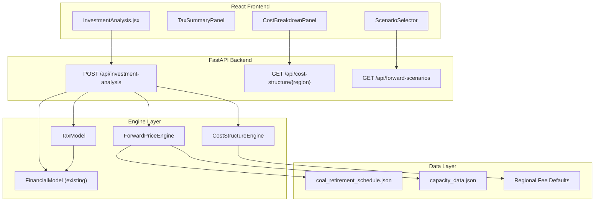

# Design Document: Financial Accuracy Modules

## Overview

Financial Accuracy Modules 为 AEMO Intelligence Platform 的投资分析引擎引入三个精度增强模块，替换当前简化的财务假设：

1. **Cost Structure Engine** (`backend/engines/cost_structure_engine.py`) — 将当前 `network_fees.py` 中的单一合并 $/MWh 网络费用分解为独立的 AEMO 参与者费用、TUOS（输电/配电）、DUOS、MLF、FPP 等组件，区分 FIXED/VARIABLE 类型，支持区域差异化配置。

2. **Tax Model** (`backend/engines/tax_model.py`) — 在现有 `FinancialModel.run_scenario()` 基础上增加澳大利亚公司税计算层，包括 30%/25% 税率、Diminishing Value / Prime Cost 折旧、税损结转、利息抵扣，输出税后现金流和税后 IRR/NPV。

3. **Forward Price Scenario Engine** (`backend/engines/forward_price_engine.py`) — 基于供需事件注册表（煤电退役、BESS 新增容量）建模未来电价分布，输出 Central/High/Low 三情景的 20 年收入预测，替代纯历史回测的收入假设。

三个模块通过扩展现有 `InvestmentParams` 和 `POST /api/investment-analysis` 端点集成，保持向后兼容。

## Architecture



### 集成策略

- **Cost Structure Engine** 在 `FinancialModel.run_scenario()` 的 opex 计算阶段被调用，替换当前的 `fixed_om + var_om` 简化逻辑，提供逐组件的费用明细。
- **Tax Model** 在 `FinancialModel.run_scenario()` 计算完 pre-tax net cash flow 后被调用，生成 after-tax cash flow 序列。
- **Forward Price Engine** 在 investment-analysis 路由层被调用，当用户选择 forward scenario 时替代历史回测基线收入。

### 向后兼容

- 现有 `InvestmentParams` 新增可选字段（`cost_structure_overrides`、`tax_config`、`forward_scenario`），不提供时使用当前默认行为。
- 现有 `CashFlowYear` 模型扩展 tax 字段，不删除任何现有字段。
- `InvestmentAnalysisResponse` 新增 `cost_breakdown`、`tax_summary`、`scenario_projections` 可选字段。

## Components and Interfaces

### 1. Cost Structure Engine

**文件**: `backend/engines/cost_structure_engine.py`

```python
class CostStructureEngine:
    """计算 BESS 项目的逐组件费用结构。"""

    @staticmethod
    def get_regional_defaults(region: str) -> RegionalFeeConfig:
        """返回指定区域的默认费用参数集。"""

    @staticmethod
    def calculate_annual_costs(
        battery: BatterySpecs,
        region: str,
        annual_throughput_mwh: float,
        connection_type: ConnectionType,
        overrides: Optional[CostStructureOverrides] = None,
    ) -> AnnualCostBreakdown:
        """计算年度费用分解，区分 FIXED 和 VARIABLE 组件。"""

    @staticmethod
    def apply_mlf(settlement_price: float, mlf: float) -> float:
        """将 MLF 作为乘数应用于结算价格。"""
```

### 2. Tax Model

**文件**: `backend/engines/tax_model.py`

```python
class TaxModel:
    """澳大利亚公司税计算，含折旧和税损结转。"""

    def __init__(self, config: TaxConfig):
        self.config = config
        self.carried_loss: float = 0.0

    def calculate_depreciation(self, year: int, capex: float) -> DepreciationResult:
        """计算指定年份的折旧额和税盾。"""

    def calculate_annual_tax(
        self,
        revenue: float,
        opex: float,
        interest_expense: float,
        depreciation: float,
    ) -> AnnualTaxResult:
        """计算单年税务结果，含税损结转逻辑。"""

    def calculate_after_tax_cash_flows(
        self,
        pre_tax_cash_flows: List[CashFlowYear],
        capex: float,
        annual_debt_service: float,
        debt_tenor: int,
    ) -> AfterTaxResult:
        """从 pre-tax 现金流序列生成 after-tax 结果。"""
```

### 3. Forward Price Scenario Engine

**文件**: `backend/engines/forward_price_engine.py`

```python
class ForwardPriceEngine:
    """基于供需事件建模未来电价分布和收入预测。"""

    def __init__(self):
        self.event_registry: EventRegistry = self._load_event_registry()

    def get_scenarios(self) -> List[ScenarioDefinition]:
        """返回可用的情景定义列表（Central/High/Low）。"""

    def calculate_price_distribution(
        self,
        region: str,
        scenario: ScenarioType,
        year: int,
        bess_capacity_ratio: float,
    ) -> PriceDistribution:
        """计算指定区域/情景/年份的价格分布参数。"""

    def estimate_annual_revenue(
        self,
        region: str,
        scenario: ScenarioType,
        year: int,
        battery: BatterySpecs,
        soh: float,
    ) -> float:
        """基于价格分布估算年度套利收入。"""

    def generate_20year_projection(
        self,
        region: str,
        scenario: ScenarioType,
        battery: BatterySpecs,
    ) -> ScenarioProjection:
        """生成 20 年收入预测序列。"""
```

### 4. API Integration

**修改文件**: `backend/routes/investment_routes.py`

- 扩展 `POST /api/investment-analysis` 接受 `cost_structure_overrides`、`tax_config`、`forward_scenario` 参数
- 新增 `GET /api/cost-structure/{region}` 返回区域默认费用分解
- 新增 `GET /api/forward-scenarios` 返回可用情景列表和摘要参数

**新增文件**: `backend/routes/cost_structure_routes.py`、`backend/routes/forward_price_routes.py`

## Data Models

### Cost Structure Models

**文件**: `backend/models/cost_structure_models.py`

```python
from enum import Enum
from typing import Optional, Dict
from pydantic import BaseModel, Field, field_validator


class FeeType(str, Enum):
    FIXED = "fixed"
    VARIABLE = "variable"


class ConnectionType(str, Enum):
    TRANSMISSION = "transmission"
    DISTRIBUTION = "distribution"


class AemoParticipantFee(BaseModel):
    """AEMO 参与者费用 — VARIABLE，基于 Gross Energy。"""
    fee_type: FeeType = FeeType.VARIABLE
    rate_per_mwh: float = Field(default=0.40, ge=0.30, le=0.50)


class AemoRegistrationFee(BaseModel):
    """AEMO 注册费 — 一次性 FIXED。"""
    fee_type: FeeType = FeeType.FIXED
    amount: float = Field(default=10000.0, ge=5000.0, le=50000.0)


class TuosDemandCharge(BaseModel):
    """TUOS 需量费 — FIXED，$/MW/year。"""
    fee_type: FeeType = FeeType.FIXED
    rate_per_mw_year: float = Field(default=10000.0, ge=5000.0, le=15000.0)


class TuosEnergyCharge(BaseModel):
    """TUOS 电量费 — VARIABLE，$/MWh。"""
    fee_type: FeeType = FeeType.VARIABLE
    rate_per_mwh: float = Field(default=2.0, ge=1.0, le=3.0)


class DuosCharge(BaseModel):
    """DUOS 配电费 — 取决于连接类型。"""
    fee_type: FeeType = FeeType.VARIABLE
    connection_type: ConnectionType = ConnectionType.TRANSMISSION
    rate_per_mwh: float = Field(default=0.0, ge=0.0, le=30.0)


class MlfConfig(BaseModel):
    """MLF 边际损耗因子 — 结算价格乘数。"""
    value: float = Field(default=0.98, ge=0.50, le=1.50)


class FppConfig(BaseModel):
    """FPP 频率性能支付 — 双向 VARIABLE。"""
    fee_type: FeeType = FeeType.VARIABLE
    net_earning_per_mw_year: float = Field(default=1000.0, ge=500.0, le=1500.0)


class RegionalFeeConfig(BaseModel):
    """区域完整费用参数集。"""
    region: str
    aemo_participant_fee: AemoParticipantFee = Field(default_factory=AemoParticipantFee)
    aemo_registration_fee: AemoRegistrationFee = Field(default_factory=AemoRegistrationFee)
    tuos_demand: TuosDemandCharge = Field(default_factory=TuosDemandCharge)
    tuos_energy: TuosEnergyCharge = Field(default_factory=TuosEnergyCharge)
    duos: DuosCharge = Field(default_factory=DuosCharge)
    mlf: MlfConfig = Field(default_factory=MlfConfig)
    fpp: FppConfig = Field(default_factory=FppConfig)


class CostStructureOverrides(BaseModel):
    """用户可覆盖的费用参数子集。"""
    aemo_participant_rate: Optional[float] = None
    tuos_demand_rate: Optional[float] = None
    tuos_energy_rate: Optional[float] = None
    duos_rate: Optional[float] = None
    mlf_value: Optional[float] = Field(default=None, ge=0.50, le=1.50)
    fpp_net_earning: Optional[float] = None
    connection_type: Optional[ConnectionType] = None


class CostLineItem(BaseModel):
    """单个费用组件的年度计算结果。"""
    name: str
    fee_type: FeeType
    annual_amount: float
    percentage_of_total: float


class AnnualCostBreakdown(BaseModel):
    """年度费用分解汇总。"""
    region: str
    total_fixed_costs: float
    total_variable_costs: float
    total_annual_cost: float
    line_items: list[CostLineItem]
    mlf_applied: float  # MLF 乘数值（非费用）
```

### Tax Models

**文件**: `backend/models/tax_models.py`

```python
from enum import Enum
from typing import Optional, List
from pydantic import BaseModel, Field, field_validator


class DepreciationMethod(str, Enum):
    DIMINISHING_VALUE = "diminishing_value"
    PRIME_COST = "prime_cost"


class EntityType(str, Enum):
    STANDARD = "standard"       # 30% tax rate
    BASE_RATE = "base_rate"     # 25% tax rate


class TaxConfig(BaseModel):
    """税务计算配置。"""
    entity_type: EntityType = EntityType.STANDARD
    depreciation_method: DepreciationMethod = DepreciationMethod.DIMINISHING_VALUE
    effective_life_years: int = Field(default=20, gt=0)
    custom_tax_rate: Optional[float] = Field(default=None, ge=0.0, le=1.0)

    @property
    def tax_rate(self) -> float:
        if self.custom_tax_rate is not None:
            return self.custom_tax_rate
        return 0.30 if self.entity_type == EntityType.STANDARD else 0.25


class DepreciationResult(BaseModel):
    """单年折旧计算结果。"""
    year: int
    depreciation_amount: float
    written_down_value: float
    tax_shield: float


class AnnualTaxResult(BaseModel):
    """单年税务计算结果。"""
    year: int
    gross_revenue: float
    operating_expenses: float
    interest_expense: float
    depreciation: float
    taxable_income_before_loss: float
    loss_offset_applied: float
    taxable_income: float
    tax_payable: float
    carried_loss_balance: float


class AfterTaxCashFlow(BaseModel):
    """单年税后现金流。"""
    year: int
    pre_tax_cash_flow: float
    tax_payable: float
    depreciation_add_back: float
    after_tax_cash_flow: float


class TaxSummary(BaseModel):
    """税务计算汇总。"""
    entity_type: EntityType
    tax_rate: float
    depreciation_method: DepreciationMethod
    effective_life_years: int
    total_depreciation: float
    total_tax_paid: float
    npv_depreciation_tax_shield: float
    after_tax_irr: Optional[float]
    after_tax_npv: float
    annual_results: List[AnnualTaxResult]
    after_tax_cash_flows: List[AfterTaxCashFlow]


class AfterTaxResult(BaseModel):
    """完整税后分析结果。"""
    tax_summary: TaxSummary
    pre_tax_irr: Optional[float]
    pre_tax_npv: float
    after_tax_irr: Optional[float]
    after_tax_npv: float
```

### Forward Price Models

**文件**: `backend/models/forward_price_models.py`

```python
from enum import Enum
from typing import List, Optional
from datetime import date
from pydantic import BaseModel, Field, field_validator


class ScenarioType(str, Enum):
    CENTRAL = "central"
    HIGH = "high"
    LOW = "low"


class EventType(str, Enum):
    COAL_CLOSURE = "coal_closure"
    BESS_COMMISSIONING = "bess_commissioning"
    RENEWABLE_BUILDOUT = "renewable_buildout"


class EventConfidence(str, Enum):
    CONFIRMED = "confirmed"
    ANNOUNCED = "announced"
    SPECULATED = "speculated"


class SupplyDemandEvent(BaseModel):
    """供需事件注册表条目。"""
    event_type: EventType
    name: str
    region: str
    expected_date: date
    capacity_mw: float = Field(gt=0)
    confidence: EventConfidence
    spread_impact_factor: float = Field(
        description="对 daily spread 的乘性影响因子。>1 增加 spread，<1 压缩 spread"
    )


class EventRegistry(BaseModel):
    """供需事件注册表。"""
    events: List[SupplyDemandEvent]
    last_updated: date


class PriceDistribution(BaseModel):
    """单年价格分布参数。"""
    year: int
    region: str
    scenario: ScenarioType
    mean_spread: float = Field(ge=0, le=10000, description="日均价差 $/MWh")
    std_dev: float = Field(ge=0, le=5000, description="标准差 $/MWh")
    spike_frequency: float = Field(ge=0.0, le=1.0, description="价格尖峰频率")
    compression_factor: float = Field(ge=0.0, le=1.0, description="BESS 饱和压缩因子")
    capture_rate: float = Field(ge=0.0, le=1.0, description="BESS 价差捕获率")


class AnnualRevenueProjection(BaseModel):
    """单年收入预测。"""
    year: int
    estimated_revenue_per_mw: float
    state_of_health: float
    mean_spread: float
    capture_rate: float


class ScenarioProjection(BaseModel):
    """单情景 20 年收入预测。"""
    scenario: ScenarioType
    region: str
    annual_projections: List[AnnualRevenueProjection]
    total_revenue_per_mw: float
    npv_per_mw: float


class ScenarioDefinition(BaseModel):
    """情景定义摘要。"""
    scenario: ScenarioType
    name: str
    description: str
    assumptions: List[str]


class ScenarioComparisonResult(BaseModel):
    """三情景对比结果。"""
    region: str
    central: ScenarioProjection
    high: ScenarioProjection
    low: ScenarioProjection
```

### Extended Existing Models

对 `backend/models/financial_params.py` 的扩展：

```python
# 新增到 InvestmentParams
class InvestmentParams(BaseModel):
    # ... 现有字段 ...
    cost_structure_overrides: Optional[CostStructureOverrides] = None
    tax_config: Optional[TaxConfig] = None
    forward_scenario: Optional[ScenarioType] = None


# 扩展 CashFlowYear
class CashFlowYear(BaseModel):
    # ... 现有字段 ...
    # 新增 tax 相关字段
    depreciation: float = 0.0
    tax_payable: float = 0.0
    after_tax_cash_flow: Optional[float] = None


# 扩展 InvestmentAnalysisResponse
class InvestmentAnalysisResponse(BaseModel):
    # ... 现有字段 ...
    cost_breakdown: Optional[AnnualCostBreakdown] = None
    tax_summary: Optional[TaxSummary] = None
    scenario_projections: Optional[ScenarioComparisonResult] = None
    after_tax_metrics: Optional[AfterTaxResult] = None
```


## Correctness Properties

*A property is a characteristic or behavior that should hold true across all valid executions of a system—essentially, a formal statement about what the system should do. Properties serve as the bridge between human-readable specifications and machine-verifiable correctness guarantees.*

### Property 1: Variable Cost Linearity

*For any* valid variable fee rate and energy volume (throughput), the calculated variable cost component SHALL equal rate × volume. This applies to AEMO Participant Fees (rate × gross_energy), TUOS Energy (rate × throughput), and DUOS (rate × throughput for distribution-connected).

**Validates: Requirements 1.1, 1.4, 3.2**

### Property 2: Fixed Cost Independence from Throughput

*For any* valid fixed fee rate and battery power capacity, the calculated fixed cost component SHALL equal rate × power_mw (for demand charges) or a constant amount (for registration fees), and SHALL NOT vary with energy throughput.

**Validates: Requirements 1.3, 3.1**

### Property 3: DUOS Connection Type Invariant

*For any* transmission-connected BESS, the DUOS cost SHALL be exactly zero. *For any* distribution-connected BESS with throughput > 0, the DUOS cost SHALL be positive and equal to the time-of-use rate × throughput.

**Validates: Requirements 1.5**

### Property 4: MLF Multiplicative Application

*For any* settlement price and valid MLF value (0.50–1.50), the adjusted price SHALL equal price × MLF. The MLF SHALL NOT appear as an additive line item in the cost breakdown.

**Validates: Requirements 1.6, 3.4**

### Property 5: Cost Breakdown Summation Invariant

*For any* calculated cost breakdown, the sum of all line item amounts SHALL equal total_annual_cost, and the sum of all percentage_of_total values SHALL equal 100% (within floating-point tolerance). Additionally, total_annual_cost SHALL equal total_fixed_costs + total_variable_costs.

**Validates: Requirements 3.5**

### Property 6: Regional Override Preservation

*For any* subset of fee parameter overrides applied to a regional configuration, the overridden parameters SHALL reflect the user-specified values, and all non-overridden parameters SHALL retain their regional default values.

**Validates: Requirements 2.4, 2.5**

### Property 7: Tax Calculation Correctness

*For any* positive taxable income and entity type (standard or base_rate), the tax payable SHALL equal taxable_income × tax_rate, where tax_rate is 0.30 for standard entities and 0.25 for base rate entities.

**Validates: Requirements 4.1, 4.2**

### Property 8: Taxable Income Formula

*For any* combination of revenue, operating expenses, interest expense, and depreciation, the taxable income before loss offset SHALL equal revenue − operating_expenses − interest_expense − depreciation.

**Validates: Requirements 4.3, 6.2**

### Property 9: Tax Loss Carry-Forward

*For any* sequence of annual taxable incomes (some negative, some positive), the tax model SHALL: (a) set tax_payable = 0 for any year with negative taxable income, (b) accumulate losses indefinitely, and (c) when taxable income is positive with existing carried loss, reduce taxable income by min(current_income, remaining_loss_balance) before calculating tax.

**Validates: Requirements 4.4, 4.6**

### Property 10: Diminishing Value Depreciation Formula

*For any* asset with original cost C and effective life L years, the Diminishing Value depreciation in year N SHALL equal (2.0 / L) × written_down_value_at_start_of_year_N, where written_down_value decreases each year by the prior year's depreciation.

**Validates: Requirements 5.1**

### Property 11: Prime Cost Depreciation Constancy

*For any* asset with original cost C and effective life L years, the Prime Cost depreciation SHALL equal C / L for every year, producing a constant annual depreciation amount.

**Validates: Requirements 5.2**

### Property 12: Depreciation Tax Shield NPV

*For any* series of annual depreciation amounts, tax rate r, and discount rate d, the NPV of depreciation tax savings SHALL equal Σ(depreciation_i × r) / (1 + d)^i for i = 1 to project_life.

**Validates: Requirements 5.5, 5.6**

### Property 13: After-Tax Cash Flow Formula

*For any* year with pre-tax cash flow P, tax payable T, and depreciation D, the after-tax cash flow SHALL equal P − T + D (depreciation non-cash add-back).

**Validates: Requirements 6.1**

### Property 14: After-Tax IRR Consistency

*For any* series of after-tax cash flows (including negative initial equity), the computed after-tax IRR SHALL satisfy: NPV of the cash flow series discounted at the IRR rate ≈ 0 (within numerical tolerance).

**Validates: Requirements 6.3**

### Property 15: Event Impact Multiplicative Composition

*For any* sequence of supply-demand events affecting a region, the final spread parameter for a future year SHALL equal the base spread × product of all applicable event impact factors, applied in chronological order.

**Validates: Requirements 8.3**

### Property 16: BESS Saturation Compression Monotonicity

*For any* two BESS capacity-to-demand ratios r₁ < r₂, the compression factor at r₂ SHALL be less than or equal to the compression factor at r₁. (Higher BESS penetration → more spread compression.)

**Validates: Requirements 8.4**

### Property 17: Price Distribution Output Bounds

*For any* valid inputs to the price distribution calculation, the outputs SHALL satisfy: mean_spread ∈ [0, 10000], std_dev ∈ [0, 5000], spike_frequency ∈ [0.0, 1.0], and capture_rate ∈ [0.0, 1.0].

**Validates: Requirements 8.5, 8.6**

### Property 18: Revenue Degradation Monotonicity

*For any* 20-year revenue projection with constant price distribution parameters, the estimated annual revenue SHALL be non-increasing over time due to state-of-health degradation.

**Validates: Requirements 10.3**

### Property 19: Revenue Efficiency Metamorphic Property

*For any* two battery configurations identical except for round-trip efficiency where η₁ < η₂, the estimated annual revenue with η₁ SHALL be less than or equal to the revenue with η₂.

**Validates: Requirements 10.2**

### Property 20: Cost Structure Serialization Round-Trip

*For any* valid `RegionalFeeConfig` object, serializing to JSON and then deserializing back SHALL produce an object equal to the original.

**Validates: Requirements 11.1, 11.2, 11.3**

### Property 21: Tax Model Serialization Round-Trip

*For any* valid `TaxConfig` object, serializing to JSON and then deserializing back SHALL produce an object equal to the original.

**Validates: Requirements 12.1, 12.2, 12.3**

### Property 22: Forward Price Serialization Round-Trip

*For any* valid `ScenarioProjection` or `SupplyDemandEvent` object, serializing to JSON and then deserializing back SHALL produce an object equal to the original.

**Validates: Requirements 13.1, 13.2, 13.3**

### Property 23: Input Validation Rejection

*For any* input value that violates defined constraints (MLF outside [0.50, 1.50], negative fee rates, tax rate outside [0, 1], effective life ≤ 0), the system SHALL raise a validation error and NOT produce a calculation result.

**Validates: Requirements 14.1, 14.2, 14.3, 14.4**

### Property 24: Gross Energy Calculation

*For any* charge energy volume and discharge energy volume (both ≥ 0), the Gross Energy for AEMO Participant Fee calculation SHALL equal charge_energy + discharge_energy.

**Validates: Requirements 3.3**

## Error Handling

### Cost Structure Engine

| Error Condition | Behavior |
|---|---|
| MLF outside [0.50, 1.50] | Raise `ValidationError` with message indicating valid range |
| Negative fee rate | Raise `ValidationError` with field name and constraint |
| Unknown region code | Return HTTP 422 with message listing valid regions |
| Invalid connection type | Raise `ValidationError` with valid options |

### Tax Model

| Error Condition | Behavior |
|---|---|
| Tax rate outside [0, 1] | Raise `ValidationError` |
| Effective life ≤ 0 | Raise `ValidationError` |
| Invalid depreciation method | Raise `ValidationError` with valid options |
| Zero CAPEX with depreciation enabled | Return depreciation = 0 for all years (graceful) |

### Forward Price Engine

| Error Condition | Behavior |
|---|---|
| Missing `coal_retirement_schedule.json` | Raise `FileNotFoundError` with descriptive message |
| Missing `capacity_data.json` | Raise `FileNotFoundError` with descriptive message |
| Event with past date | Log warning, exclude from future projections |
| Invalid scenario type | Raise `ValidationError` with valid options |
| Region not in supported list | Raise `ValidationError` listing supported regions |

### API Layer

- All Pydantic validation errors are automatically converted to HTTP 422 responses by FastAPI
- Engine-level exceptions are caught in route handlers and returned as HTTP 500 with descriptive messages
- File-not-found errors for data files return HTTP 503 (Service Unavailable) indicating data dependency issue

## Testing Strategy

### Property-Based Testing (Hypothesis)

本项目已使用 Hypothesis 进行属性测试（见 `tests/test_backtest_properties.py` 等）。新模块将遵循相同模式。

**库**: `hypothesis` (已在项目依赖中)

**配置**: 每个属性测试最少 100 次迭代 (`@settings(max_examples=100)`)

**标签格式**: `Feature: financial-accuracy-modules, Property {N}: {property_text}`

**测试文件**:
- `tests/test_cost_structure_properties.py` — Properties 1-6, 20, 23, 24
- `tests/test_tax_model_properties.py` — Properties 7-14, 21, 23
- `tests/test_forward_price_properties.py` — Properties 15-19, 22, 23

**Hypothesis Strategies**:

```python
@st.composite
def valid_regional_fee_config(draw):
    """生成有效的区域费用配置。"""
    region = draw(st.sampled_from(["NSW1", "QLD1", "VIC1", "SA1", "TAS1", "WEM"]))
    aemo_rate = draw(st.floats(min_value=0.30, max_value=0.50))
    tuos_demand = draw(st.floats(min_value=5000.0, max_value=15000.0))
    tuos_energy = draw(st.floats(min_value=1.0, max_value=3.0))
    mlf = draw(st.floats(min_value=0.90, max_value=1.05))
    # ...
    return RegionalFeeConfig(region=region, ...)

@st.composite
def valid_tax_config(draw):
    """生成有效的税务配置。"""
    entity_type = draw(st.sampled_from(list(EntityType)))
    method = draw(st.sampled_from(list(DepreciationMethod)))
    life = draw(st.integers(min_value=1, max_value=40))
    return TaxConfig(entity_type=entity_type, depreciation_method=method, effective_life_years=life)

@st.composite
def valid_supply_demand_event(draw):
    """生成有效的供需事件。"""
    event_type = draw(st.sampled_from(list(EventType)))
    region = draw(st.sampled_from(["NSW1", "QLD1", "VIC1", "SA1", "TAS1", "WEM"]))
    capacity = draw(st.floats(min_value=10.0, max_value=5000.0))
    impact = draw(st.floats(min_value=0.5, max_value=2.0))
    # ...
    return SupplyDemandEvent(...)
```

### Unit Tests (Example-Based)

**测试文件**:
- `tests/test_cost_structure_engine.py` — 区域默认值、DUOS 豁免、FPP 分类
- `tests/test_tax_model.py` — 实体类型选择、默认有效寿命、折旧方法切换
- `tests/test_forward_price_engine.py` — 情景定义、区域覆盖、数据文件加载

### Integration Tests

**测试文件**:
- `tests/test_financial_accuracy_integration.py` — 端到端：cost structure → tax → forward price → financial model
- `tests/test_financial_accuracy_api.py` — API 端点测试：GET/POST 请求、响应格式、向后兼容

### 测试覆盖目标

- 属性测试覆盖所有 24 个 correctness properties
- 单元测试覆盖所有 EXAMPLE 和 EDGE_CASE 分类的验收标准
- 集成测试验证三个模块与现有 FinancialModel 的正确集成
- API 测试验证新端点和扩展端点的请求/响应契约
