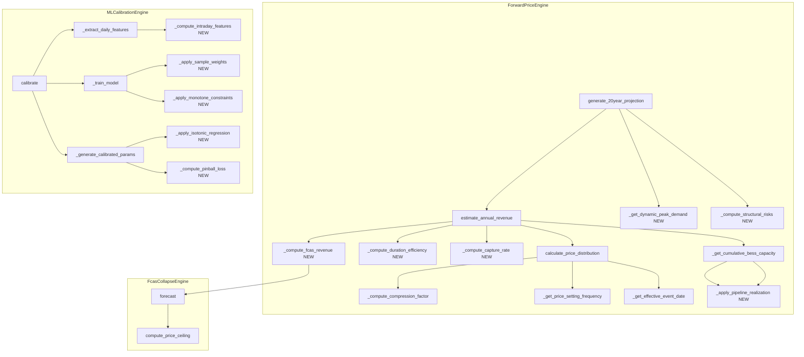
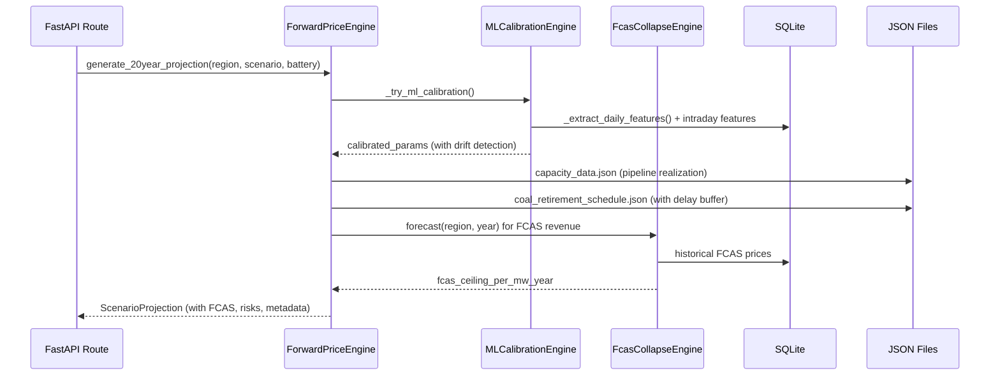

# Design Document: Forward Model Accuracy Upgrade

## Overview

本设计文档描述 ForwardPriceEngine 和 MLCalibrationEngine 的精度升级方案。升级涵盖 10 个需求模块，核心目标是将模型输出与 Modo Energy 基准数据的偏差控制在 ≤30% 以内。

**设计原则：**
- 所有修改保持 API 契约向后兼容（新增字段为 Optional）
- ML 降级机制不变（校准失败时回退到规则模型默认值）
- 数学不变量通过 Hypothesis 属性测试保证
- 模块化设计，各需求独立可测试

**影响范围：**
- `backend/engines/forward_price_engine.py` — 主引擎（Req 1-8）
- `backend/engines/ml_calibration_engine.py` — ML 校准（Req 3, 9, 10）
- `backend/models/forward_price_models.py` — 数据模型扩展
- `data/capacity_data.json` — 容量数据（读取，不修改结构）

## Architecture



**数据流：**



## Components and Interfaces

### 1. ForwardPriceEngine 扩展

#### 1.1 FCAS 收入集成 (Req 1)

```python
def _compute_fcas_revenue(
    self,
    region: str,
    year: int,
    battery: BatterySpecs,
) -> FcasRevenueComponent:
    """计算指定年份的 FCAS 收入分量。
    
    调用 FcasCollapseEngine.forecast() 获取价格天花板，
    乘以电池容量和参与率得到年度 FCAS 收入。
    
    降级策略：计算失败时返回 revenue=0.0, degraded=True。
    """
```

**新增数据模型：**
```python
class FcasRevenueComponent(BaseModel):
    year: int
    fcas_revenue_per_mw: float = Field(ge=0.0)
    degraded: bool = False
    ceiling_per_mw_year: float = Field(ge=0.0)
```

#### 1.2 Capture Rate 更新 (Req 2)

```python
def _compute_capture_rate(
    self,
    compression_factor: float,
    year: int,
    bess_capacity_ratio: float,
    fleet_size: int,
) -> float:
    """计算更新后的 capture_rate。
    
    公式: capture_rate = BASE_CAPTURE_RATE × compression^0.5 
                        × autobidder_decay(year) × fleet_size_factor
    
    约束: capture_rate ∈ [0.10, 0.55]
    当 bess_capacity_ratio > 0.30 时: capture_rate ≤ 0.40
    """

def _autobidder_decay(self, year: int) -> float:
    """Autobidder 竞争衰减函数。
    
    逻辑斯蒂衰减: decay = 0.7 + 0.3 / (1 + exp(0.3 * (year - 2028)))
    范围: [0.7, 1.0]，单调递减。
    """

def _fleet_size_factor(self, fleet_size: int) -> float:
    """Fleet size 额外衰减因子。
    
    公式: factor = 1.0 / (1 + 0.02 * max(0, fleet_size - 5))
    5 个以下项目无额外衰减。
    """
```

**常量更新：**
```python
BASE_CAPTURE_RATE: float = 0.55  # 从 0.65 降至 0.55
```

#### 1.3 BESS 容量管道建模 (Req 4)

```python
PIPELINE_REALIZATION_RATES: Dict[str, float] = {
    "registered": 0.90,
    "construction": 0.90,
    "committed": 0.90,
    "proposed": 0.50,
    "speculated": 0.20,
}

def _apply_pipeline_realization(
    self,
    capacity_mw: float,
    status: str,
) -> float:
    """对项目容量应用管道实现率加权。
    
    未知 status 使用 20% 默认实现率并记录警告。
    """
```

#### 1.4 动态需求增长 (Req 5)

```python
DEMAND_GROWTH_BASE_YEAR: int = 2025
DEMAND_GROWTH_RATE: float = 0.025  # 2.5%/年

def _get_dynamic_peak_demand(
    self,
    region: str,
    year: int,
    annual_growth_rate: float = 0.025,
) -> float:
    """计算动态峰值需求。
    
    公式: peak_demand(year) = base × (1 + rate)^(year - 2025)
    约束: 不低于当前静态 PEAK_DEMAND 值
    参数范围: annual_growth_rate ∈ [0.0, 0.10]
    """
```

#### 1.5 煤电退役延期缓冲 (Req 6)

修改 `_get_effective_event_date()` 方法：

| 情景 | 煤电退役调整 | 当前逻辑 | 新逻辑 |
|------|-------------|---------|--------|
| Central | 延后 | 不调整 | **延后 2 年** |
| High | 提前 | 提前 2 年 | 提前 2 年（不变） |
| Low | 延后 | 延后 3 年 | **延后 4 年** |

#### 1.6 Duration 非线性效应 (Req 7)

```python
def _compute_duration_efficiency(
    self,
    duration_hours: float,
) -> float:
    """计算有效时长因子（替代线性 duration_hours）。
    
    公式: 
      - duration ≤ 12h: factor = duration^0.85
      - duration > 12h: factor = 12^0.85 × (duration/12)^0.75
    
    不变量: 单调递增
    """
```

#### 1.7 市场改革风险标注 (Req 8)

```python
def _compute_structural_risks(self, year: int) -> List[str]:
    """生成结构性市场改革风险列表。
    
    - year > 2028: 添加 Nelson Review 风险
    - 始终返回列表（可能为空），不返回 null
    """
```

**模型扩展：**
```python
class AnnualRevenueProjection(BaseModel):
    # ... 现有字段 ...
    fcas_revenue_per_mw: Optional[float] = None
    structural_risks: List[str] = Field(default_factory=list)
    effective_peak_demand: Optional[float] = None
    duration_efficiency_factor: Optional[float] = None
```

### 2. MLCalibrationEngine 扩展

#### 2.1 Concept Drift 修复 (Req 3)

```python
def _compute_sample_weights(self, records: List[dict]) -> np.ndarray:
    """计算时间衰减样本权重。
    
    策略:
    - 最近 12 个月: weight = 1.0
    - 12-24 个月: weight = 0.5
    - 24 个月以前: weight = 0.2
    """

def _detect_extrapolation(
    self,
    current_bess_ratio: float,
    train_max_ratio: float,
) -> bool:
    """检测 bess_capacity_ratio 是否超出训练集范围。"""

def _compute_regime_indicator(self, bess_ratio: float) -> str:
    """计算渗透率区间标识。
    
    - low: < 5%
    - medium: 5-15%
    - high: > 15%
    """
```

**LightGBM 参数更新：**
```python
# 新增 monotone_constraints（bess_capacity_ratio 列索引对应 -1）
base_params["monotone_constraints"] = [0, 0, 0, 0, 0, 0, -1, 0, 0, 0, 0]
```

#### 2.2 Quantile Regression 改进 (Req 9)

```python
def _apply_isotonic_regression(
    self,
    predictions_p10: np.ndarray,
    predictions_p50: np.ndarray,
    predictions_p90: np.ndarray,
) -> tuple[np.ndarray, np.ndarray, np.ndarray]:
    """Isotonic Regression 后处理消除 quantile crossing。
    
    确保: P10 ≤ P50 ≤ P90 对所有样本成立。
    最小区间宽度: P90 - P10 ≥ 20 AUD/MWh。
    """

def _compute_pinball_loss(
    self,
    y_true: np.ndarray,
    y_pred: np.ndarray,
    alpha: float,
) -> float:
    """计算 pinball loss 指标。
    
    pinball(y, q, α) = α × max(y - q, 0) + (1-α) × max(q - y, 0)
    """

def _sqr_averaging(
    self,
    region_predictions: Dict[str, np.ndarray],
) -> np.ndarray:
    """Simple Quantile Regression Averaging 集成预测。"""
```

#### 2.3 日内粒度特征 (Req 10)

```python
def _compute_intraday_features(
    self,
    table_name: str,
    region: str,
) -> List[dict]:
    """计算日内价格结构特征。
    
    新增特征:
    - evening_solar_spread: 17:00-21:00 均价 - 10:00-14:00 均价
    - morning_ramp_spread: 06:00-09:00 均价 - 00:00-05:00 均价
    
    使用前一天值作为滞后特征以消除数据泄漏。
    interval_count < 48 时设为 0.0 并标记 incomplete_intraday。
    """
```

**特征列表更新：**
```python
feature_cols = [
    "lag_1_avg_price",
    "lag_1_spike_ratio",
    "day_of_week",
    "month_sin",
    "month_cos",
    "is_weekend",
    "bess_capacity_ratio",
    "lag_1_spread",
    "lag_7_spread",
    "rolling_7d_volatility",
    "region_encoded",
    "lag_1_evening_solar_spread",   # NEW
    "lag_1_morning_ramp_spread",    # NEW
]
```

## Data Models

### 扩展的 Pydantic 模型

```python
# forward_price_models.py 扩展

class FcasRevenueComponent(BaseModel):
    """FCAS 收入分量（独立于能量套利）。"""
    year: int
    fcas_revenue_per_mw: float = Field(ge=0.0, description="FCAS 年收入 $/MW")
    ceiling_per_mw_year: float = Field(ge=0.0, description="FCAS 价格天花板 $/MW/yr")
    degraded: bool = Field(default=False, description="是否降级（计算失败时为 True）")


class AnnualRevenueProjection(BaseModel):
    """单年收入预测（扩展版）。"""
    year: int
    estimated_revenue_per_mw: float
    state_of_health: float
    mean_spread: float
    capture_rate: float
    # --- 新增可选字段（向后兼容）---
    fcas_revenue_per_mw: Optional[float] = None
    structural_risks: List[str] = Field(default_factory=list)
    effective_peak_demand: Optional[float] = None
    duration_efficiency_factor: Optional[float] = None
    autobidder_decay: Optional[float] = None


class ScenarioProjection(BaseModel):
    """单情景 20 年收入预测（扩展版）。"""
    scenario: ScenarioType
    region: str
    annual_projections: List[AnnualRevenueProjection]
    total_revenue_per_mw: float
    npv_per_mw: float
    # --- 新增可选字段 ---
    metadata: Optional[Dict[str, Any]] = None  # 包含 structural_risks 等


class CalibrationMetadata(BaseModel):
    """ML 校准元数据（扩展版）。"""
    status: str
    # ... 现有字段 ...
    # --- 新增字段 ---
    regime_indicator: Optional[str] = None  # "low" | "medium" | "high"
    extrapolation_warning: Optional[bool] = None
    concept_drift_detected: Optional[bool] = None
    pinball_loss: Optional[Dict[str, float]] = None  # {"p10": x, "p50": y, "p90": z}
```

### 常量变更汇总

| 常量 | 当前值 | 新值 | 需求 |
|------|--------|------|------|
| `BASE_CAPTURE_RATE` | 0.65 | 0.55 | Req 2 |
| Central 煤电退役调整 | 0 年 | +2 年 | Req 6 |
| Low 煤电退役调整 | +3 年 | +4 年 | Req 6 |
| Duration 乘数 | 线性 | `d^0.85` | Req 7 |


## Correctness Properties

*A property is a characteristic or behavior that should hold true across all valid executions of a system — essentially, a formal statement about what the system should do. Properties serve as the bridge between human-readable specifications and machine-verifiable correctness guarantees.*

### Property 1: FCAS 收入随 BESS 容量单调递减

*For any* region and any two BESS capacity values cap1 < cap2（其他参数相同），ForwardPriceEngine 计算的 FCAS 年收入在 cap1 时应 ≥ cap2 时的值。

**Validates: Requirements 1.3**

### Property 2: Capture Rate 公式正确性

*For any* valid inputs (compression_factor ∈ [0.05, 1.0], year ∈ [2025, 2050], bess_capacity_ratio ∈ [0, 1], fleet_size ∈ [0, 100])，`_compute_capture_rate` 的输出应等于 `0.55 × compression^0.5 × autobidder_decay(year) × fleet_size_factor(fleet_size)` 再 clamp 到有效范围。

**Validates: Requirements 2.1, 2.2**

### Property 3: Capture Rate 子函数单调递减

*For any* year1 < year2，`autobidder_decay(year1) >= autobidder_decay(year2)` 且值在 [0.7, 1.0] 范围内。*For any* fleet_size1 < fleet_size2，`fleet_size_factor(fleet_size1) >= fleet_size_factor(fleet_size2)`。

**Validates: Requirements 2.3, 2.5**

### Property 4: Capture Rate 边界约束

*For any* valid inputs，capture_rate 始终在 [0.10, 0.55] 范围内。当 bess_capacity_ratio > 0.30 时，capture_rate ≤ 0.40。

**Validates: Requirements 2.4, 2.6**

### Property 5: ML 样本权重时间衰减

*For any* 训练记录，其样本权重应满足：距今 ≤12 个月 → weight=1.0，12-24 个月 → weight=0.5，>24 个月 → weight=0.2。

**Validates: Requirements 3.1**

### Property 6: 渗透率区间分类正确性

*For any* bess_capacity_ratio 值，regime_indicator 应满足：ratio < 0.05 → "low"，0.05 ≤ ratio ≤ 0.15 → "medium"，ratio > 0.15 → "high"。

**Validates: Requirements 3.4**

### Property 7: 管道实现率加权容量

*For any* 项目集合（每个项目有 capacity_mw 和 status），加权后的总容量应等于 Σ(capacity_mw × realization_rate(status))，其中 registered/construction/committed → 0.90，proposed → 0.50，speculated → 0.20，unknown → 0.20。

**Validates: Requirements 4.1, 4.3, 4.5**

### Property 8: 累计加权容量时间单调性

*For any* region 和 scenario，累计加权 BESS 容量随年份单调非递减（year1 < year2 → cumulative(year1) ≤ cumulative(year2)）。

**Validates: Requirements 4.4**

### Property 9: 动态峰值需求公式与下界

*For any* region、year ≥ 2025 和 annual_growth_rate ∈ [0.0, 0.10]，动态峰值需求应等于 `PEAK_DEMAND[region] × (1 + rate)^(year - 2025)` 且不低于静态 `PEAK_DEMAND[region]` 值。

**Validates: Requirements 5.1, 5.3**

### Property 10: 煤电退役日期情景调整

*For any* 煤电退役事件，Central 情景的有效日期应为 original_date + 2 年，High 情景为 original_date - 2 年，Low 情景为 original_date + 4 年。

**Validates: Requirements 6.1, 6.2, 6.3**

### Property 11: 调整后事件日期不早于今天

*For any* 事件和情景组合，`_get_effective_event_date` 返回的日期不早于当前日期。

**Validates: Requirements 6.4**

### Property 12: Duration 效率因子公式

*For any* duration_hours > 0，duration_efficiency_factor 应满足：duration ≤ 12 时等于 `duration^0.85`，duration > 12 时等于 `12^0.85 × (duration/12)^0.75`。

**Validates: Requirements 7.1, 7.2, 7.5**

### Property 13: Duration 效率因子单调递增

*For any* duration1 < duration2（均 > 0），`duration_efficiency_factor(duration1) < duration_efficiency_factor(duration2)`。

**Validates: Requirements 7.3**

### Property 14: 结构性风险条件包含

*For any* year > 2028，`_compute_structural_risks(year)` 返回的列表应包含 Nelson Review 相关风险描述。*For any* year ≤ 2028，返回空列表（非 null）。

**Validates: Requirements 8.2, 8.4**

### Property 15: 分位数排序不变量

*For any* 预测样本集合，经过 Isotonic Regression 后处理后，P10[i] ≤ P50[i] ≤ P90[i] 对所有 i 成立。

**Validates: Requirements 9.1, 9.2**

### Property 16: 最小分位数区间宽度

*For any* 预测样本，经过后处理后 P90 - P10 ≥ 20 AUD/MWh。

**Validates: Requirements 9.5**

### Property 17: Pinball Loss 公式正确性

*For any* (y_true, y_pred, alpha ∈ (0,1))，pinball_loss 应等于 `α × max(y_true - y_pred, 0) + (1-α) × max(y_pred - y_true, 0)`。

**Validates: Requirements 9.4**

### Property 18: 日内价差特征计算

*For any* 有效的半小时价格序列（≥48 个间隔），evening_solar_spread 应等于 avg(17:00-21:00 价格) - avg(10:00-14:00 价格)，morning_ramp_spread 应等于 avg(06:00-09:00 价格) - avg(00:00-05:00 价格)。

**Validates: Requirements 10.1, 10.2**

### Property 19: 滞后特征时序正确性

*For any* 连续两天的记录 (day_n-1, day_n)，lag_1_evening_solar_spread[day_n] 应等于 evening_solar_spread[day_n-1]，lag_1_morning_ramp_spread[day_n] 同理。

**Validates: Requirements 10.3**


## Error Handling

### ML 降级策略

| 失败场景 | 行为 | 影响 |
|---------|------|------|
| LightGBM 导入失败 | 使用规则模型默认参数 | 无 ML 校准 |
| 训练数据不足 (<90 天) | 返回空校准结果 | 使用默认 BASE_SPREAD_PARAMS |
| 验证质量不足 (R² < 0.3) | 丢弃模型，标记 quality_insufficient | 使用默认参数 |
| Concept drift 检测 | 降低校准权重至 0.5 | 部分使用 ML 校准 |
| Quantile crossing | Isotonic Regression 修正 | 自动修复 |
| 外推警告 | 标记 extrapolation_warning | 继续使用但标注风险 |

### FCAS 收入降级

```python
try:
    fcas_revenue = self._compute_fcas_revenue(region, year, battery)
except Exception as e:
    logger.warning(f"FCAS revenue computation failed: {e}")
    fcas_revenue = FcasRevenueComponent(
        year=year,
        fcas_revenue_per_mw=0.0,
        ceiling_per_mw_year=0.0,
        degraded=True,
    )
```

### 输入验证

| 参数 | 有效范围 | 超出行为 |
|------|---------|---------|
| annual_growth_rate | [0.0, 0.10] | 拒绝，使用默认 0.025 |
| duration_hours | > 0 | ValueError |
| bess_capacity_ratio | ≥ 0 | clamp to 0 |
| convergence_factor | [0.05, 0.30] | ValueError |
| gamma | > 0 | 使用默认 0.85 |

### API 向后兼容保证

所有新增字段使用 `Optional` 类型和 `default_factory`：
- 现有 API 消费者不会因缺少新字段而报错
- 新字段仅在显式请求或计算成功时填充
- `structural_risks` 默认为空列表 `[]`，不为 `null`

## Testing Strategy

### 属性测试 (Property-Based Testing with Hypothesis)

**库选择：** Hypothesis（已在项目中使用，见 `.hypothesis/` 目录）

**配置：** 每个属性测试最少 100 次迭代。

**标签格式：** `Feature: forward-model-accuracy-upgrade, Property {N}: {description}`

#### 属性测试覆盖

| Property | 测试目标函数 | 生成器策略 |
|----------|-------------|-----------|
| 1 | `_compute_fcas_revenue` | `st.floats(0.0, 2.0)` for capacity ratios |
| 2 | `_compute_capture_rate` | `st.floats(0.05, 1.0)` × `st.integers(2025, 2050)` × `st.floats(0, 1)` × `st.integers(0, 100)` |
| 3 | `_autobidder_decay`, `_fleet_size_factor` | `st.integers(2025, 2060)` pairs, `st.integers(0, 200)` pairs |
| 4 | `_compute_capture_rate` | 同 Property 2，重点 bess_ratio > 0.30 |
| 5 | `_compute_sample_weights` | `st.dates()` with various offsets |
| 6 | `_compute_regime_indicator` | `st.floats(0.0, 0.5)` |
| 7 | `_apply_pipeline_realization` | `st.lists(st.tuples(st.floats(1, 1000), st.sampled_from(statuses)))` |
| 8 | `_get_cumulative_bess_capacity` | 随机项目时间线 |
| 9 | `_get_dynamic_peak_demand` | `st.sampled_from(regions)` × `st.integers(2025, 2050)` × `st.floats(0, 0.10)` |
| 10 | `_get_effective_event_date` | 随机煤电事件 × `st.sampled_from(scenarios)` |
| 11 | `_get_effective_event_date` | 同 Property 10，验证下界 |
| 12 | `_compute_duration_efficiency` | `st.floats(0.5, 24.0)` |
| 13 | `_compute_duration_efficiency` | `st.floats(0.5, 24.0)` pairs |
| 14 | `_compute_structural_risks` | `st.integers(2025, 2060)` |
| 15 | `_apply_isotonic_regression` | `st.lists(st.tuples(st.floats, st.floats, st.floats))` |
| 16 | `_apply_isotonic_regression` | 同 Property 15 |
| 17 | `_compute_pinball_loss` | `st.floats(-100, 500)` × `st.floats(-100, 500)` × `st.floats(0.01, 0.99)` |
| 18 | `_compute_intraday_features` | `st.lists(st.floats(-100, 500), min_size=48, max_size=288)` |
| 19 | `_add_lag_features` (intraday) | 多天随机数据序列 |

### 单元测试 (Example-Based)

| 测试场景 | 验证内容 |
|---------|---------|
| BASE_CAPTURE_RATE 常量 | 值为 0.55 |
| 默认参数 | base_year=2025, growth_rate=0.025 |
| High 情景煤电退役 | 提前 2 年（无变化） |
| ScenarioDefinition.assumptions | 包含延期缓冲描述 |
| Duration 具体值 | 2h≈1.81, 4h≈3.28, 8h≈5.93 |
| metadata 结构 | 包含 structural_risks, effective_peak_demand |
| SQR Averaging | 多区域预测平均值正确 |
| 现有特征不变 | 新增特征不影响已有特征计算 |

### 集成测试

| 测试场景 | 验证内容 |
|---------|---------|
| ML 校准失败降级 | ForwardPriceEngine 正常运行，使用默认参数 |
| FCAS 引擎集成 | ForwardPriceEngine 正确调用 FcasCollapseEngine |
| Concept drift 检测 | val_MAE > 2×train_MAE 时触发警告 |
| 基准验证 | 与 Modo Energy 数据偏差 ≤30% |
| 外推警告 | bess_ratio 超出训练范围时标注 |

### 边界测试

| 边界条件 | 预期行为 |
|---------|---------|
| FCAS 计算异常 | revenue=0, degraded=True |
| 未知 project status | 20% 实现率 + 警告日志 |
| growth_rate 超出 [0, 0.10] | 拒绝，使用 0.025 |
| structural_risks 为空 | 返回 `[]` 非 `null` |
| interval_count < 48 | 日内特征=0.0, incomplete_intraday=True |
| duration_hours = 0 | ValueError |

### 基准回归测试

```python
def test_modo_benchmark_deviation():
    """确保模型输出与 Modo Energy 基准偏差 ≤30%。"""
    engine = ForwardPriceEngine()
    result = engine.validate_against_benchmarks()
    assert result["all_within_threshold"] is True
    assert result["max_deviation_pct"] <= 30.0
```
