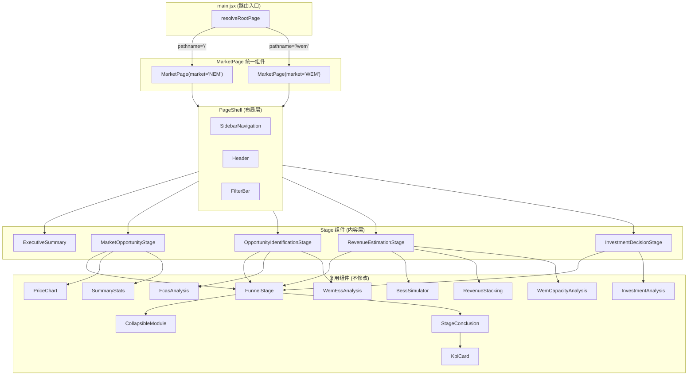
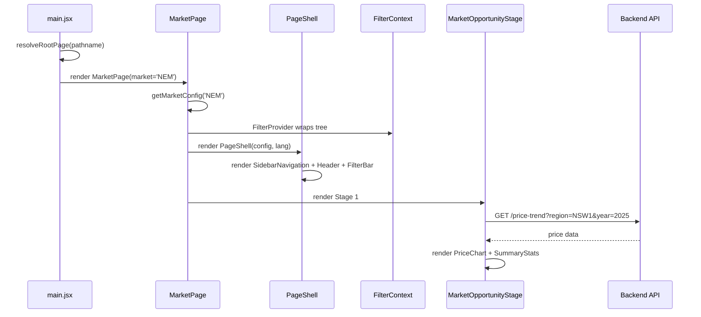
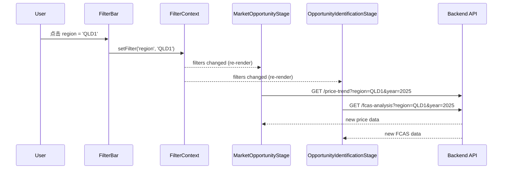

# Design Document: Frontend Rewrite

## Overview

本设计文档描述了 NEM/WEM 前端页面的完整重写方案。核心目标是将 `App.jsx`（1000+ 行）和 `WemPage.jsx` 合并为一个统一的 `MarketPage` 组件，通过 `marketConfig` 驱动市场差异化渲染。

重写遵循三个核心原则：**配置驱动**（市场差异由配置对象决定，而非代码分支）、**阶段自治**（每个 Stage 组件独立获取数据、管理状态）、**组件复用**（保留已验证的 funnel 组件和分析组件，仅改变编排方式）。

最终产出是一个 < 200 行的 `MarketPage` 编排器，4 个独立的 Stage 组件，以及提取出的 `PageShell` 和 `FilterBar` 布局组件。

## Architecture



## Sequence Diagrams

### 页面初始化流程



### 筛选器变更流程



## Components and Interfaces

### Component 1: MarketPage

**Purpose**: 统一的市场页面编排器。根据 `market` prop 加载对应配置，渲染 PageShell + 4 个 Stage 组件。不包含任何数据获取逻辑。

**Interface**:
```javascript
/**
 * @param {Object} props
 * @param {'NEM'|'WEM'} props.market - 市场标识符
 */
function MarketPage({ market })
```

**Responsibilities**:
- 从 `marketConfig` 获取市场配置
- 管理语言状态 (lang)
- 渲染 PageShell（传入 config + sectionLinks）
- 按顺序渲染 ExecutiveSummary + 4 个 Stage 组件
- 协调 scroll-spy（activeSection 状态）
- 处理 KPI 点击跳转

### Component 2: PageShell

**Purpose**: 布局外壳，包含侧边栏导航 + 页面头部 + 筛选器栏。纯布局组件，不包含业务逻辑。

**Interface**:
```javascript
/**
 * @param {Object} props
 * @param {Object} props.config - marketConfig 对象
 * @param {Array} props.sectionLinks - 侧边栏导航链接
 * @param {string} props.activeSection - 当前活动 section
 * @param {Function} props.onSectionClick - section 点击回调
 * @param {string} props.lang - 当前语言
 * @param {Function} props.onLangToggle - 语言切换回调
 * @param {React.ReactNode} props.children - 页面内容
 */
function PageShell({ config, sectionLinks, activeSection, onSectionClick, lang, onLangToggle, children })
```

**Responsibilities**:
- 渲染 SidebarNavigation（传入 activePage、sectionLinks）
- 渲染页面 Header（市场名称、结算间隔、时区）
- 渲染 FilterBar
- 提供 main content 区域（children slot）

### Component 3: FilterBar

**Purpose**: 提取的筛选器控件组件。渲染年份选择器、季度、日类型、月份筛选按钮。通过 FilterContext 读写状态。

**Interface**:
```javascript
/**
 * @param {Object} props
 * @param {Object} props.config - marketConfig 对象（决定可用 regions）
 * @param {Array<number>} props.years - 可用年份列表
 * @param {string} props.lang - 当前语言
 */
function FilterBar({ config, years, lang })
```

**Responsibilities**:
- 渲染 region 选择器（NEM: 5 个 region，WEM: 固定 'WEM'）
- 渲染年份按钮组
- 渲染季度筛选器
- 渲染日类型筛选器（工作日/周末/全部）
- 渲染月份筛选器（可折叠）
- 所有状态通过 `useFilters()` hook 读写

### Component 4: MarketOpportunityStage

**Purpose**: Stage 1 — 市场机会评估。获取价格数据，渲染 PriceChart + SummaryStats + HourlyDistributionChart。

**Interface**:
```javascript
/**
 * @param {Object} props
 * @param {Object} props.config - marketConfig 对象
 * @param {Object} props.conclusionData - stage-summary API 返回的结论数据
 * @param {boolean} props.isLoading - 结论数据加载中
 * @param {Function} props.onVisible - scroll-spy 回调
 * @param {string} props.lang - 当前语言
 */
function MarketOpportunityStage({ config, conclusionData, isLoading, onVisible, lang })
```

**Responsibilities**:
- 从 FilterContext 读取 region/year/quarter/dayType
- 调用 `/price-trend` API 获取价格数据
- 渲染 FunnelStage 容器（stageNumber=1）
- 根据 config.stages['market-opportunity'].modules 渲染对应模块
- 管理 visibleChartData 状态（窗口选择）

### Component 5: OpportunityIdentificationStage

**Purpose**: Stage 2 — 机会识别。NEM 渲染 FCAS + ChargingWindow + GridForecast，WEM 渲染 ESS。

**Interface**:
```javascript
/**
 * @param {Object} props
 * @param {Object} props.config - marketConfig 对象
 * @param {Object} props.conclusionData - stage-summary 结论数据
 * @param {boolean} props.isLoading - 结论数据加载中
 * @param {Function} props.onVisible - scroll-spy 回调
 * @param {string} props.lang - 当前语言
 */
function OpportunityIdentificationStage({ config, conclusionData, isLoading, onVisible, lang })
```

**Responsibilities**:
- 根据 config.stages['opportunity-identification'].modules 决定渲染哪些模块
- NEM: PeakAnalysis, FcasAnalysis, ChargingWindow, GridForecast
- WEM: WemEssAnalysis
- 每个模块包裹在 CollapsibleModule 中

### Component 6: RevenueEstimationStage

**Purpose**: Stage 3 — 收入估算。NEM 渲染 BessSimulator + RevenueStacking + CycleCost，WEM 渲染 WemCapacityAnalysis。

**Interface**:
```javascript
/**
 * @param {Object} props
 * @param {Object} props.config - marketConfig 对象
 * @param {Object} props.conclusionData - stage-summary 结论数据
 * @param {boolean} props.isLoading - 结论数据加载中
 * @param {Function} props.onVisible - scroll-spy 回调
 * @param {string} props.lang - 当前语言
 */
function RevenueEstimationStage({ config, conclusionData, isLoading, onVisible, lang })
```

### Component 7: InvestmentDecisionStage

**Purpose**: Stage 4 — 投资决策。渲染 InvestmentAnalysis + ReportPreview。

**Interface**:
```javascript
/**
 * @param {Object} props
 * @param {Object} props.config - marketConfig 对象
 * @param {Object} props.conclusionData - stage-summary 结论数据
 * @param {boolean} props.isLoading - 结论数据加载中
 * @param {Function} props.onVisible - scroll-spy 回调
 * @param {string} props.lang - 当前语言
 */
function InvestmentDecisionStage({ config, conclusionData, isLoading, onVisible, lang })
```

## Data Models

### MarketConfig (扩展)

```javascript
/**
 * 扩展后的 marketConfig 结构，新增 stages 字段
 */
const MARKET_CONFIGS = {
  NEM: {
    id: 'NEM',
    label: '国家电力市场 (NEM)',
    regions: ['NSW1', 'QLD1', 'VIC1', 'SA1', 'TAS1'],
    settlementIntervalMinutes: 5,
    timezone: 'Australia/Sydney',
    timezoneLabel: 'AEST',
    currency: 'AUD',
    ancillaryServiceType: 'FCAS',
    ancillaryServices: [...],
    defaultRegion: 'NSW1',
    path: '/',
    // 新增：阶段模块配置
    stages: {
      'market-opportunity': {
        modules: ['PriceChart', 'SummaryStats', 'HourlyDistributionChart'],
      },
      'opportunity-identification': {
        modules: ['PeakAnalysis', 'FcasAnalysis', 'ChargingWindow', 'GridForecast'],
      },
      'revenue-estimation': {
        modules: ['BessSimulator', 'RevenueStacking', 'CycleCost'],
      },
      'investment-decision': {
        modules: ['InvestmentAnalysis', 'ReportPreview'],
      },
    },
  },
  WEM: {
    id: 'WEM',
    label: '西澳电力市场 (WEM)',
    regions: ['WEM'],
    settlementIntervalMinutes: 30,
    timezone: 'Australia/Perth',
    timezoneLabel: 'AWST',
    currency: 'AUD',
    ancillaryServiceType: 'ESS',
    ancillaryServices: [...],
    defaultRegion: 'WEM',
    path: '/wem',
    // 新增：阶段模块配置
    stages: {
      'market-opportunity': {
        modules: ['PriceChart', 'SummaryStats'],
      },
      'opportunity-identification': {
        modules: ['WemEssAnalysis'],
      },
      'revenue-estimation': {
        modules: ['WemCapacityAnalysis'],
      },
      'investment-decision': {
        modules: ['InvestmentAnalysis'],
      },
    },
  },
};
```

**Validation Rules**:
- `stages` 对象必须包含全部 4 个 stage key
- 每个 stage 的 `modules` 数组至少包含 1 个模块
- 模块名必须对应已注册的组件标识符

### Stage 定义常量

```javascript
/**
 * 4 阶段决策漏斗定义（双语）
 */
const STAGE_DEFINITIONS = [
  {
    id: 'market-opportunity',
    number: 1,
    title: { zh: '市场机会评估', en: 'Market Opportunity Assessment' },
    coreQuestion: { zh: '市场是否存在套利机会？规模多大？', en: 'Is there arbitrage opportunity? How big?' },
  },
  {
    id: 'opportunity-identification',
    number: 2,
    title: { zh: '机会识别', en: 'Opportunity Identification' },
    coreQuestion: { zh: '何时交易？哪些时段？哪些服务？', en: 'When to trade? Which slots? Which services?' },
  },
  {
    id: 'revenue-estimation',
    number: 3,
    title: { zh: '收入估算', en: 'Revenue Estimation' },
    coreQuestion: { zh: '电池能赚多少？扣除成本后呢？', en: 'How much can a battery earn? After costs?' },
  },
  {
    id: 'investment-decision',
    number: 4,
    title: { zh: '投资决策', en: 'Investment Decision' },
    coreQuestion: { zh: '项目是否值得投资？NPV/IRR/回收期？', en: 'Is the project worth investing? NPV/IRR/payback?' },
  },
];
```

### BESS 默认参数

```javascript
const DEFAULT_BESS_PARAMS = {
  power_mw: 100,
  duration_hours: 4,
  round_trip_efficiency: 0.87,
  variable_om_per_mwh: 2.5,
};
```

## File Structure

```
web/src/
├── main.jsx                          (修改: 用 MarketPage 替换 App/WemPage)
├── App.jsx                           (删除)
├── pages/
│   ├── MarketPage.jsx                (新建: ~200 行，统一编排器)
│   ├── WemPage.jsx                   (删除)
│   ├── FinlandPage.jsx               (保留)
│   ├── FingridPage.jsx               (保留)
│   ├── DeveloperPortalPage.jsx       (保留)
│   └── stages/
│       ├── MarketOpportunityStage.jsx      (新建: ~150 行)
│       ├── OpportunityIdentificationStage.jsx (新建: ~120 行)
│       ├── RevenueEstimationStage.jsx      (新建: ~120 行)
│       └── InvestmentDecisionStage.jsx     (新建: ~100 行)
├── components/
│   ├── PageShell.jsx                 (新建: ~80 行)
│   ├── FilterBar.jsx                 (新建: ~120 行)
│   ├── SidebarNavigation.jsx         (保留)
│   ├── PriceChart.jsx                (保留)
│   ├── SummaryStats.jsx              (保留)
│   ├── FcasAnalysis.jsx              (保留)
│   ├── InvestmentAnalysis.jsx        (保留)
│   ├── BessSimulator.jsx             (保留)
│   ├── RevenueStacking.jsx           (保留)
│   ├── funnel/                       (全部保留)
│   │   ├── KpiCard.jsx
│   │   ├── FunnelStage.jsx
│   │   ├── StageConclusion.jsx
│   │   ├── CollapsibleModule.jsx
│   │   └── ExecutiveSummary.jsx
│   └── wem/                          (保留)
│       ├── WemEssAnalysis.jsx
│       └── WemCapacityAnalysis.jsx
├── hooks/
│   ├── useMarketData.js              (新建: 价格数据获取 hook)
│   └── useStageSummaries.js          (新建: 4 阶段结论获取 hook)
├── contexts/
│   └── FilterContext.jsx             (保留)
├── lib/
│   ├── marketConfig.js               (修改: 新增 stages 配置)
│   ├── pageRouter.js                 (保留)
│   ├── apiClient.js                  (保留)
│   └── apiBase.js                    (保留)
└── translations.js                   (保留)
```

## Key Functions with Formal Specifications

### Function 1: MarketPage (组件渲染)

```javascript
function MarketPage({ market }) {
  const config = getMarketConfig(market);
  // ... orchestration logic
}
```

**Preconditions:**
- `market` 是 'NEM' 或 'WEM'
- `getMarketConfig(market)` 返回有效配置对象
- FilterContext Provider 已在组件树上层

**Postconditions:**
- 渲染 PageShell + ExecutiveSummary + 4 个 Stage 组件
- 每个 Stage 组件接收正确的 config 和 conclusionData
- scroll-spy 正确追踪当前可见 stage

**Loop Invariants:** N/A

### Function 2: useStageSummaries(market, region, year, bessParams)

```javascript
/**
 * 并行获取 4 个 stage 的 summary 数据
 * @returns {{ summaries: Object, loading: Object, fetchAll: Function }}
 */
function useStageSummaries(market, region, year, bessParams)
```

**Preconditions:**
- `market` 是有效市场 ID
- `region` 是该市场的有效 region
- `year` 是正整数
- `bessParams` 包含 power_mw, duration_hours, round_trip_efficiency

**Postconditions:**
- 返回 `summaries` 对象，key 为 stageId，value 为 API 响应或 null
- 返回 `loading` 对象，key 为 stageId，value 为 boolean
- 任一 stage 请求失败不影响其他 stage
- 参数变化时自动重新获取

**Loop Invariants:**
- 在获取过程中，`loading[stageId] === true` 当且仅当该 stage 的请求尚未完成

### Function 3: useMarketData(config, filters)

```javascript
/**
 * 获取市场价格数据，支持窗口选择
 * @returns {{ chartData, visibleData, loading, error, onWindowChange }}
 */
function useMarketData(config, filters)
```

**Preconditions:**
- `config` 是有效的 marketConfig 对象
- `filters` 包含 region, year, quarter, dayType
- `config.settlementIntervalMinutes` 是正整数

**Postconditions:**
- `chartData` 包含完整价格时间序列或 null
- `visibleData` 是 chartData 的子集（窗口选择后）
- `loading` 在请求进行中为 true
- `error` 在请求失败时包含错误消息
- API 请求使用 config.settlementIntervalMinutes 作为 interval 参数

**Loop Invariants:** N/A

### Function 4: resolveStageModules(config, stageId)

```javascript
/**
 * 根据市场配置解析某个 stage 应渲染的模块列表
 * @returns {Array<{ id: string, Component: React.LazyComponent, props: Object }>}
 */
function resolveStageModules(config, stageId)
```

**Preconditions:**
- `config.stages[stageId]` 存在且包含 `modules` 数组
- 每个 module name 在 MODULE_REGISTRY 中有对应条目

**Postconditions:**
- 返回数组长度等于 `config.stages[stageId].modules.length`
- 每个条目包含有效的 lazy-loaded Component
- 模块顺序与配置中的顺序一致

**Loop Invariants:**
- 遍历 modules 数组时，已处理的模块均在 MODULE_REGISTRY 中找到对应组件

## Algorithmic Pseudocode

### MarketPage 渲染算法

```javascript
function MarketPage({ market }) {
  // 1. 加载配置
  const config = getMarketConfig(market);
  
  // 2. 初始化状态
  const [lang, setLang] = useState('zh');
  const [activeSection, setActiveSection] = useState('executive-summary');
  const { filters } = useFilters();
  
  // 3. 获取可用年份
  const years = useAvailableYears();
  
  // 4. 获取 stage summaries（并行）
  const { summaries, loading } = useStageSummaries(
    config.id,
    filters.region,
    filters.year,
    DEFAULT_BESS_PARAMS
  );
  
  // 5. 构建 section links
  const sectionLinks = buildSectionLinks(STAGE_DEFINITIONS, lang);
  
  // 6. 渲染
  return (
    <PageShell
      config={config}
      sectionLinks={sectionLinks}
      activeSection={activeSection}
      onSectionClick={scrollToSection}
      lang={lang}
      onLangToggle={() => setLang(prev => prev === 'zh' ? 'en' : 'zh')}
    >
      <ExecutiveSummary
        market={config.id}
        region={filters.region}
        year={filters.year}
        bessParams={DEFAULT_BESS_PARAMS}
        onKpiClick={scrollToSection}
        lang={lang}
      />
      
      {STAGE_DEFINITIONS.map(stage => {
        const StageComponent = STAGE_COMPONENT_MAP[stage.id];
        return (
          <StageComponent
            key={stage.id}
            config={config}
            conclusionData={summaries[stage.id]}
            isLoading={loading[stage.id]}
            onVisible={setActiveSection}
            lang={lang}
          />
        );
      })}
    </PageShell>
  );
}
```

### useStageSummaries Hook 算法

```javascript
function useStageSummaries(market, region, year, bessParams) {
  const [summaries, setSummaries] = useState({});
  const [loading, setLoading] = useState({});
  
  useEffect(() => {
    if (!year) return;
    
    const stageIds = ['market-opportunity', 'opportunity-identification',
                      'revenue-estimation', 'investment-decision'];
    
    // 标记全部为 loading
    const loadingState = {};
    stageIds.forEach(id => { loadingState[id] = true; });
    setLoading(loadingState);
    
    // 并行获取
    stageIds.forEach(async (stageId) => {
      try {
        const url = `${API_BASE}/stage-summary/${market}/${region}/${stageId}?` +
          `year=${year}&bess_power_mw=${bessParams.power_mw}` +
          `&bess_duration_hours=${bessParams.duration_hours}` +
          `&bess_efficiency=${bessParams.round_trip_efficiency}`;
        
        const data = await fetchJson(url);
        setSummaries(prev => ({ ...prev, [stageId]: data }));
      } catch {
        setSummaries(prev => ({ ...prev, [stageId]: null }));
      } finally {
        setLoading(prev => ({ ...prev, [stageId]: false }));
      }
    });
  }, [market, region, year, bessParams.power_mw, bessParams.duration_hours, bessParams.round_trip_efficiency]);
  
  return { summaries, loading };
}
```

### useMarketData Hook 算法

```javascript
function useMarketData(config, filters) {
  const [chartData, setChartData] = useState(null);
  const [visibleData, setVisibleData] = useState([]);
  const [loading, setLoading] = useState(true);
  const [error, setError] = useState(null);
  
  useEffect(() => {
    if (!filters.year) return;
    setLoading(true);
    setError(null);
    
    let url = `${API_BASE}/price-trend?year=${filters.year}` +
      `&region=${filters.region}` +
      `&limit=720` +
      `&interval_minutes=${config.settlementIntervalMinutes}`;
    
    if (filters.quarter !== 'ALL') url += `&quarter=${filters.quarter}`;
    if (filters.dayType !== 'ALL') url += `&day_type=${filters.dayType}`;
    
    fetchJson(url)
      .then(data => {
        setChartData(data);
        setVisibleData(Array.isArray(data?.data) ? data.data : []);
        setLoading(false);
      })
      .catch(err => {
        setError(err.message);
        setLoading(false);
      });
  }, [filters.year, filters.region, filters.quarter, filters.dayType, config.settlementIntervalMinutes]);
  
  const onWindowChange = useCallback((data) => {
    setVisibleData(data);
  }, []);
  
  return { chartData, visibleData, loading, error, onWindowChange };
}
```

### Stage 组件渲染算法（以 OpportunityIdentificationStage 为例）

```javascript
function OpportunityIdentificationStage({ config, conclusionData, isLoading, onVisible, lang }) {
  const { filters } = useFilters();
  const stageConfig = config.stages['opportunity-identification'];
  const modules = stageConfig.modules;
  
  return (
    <FunnelStage
      stageId="opportunity-identification"
      stageNumber={2}
      title={STAGE_DEFINITIONS[1].title[lang]}
      coreQuestion={STAGE_DEFINITIONS[1].coreQuestion[lang]}
      conclusionData={conclusionData}
      isLoading={isLoading}
      onVisible={onVisible}
      lang={lang}
    >
      {modules.includes('PeakAnalysis') && (
        <CollapsibleModule moduleId="peak-analysis" title="峰值分析" defaultExpanded>
          <PeakAnalysis region={filters.region} year={filters.year} lang={lang} />
        </CollapsibleModule>
      )}
      
      {modules.includes('FcasAnalysis') && (
        <CollapsibleModule moduleId="fcas-analysis" title="FCAS 分析" defaultExpanded>
          <FcasAnalysis region={filters.region} year={filters.year} lang={lang} />
        </CollapsibleModule>
      )}
      
      {modules.includes('WemEssAnalysis') && (
        <CollapsibleModule moduleId="wem-ess-analysis" title="ESS 分析" defaultExpanded>
          <WemEssAnalysis region={filters.region} year={filters.year} lang={lang} />
        </CollapsibleModule>
      )}
      
      {modules.includes('ChargingWindow') && (
        <CollapsibleModule moduleId="charging-window" title="充电窗口">
          <ChargingWindow region={filters.region} year={filters.year} lang={lang} />
        </CollapsibleModule>
      )}
      
      {modules.includes('GridForecast') && (
        <CollapsibleModule moduleId="grid-forecast" title="电网预测">
          <GridForecast region={filters.region} year={filters.year} lang={lang} />
        </CollapsibleModule>
      )}
    </FunnelStage>
  );
}
```

## Example Usage

### main.jsx（重写后）

```javascript
import { StrictMode, Suspense, lazy } from 'react';
import { createRoot } from 'react-dom/client';
import './index.css';
import { resolveRootPage } from './lib/pageRouter.js';
import { FilterProvider } from './contexts/FilterContext';

const rootPage = resolveRootPage(globalThis.location?.pathname || '/');
const MarketPage = lazy(() => import('./pages/MarketPage.jsx'));
const FinlandPage = lazy(() => import('./pages/FinlandPage.jsx'));
const FingridPage = lazy(() => import('./pages/FingridPage.jsx'));
const DeveloperPortalPage = lazy(() => import('./pages/DeveloperPortalPage.jsx'));

function BootFallback() {
  return (
    <div className="min-h-screen bg-[var(--color-bg)] text-[var(--color-text)]">
      <div className="mx-auto flex min-h-screen max-w-5xl items-center justify-center px-6 text-sm text-[var(--color-muted)]">
        Loading workspace...
      </div>
    </div>
  );
}

// NEM 和 WEM 使用同一个 MarketPage，仅 market prop 不同
const rootElement = rootPage === 'wem'
  ? <FilterProvider><MarketPage market="WEM" /></FilterProvider>
  : rootPage === 'finland'
    ? <FinlandPage />
    : rootPage === 'fingrid'
      ? <FingridPage />
      : rootPage === 'developer'
        ? <DeveloperPortalPage />
        : <FilterProvider><MarketPage market="NEM" /></FilterProvider>;

createRoot(document.getElementById('root')).render(
  <StrictMode>
    <Suspense fallback={<BootFallback />}>
      {rootElement}
    </Suspense>
  </StrictMode>,
);
```

## Correctness Properties

*A property is a characteristic or behavior that should hold true across all valid executions of a system — essentially, a formal statement about what the system should do. Properties serve as the bridge between human-readable specifications and machine-verifiable correctness guarantees.*

### Property 1: 市场配置完整性

*For any* valid market identifier (NEM or WEM), `getMarketConfig(market).stages` shall contain entries for all four stage identifiers ('market-opportunity', 'opportunity-identification', 'revenue-estimation', 'investment-decision'), and each stage's `modules` array shall be non-empty.

**Validates: Requirements 2.1, 2.3**

### Property 2: 配置驱动渲染一致性

*For any* MarketConfig and any stageId, the set of modules rendered by the corresponding Stage_Component shall be exactly equal to `config.stages[stageId].modules` — no additional modules are rendered and no configured modules are omitted, regardless of which market is active.

**Validates: Requirements 1.4, 2.2**

### Property 3: 筛选器状态传播

*For any* filter change (region, year, quarter, dayType), the API request parameters constructed by useMarketData shall exactly match the current FilterContext state, including `config.settlementIntervalMinutes` as the interval_minutes parameter.

**Validates: Requirements 4.5, 5.3, 6.2, 6.3**

### Property 4: Stage 独立性（故障隔离）

*For any* subset of stages whose API requests fail, the remaining stages shall continue to render their module content with their own independently-fetched data unaffected, and the failed stages shall display content without conclusion data rather than propagating errors.

**Validates: Requirements 5.1, 5.4, 7.2, 12.2**

### Property 5: 未知模块静默降级

*For any* module name in `config.stages[stageId].modules` that does not exist in MODULE_REGISTRY, the Stage_Component shall skip that module without crashing and log a console warning, while still rendering all other valid modules in the stage.

**Validates: Requirements 2.4, 12.3**

### Property 6: Header 配置映射

*For any* valid MarketConfig, the PageShell Header shall display the market name, settlement interval, and timezone values that exactly match the corresponding fields in the config object.

**Validates: Requirements 3.2**

### Property 7: FilterBar 区域渲染

*For any* MarketConfig with a regions array, the FilterBar shall render exactly the regions specified in `config.regions` — no more, no fewer.

**Validates: Requirements 4.1, 4.2**

### Property 8: 国际化完整性

*For any* stage definition in STAGE_DEFINITIONS, both `title.zh` and `title.en` shall be non-empty strings, and both `coreQuestion.zh` and `coreQuestion.en` shall be non-empty strings. When the language state changes, all rendered text shall correspond to the selected language key.

**Validates: Requirements 11.2, 11.3**

### Property 9: Hook 错误状态一致性

*For any* API error response received by useMarketData, the hook shall set `error` to a non-null value containing the error message and set `loading` to false, while `chartData` remains unchanged from its previous state.

**Validates: Requirements 6.5, 12.1**

## Error Handling

### Error Scenario 1: Stage Summary 请求失败

**Condition**: `/stage-summary/{market}/{region}/{stageId}` 返回 4xx/5xx 或网络超时
**Response**: 对应 stage 的 StageConclusion 显示 LoadingSkeleton 后切换为空状态（不显示错误 UI，因为模块内容仍可正常展示）
**Recovery**: 用户切换筛选器时自动重试；其他 stage 不受影响

### Error Scenario 2: 价格数据请求失败

**Condition**: `/price-trend` 返回错误
**Response**: MarketOpportunityStage 显示错误提示（红色边框面板 + 重试按钮）
**Recovery**: 用户点击重试或切换年份/region 时自动重新请求

### Error Scenario 3: 市场配置缺失模块

**Condition**: `config.stages[stageId].modules` 包含未注册的模块名
**Response**: 跳过该模块，不渲染（静默降级），console.warn 记录
**Recovery**: 开发者修复 marketConfig 中的模块名

### Error Scenario 4: FilterContext 未提供

**Condition**: Stage 组件在 FilterProvider 外部渲染
**Response**: `useFilters()` 抛出错误 "useFilters must be used within FilterProvider"
**Recovery**: 这是开发时错误，通过组件树结构保证不会在生产中发生

## Testing Strategy

### Unit Testing Approach

- 每个 Stage 组件的渲染测试（mock API 响应）
- FilterBar 的交互测试（点击按钮 → FilterContext 状态变更）
- useStageSummaries hook 的状态管理测试
- useMarketData hook 的请求参数构建测试
- marketConfig 的 stages 配置完整性验证

### Property-Based Testing Approach

**Property Test Library**: fast-check

- **配置完整性**: 对任意有效 market ID，stages 配置包含全部 4 个 stage 且 modules 非空
- **筛选器传播**: 对任意 filter 组合，API 请求参数与 filter 状态一致
- **模块解析**: 对任意 config + stageId 组合，resolveStageModules 返回的数组长度等于配置中的 modules 长度

### Integration Testing Approach

- 完整页面渲染测试：MarketPage(market='NEM') 和 MarketPage(market='WEM') 均能正常渲染
- 筛选器 → API 调用 → UI 更新的端到端流程
- scroll-spy 导航高亮与实际可见 stage 的一致性

## Performance Considerations

1. **React.lazy + Suspense**: 所有分析模块（FcasAnalysis、BessSimulator 等）保持 lazy-loaded，仅在 CollapsibleModule 首次展开时加载
2. **并行数据获取**: useStageSummaries 并行发起 4 个请求，不串行等待
3. **防抖**: ExecutiveSummary 的 market-summary 请求保持 500ms 防抖（已有实现）
4. **窗口数据**: PriceChart 的 onWindowDataChange 仅更新 visibleData，不触发重新请求
5. **sessionStorage 持久化**: CollapsibleModule 的展开状态持久化到 sessionStorage，避免页面刷新后重新加载所有模块
6. **Memoization**: Stage 组件使用 `useMemo` 计算 summaryMetrics，避免每次 render 重新计算

## Security Considerations

1. **API 请求参数验证**: 所有用户输入（region、year）通过 FilterContext 的 reducer 验证后才用于 API 请求
2. **XSS 防护**: React 默认转义所有渲染内容，API 响应中的文本通过 JSX 渲染（不使用 dangerouslySetInnerHTML）
3. **无敏感数据**: 前端不处理认证/授权，所有 API 为公开只读接口

## Dependencies

| 依赖 | 版本 | 用途 |
|------|------|------|
| react | ^19.2.4 | UI 框架 |
| react-dom | ^19.2.4 | DOM 渲染 |
| framer-motion | ^12.38.0 | 动画（页面过渡、折叠展开） |
| recharts | ^3.8.1 | 图表渲染 |
| lucide-react | ^1.7.0 | 图标 |
| tailwindcss | ^4.2.2 | 样式 |
| vite | ^8.0.1 | 构建工具 |

无新增依赖。重写仅重新组织现有代码，不引入新的第三方库。

## Migration Plan

### Phase 1: 基础设施（无破坏性变更）

1. 扩展 `marketConfig.js` — 添加 `stages` 配置字段
2. 创建 `useMarketData.js` hook — 从 App.jsx 提取价格数据获取逻辑
3. 创建 `useStageSummaries.js` hook — 从 App.jsx/WemPage.jsx 提取 funnel reducer 逻辑

### Phase 2: 新组件创建（与旧代码并行）

4. 创建 `FilterBar.jsx` — 从 App.jsx 提取筛选器渲染逻辑
5. 创建 `PageShell.jsx` — 组合 SidebarNavigation + Header + FilterBar
6. 创建 4 个 Stage 组件 — 从 App.jsx/WemPage.jsx 提取各阶段渲染逻辑
7. 创建 `MarketPage.jsx` — 编排 PageShell + Stages

### Phase 3: 切换与清理（破坏性变更）

8. 修改 `main.jsx` — 用 MarketPage 替换 App 和 WemPage 的引用
9. 删除 `App.jsx`
10. 删除 `pages/WemPage.jsx`
11. 验证：两个市场页面功能等价
