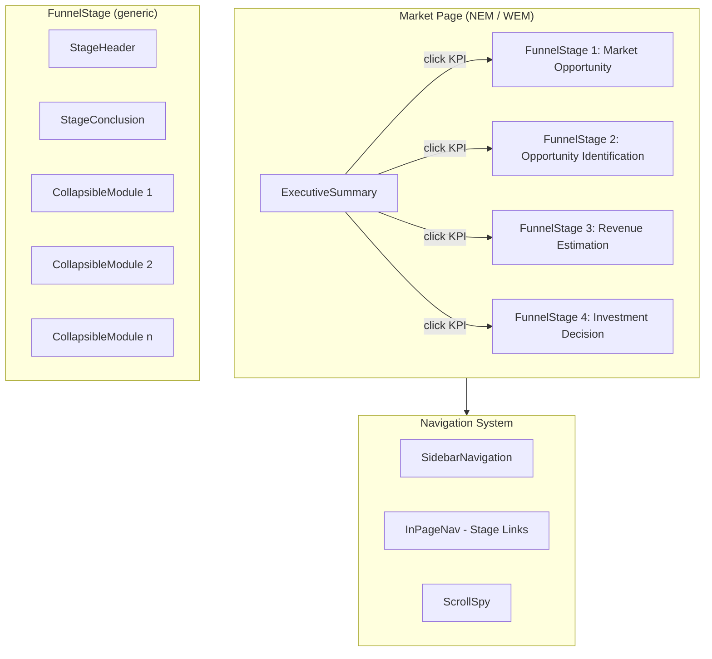
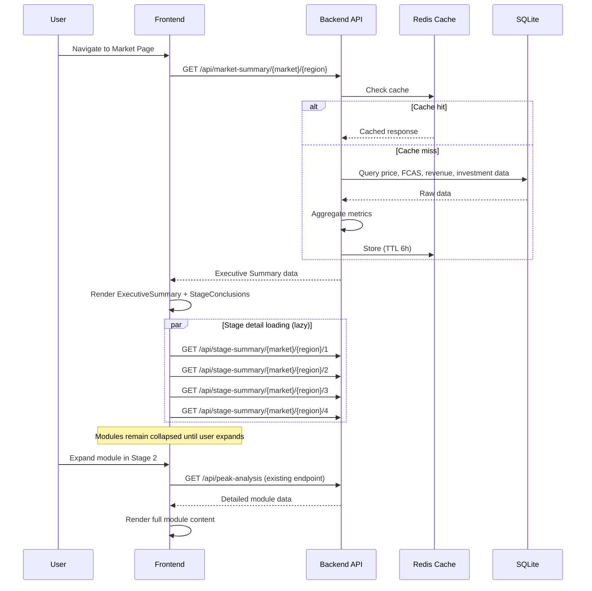

# Design Document: Information Architecture Redesign

## Overview

本设计将 AEMO Intelligence 平台从当前的"平铺模块列表"重构为"决策漏斗"（Decision Funnel）信息架构。核心变更：

1. **前端组件层级重组** — 将 10+ 个分析模块组织为 4 个顺序阶段（FunnelStage），每个阶段回答一个核心投资决策问题
2. **执行摘要视图** — 新增 ExecutiveSummary 组件，聚合各阶段关键 KPI，单屏呈现投资结论
3. **渐进式披露** — 阶段结论默认展开，详细模块默认折叠，按需展开
4. **后端聚合 API** — 新增 `/api/market-summary` 和 `/api/stage-summary` 端点，减少前端请求次数
5. **导航重构** — 侧边栏从"澳洲市场 + 其他入口"重组为"BESS 投资分析 + 研究工具 + 系统"三级结构

设计遵循 DESIGN.md 中的"工业极简"设计系统，保持数据优先、安静权威的品牌调性。

## Architecture

### High-Level Component Hierarchy



### Page Load Sequence



### Module-to-Stage Assignment

| Stage | ID | Core Question | Modules |
|-------|-----|---------------|---------|
| 1 | `market-opportunity` | 市场是否存在套利机会？规模多大？ | PriceChart, SummaryStats, HourlyDistributionChart |
| 2 | `opportunity-identification` | 何时交易？哪些时段？哪些服务？ | PeakAnalysis, FcasAnalysis, ChargingWindow, GridForecast |
| 3 | `revenue-estimation` | 电池能赚多少？扣除成本后呢？ | BessSimulator, RevenueStacking, CycleCost |
| 4 | `investment-decision` | 项目是否值得投资？NPV/IRR/回收期？ | InvestmentAnalysis, ReportPreview |

## Components and Interfaces

### ExecutiveSummary

```typescript
interface ExecutiveSummaryProps {
  market: 'NEM' | 'WEM';
  region: string;
  year: number;
  bessParams: BessParams;
  onKpiClick: (stageId: string) => void;
}

interface MarketSummaryData {
  price_spread: {
    avg_4h_spread: number;
    max_4h_spread: number;
    unit: string;
  };
  fcas_potential: {
    annual_revenue_estimate: number;
    opportunity_score: number; // 0-100
    unit: string;
  };
  bess_daily_revenue: {
    estimated_daily: number;
    estimated_annual: number;
    unit: string;
  };
  investment_indicators: {
    npv: number;
    irr: number;
    payback_years: number;
    unit: string;
  };
  overall_rating: 'strong_opportunity' | 'moderate_opportunity' | 'weak_opportunity' | 'unfavorable';
  metadata: ResponseMetadata;
  warnings: Warning[];
}
```

**Behavior:**
- Fetches data from `/api/market-summary/{market}/{region}` on mount and filter change
- Renders 4-6 KPI cards in a responsive row/grid layout
- Each KPI card applies semantic color coding (green/red/amber) based on thresholds
- Clicking a KPI card scrolls to the corresponding FunnelStage via `onKpiClick`
- Shows skeleton loading state while data is in flight
- Updates within 2 seconds of filter change (debounced fetch)

### FunnelStage

```typescript
interface FunnelStageProps {
  stageId: string;
  stageNumber: number;
  title: string;
  coreQuestion: string;
  coreQuestionEn: string;
  children: React.ReactNode; // CollapsibleModule instances
  conclusionData: StageConclusionData | null;
  isLoading: boolean;
  isDeemphasized: boolean;
}
```

**Behavior:**
- Renders stage header with number, title, and core question
- Contains a StageConclusion panel at the top
- Wraps child modules in CollapsibleModule containers
- Provides "展开全部 / 收起全部" toggle for all child modules
- Applies reduced opacity (`opacity-60`) when `isDeemphasized` is true
- Registers an IntersectionObserver for scroll-spy navigation highlighting

### StageConclusion

```typescript
interface StageConclusionData {
  summary_text: string;        // One-sentence natural language conclusion
  kpis: KpiMetric[];           // 2-4 key metrics
  sentiment: 'positive' | 'negative' | 'neutral';
  stage_id: string;
}

interface KpiMetric {
  label: string;
  value: number | string;
  unit: string;
  sentiment: 'positive' | 'negative' | 'neutral' | 'warning';
}

interface StageConclusionProps {
  data: StageConclusionData | null;
  isLoading: boolean;
  loadingMessage: string;
}
```

**Behavior:**
- Displays one-sentence summary in serif font (Playfair Display)
- Renders 2-4 KPI cards below the summary text
- Shows loading state with descriptive message (e.g., "正在计算套利窗口...")
- Applies border-left color based on sentiment (green/red/neutral)

### CollapsibleModule

```typescript
interface CollapsibleModuleProps {
  moduleId: string;
  title: string;
  metricSummary: string;       // One-line metric shown when collapsed
  defaultExpanded?: boolean;   // Default: false
  children: React.ReactNode;   // The actual module component
}
```

**Behavior:**
- Collapsed state: shows title + one-line metric summary
- Expanded state: reveals full module content with 200ms expand animation (Framer Motion)
- Expand/collapse state persisted to `sessionStorage` keyed by `moduleId`
- Lazy-loads module content only on first expand (using React.lazy + Suspense)

### SidebarNavigation (Updated)

```typescript
interface SidebarNavigationProps {
  activePage: 'aemo' | 'wem' | 'finland' | 'fingrid' | 'developer';
  stageLinks: StageLink[];     // NEW: funnel stage navigation
  activeStage: string | null;  // NEW: currently visible stage
  onStageClick: (stageId: string) => void;
  lang: 'zh' | 'en';
}

interface StageLink {
  id: string;                  // e.g., 'executive-summary', 'market-opportunity'
  label: string;
  stageNumber: number | null;  // null for executive summary
}
```

**Navigation Groups:**
1. **BESS 投资分析** (primary) — NEM, WEM market pages
2. **研究工具** (secondary, `opacity-60`, `text-xs`) — Finland, Fingrid
3. **系统** (tertiary) — Developer Portal

**In-page navigation:** When on a Market Page, displays stage links (Executive Summary + 4 stages) with scroll-spy highlighting.

### KpiCard

```typescript
interface KpiCardProps {
  label: string;
  value: number | string;
  unit: string;
  sentiment: 'positive' | 'negative' | 'neutral' | 'warning';
  onClick?: () => void;
  size?: 'sm' | 'md';         // sm for StageConclusion, md for ExecutiveSummary
}
```

**Color mapping:**
- `positive` → `text-[#22C55E]` (var(--color-positive))
- `negative` → `text-[#E53E3E]` (var(--color-error))
- `warning` → `text-[#F59E0B]` (var(--color-warning))
- `neutral` → `text-[#050505]` (var(--color-text))

## Data Models

### Backend API Schemas

#### GET `/api/market-summary/{market}/{region}`

**Query Parameters:**
| Parameter | Type | Default | Description |
|-----------|------|---------|-------------|
| year | int | current year | Analysis year |
| bess_power_mw | float | 100 | Battery power capacity |
| bess_duration_hours | float | 4 | Battery duration |
| bess_efficiency | float | 0.87 | Round-trip efficiency |

**Response Schema:**
```json
{
  "market": "NEM",
  "region": "NSW1",
  "year": 2025,
  "bess_params": {
    "power_mw": 100,
    "duration_hours": 4,
    "round_trip_efficiency": 0.87
  },
  "stages": {
    "market_opportunity": {
      "summary_text": "NSW1 2025年平均4小时价差 $45.2/MWh，存在显著套利机会",
      "sentiment": "positive",
      "kpis": [
        { "label": "平均4h价差", "value": 45.2, "unit": "$/MWh", "sentiment": "positive" },
        { "label": "最大日价差", "value": 312.5, "unit": "$/MWh", "sentiment": "positive" },
        { "label": "负电价占比", "value": 8.3, "unit": "%", "sentiment": "neutral" }
      ]
    },
    "opportunity_identification": {
      "summary_text": "最佳充电窗口集中在凌晨2-5点，FCAS叠加可增收35%",
      "sentiment": "positive",
      "kpis": [
        { "label": "FCAS年收入潜力", "value": 2800000, "unit": "$", "sentiment": "positive" },
        { "label": "最优充电时段", "value": "02:00-05:00", "unit": "", "sentiment": "neutral" }
      ]
    },
    "revenue_estimation": {
      "summary_text": "100MW/400MWh BESS 预计日均收入 $18,500，年化 $6.75M",
      "sentiment": "positive",
      "kpis": [
        { "label": "日均收入", "value": 18500, "unit": "$", "sentiment": "positive" },
        { "label": "年化收入", "value": 6750000, "unit": "$", "sentiment": "positive" },
        { "label": "循环成本占比", "value": 12.3, "unit": "%", "sentiment": "neutral" }
      ]
    },
    "investment_decision": {
      "summary_text": "NPV $12.3M (正), IRR 14.2%, 回收期 6.8年",
      "sentiment": "positive",
      "kpis": [
        { "label": "NPV", "value": 12300000, "unit": "$", "sentiment": "positive" },
        { "label": "IRR", "value": 14.2, "unit": "%", "sentiment": "positive" },
        { "label": "回收期", "value": 6.8, "unit": "年", "sentiment": "warning" }
      ]
    }
  },
  "overall_rating": "strong_opportunity",
  "metadata": {
    "market": "NEM",
    "region_or_zone": "NSW1",
    "timezone": "Australia/Sydney",
    "currency": "AUD",
    "data_grade": "analytical",
    "freshness": { "last_updated_at": "2025-01-15T10:30:00Z" },
    "source_version": "2025-01-15T10:30:00Z",
    "methodology_version": "market_summary_v1"
  },
  "warnings": []
}
```

#### GET `/api/stage-summary/{market}/{region}/{stage_id}`

**Path Parameters:**
- `market`: `NEM` | `WEM`
- `region`: e.g., `NSW1`, `QLD1`, `WEM`
- `stage_id`: `market-opportunity` | `opportunity-identification` | `revenue-estimation` | `investment-decision`

**Query Parameters:** Same as market-summary (year, bess_params)

**Response Schema:**
```json
{
  "stage_id": "market-opportunity",
  "market": "NEM",
  "region": "NSW1",
  "summary_text": "NSW1 2025年平均4小时价差 $45.2/MWh，存在显著套利机会",
  "sentiment": "positive",
  "kpis": [
    { "label": "平均4h价差", "value": 45.2, "unit": "$/MWh", "sentiment": "positive" },
    { "label": "最大日价差", "value": 312.5, "unit": "$/MWh", "sentiment": "positive" },
    { "label": "负电价占比", "value": 8.3, "unit": "%", "sentiment": "neutral" }
  ],
  "metadata": {
    "market": "NEM",
    "region_or_zone": "NSW1",
    "timezone": "Australia/Sydney",
    "currency": "AUD",
    "data_grade": "analytical",
    "freshness": { "last_updated_at": "2025-01-15T10:30:00Z" },
    "source_version": "2025-01-15T10:30:00Z",
    "methodology_version": "stage_summary_v1"
  },
  "warnings": []
}
```

### Frontend State Model

```typescript
// Funnel page state (managed via useReducer in MarketPage)
interface FunnelPageState {
  // Data
  marketSummary: MarketSummaryData | null;
  stageSummaries: Record<string, StageConclusionData | null>;

  // Loading states
  summaryLoading: boolean;
  stageLoading: Record<string, boolean>;

  // UI state
  expandedModules: Record<string, boolean>;  // persisted to sessionStorage
  activeStage: string | null;                // scroll-spy driven
  deemphasizedStages: Set<string>;           // derived from stage sentiments
}
```

### Expand/Collapse Persistence

```typescript
// sessionStorage key format
const STORAGE_KEY = `funnel-expand-state-${market}-${region}`;

// Stored value
interface ExpandState {
  [moduleId: string]: boolean;
}
```

### Responsive Breakpoints

| Viewport | Executive Summary Layout | Sidebar | Stage Layout |
|----------|------------------------|---------|--------------|
| ≥ 1280px | Horizontal row (4 cards) | Visible with stage links | Full width |
| 1024-1279px | 2×2 grid | Visible with stage links | Full width |
| < 1024px | Vertical stack | Hidden (top nav bar) | Full width |

## Correctness Properties

*A property is a characteristic or behavior that should hold true across all valid executions of a system — essentially, a formal statement about what the system should do. Properties serve as the bridge between human-readable specifications and machine-verifiable correctness guarantees.*

### Property 1: Stage ordering invariant

*For any* viewport width and any combination of stage data states (loaded, loading, error, empty), the four Funnel Stages SHALL always render in sequential DOM order 1 → 2 → 3 → 4, with the Executive Summary preceding all stages.

**Validates: Requirements 1.2, 10.4**

### Property 2: Module-to-stage assignment uniqueness

*For any* module in the system's module registry, that module SHALL appear in exactly one stage's module list, and the union of all stage module lists SHALL equal the complete set of registered modules with no duplicates and no omissions.

**Validates: Requirements 1.3**

### Property 3: Semantic color mapping correctness

*For any* KPI metric with a sentiment value (`positive`, `negative`, `warning`, `neutral`), the KpiCard component SHALL apply exactly the corresponding color class: positive → `--color-positive`, negative → `--color-error`, warning → `--color-warning`, neutral → `--color-text`.

**Validates: Requirements 2.5**

### Property 4: Stage conclusion response structure

*For any* valid stage-summary API response, the response SHALL contain a non-empty `summary_text` string and a `kpis` array with length between 2 and 4 inclusive, where each KPI object contains `label`, `value`, `unit`, and `sentiment` fields.

**Validates: Requirements 3.2, 3.3**

### Property 5: De-emphasis propagation

*For any* stage index N (1-4) whose Stage Conclusion has `sentiment: "negative"`, all subsequent stages (N+1 through 4) SHALL have the de-emphasis visual treatment applied (opacity-60 class), and stages 1 through N SHALL NOT be de-emphasized.

**Validates: Requirements 3.5**

### Property 6: Expand/collapse persistence round-trip

*For any* module ID and any sequence of expand/collapse toggle actions, writing the resulting state to sessionStorage and then reading it back SHALL produce the same expand/collapse state for that module, and a fresh page render SHALL restore the persisted state.

**Validates: Requirements 4.5**

### Property 7: Market-summary API response contract

*For any* valid combination of market (`NEM`|`WEM`), region, year, and bess_params, the `/api/market-summary/{market}/{region}` endpoint SHALL return a response containing: `stages` object with all four stage keys, each containing `summary_text`, `sentiment`, and `kpis`; an `overall_rating` field; and a `metadata` object with all standard contract fields (`market`, `region_or_zone`, `timezone`, `currency`, `data_grade`, `freshness`, `source_version`).

**Validates: Requirements 6.3, 6.4**

### Property 8: Partial results graceful degradation

*For any* market-summary request where one or more underlying data sources are unavailable, the API SHALL return HTTP 200 with partial results for the available stages and a non-empty `warnings` array where each warning identifies the unavailable metric and the reason.

**Validates: Requirements 6.5**

### Property 9: Bookmark redirect mapping

*For any* legacy section identifier (URL hash fragment from the current architecture, e.g., `#peak-analysis`, `#bess-simulator`), the platform SHALL map it to the correct new location (stage ID + module ID) such that navigating to the old URL results in the page scrolling to the equivalent module within its assigned Funnel Stage.

**Validates: Requirements 11.4**

## Error Handling

### Frontend Error Strategy

| Scenario | Behavior | User Action |
|----------|----------|-------------|
| Market-summary API fails | Executive Summary shows error card with retry button; stages load independently | Click "重试" to re-fetch |
| Stage-summary API fails | Affected stage shows error in StageConclusion; other stages unaffected | Click "重试" on affected stage |
| Individual module data fails | Module shows inline error within its CollapsibleModule container | Click "重试" within module |
| Network timeout (>5s) | Show timeout message with suggestion to check connection | Retry or refresh |
| Partial data (warnings) | Render available metrics; show warning badge on incomplete KPIs | Hover for explanation |

### Backend Error Strategy

```python
# Aggregation endpoint error handling pattern
@router.get("/api/market-summary/{market}/{region}")
def get_market_summary(market: str, region: str, ...):
    warnings = []
    stages = {}

    # Each stage computation is independent and fault-tolerant
    for stage_id, compute_fn in STAGE_COMPUTERS.items():
        try:
            stages[stage_id] = compute_fn(market, region, params)
        except DataUnavailableError as e:
            stages[stage_id] = None
            warnings.append({
                "stage": stage_id,
                "metric": e.metric_name,
                "reason": str(e),
                "severity": "degraded"
            })
        except Exception as e:
            stages[stage_id] = None
            warnings.append({
                "stage": stage_id,
                "reason": "computation_failed",
                "severity": "error"
            })

    # Always return 200 with partial results
    return {
        "stages": stages,
        "overall_rating": derive_rating(stages),
        "metadata": build_metadata(...),
        "warnings": warnings,
    }
```

### Error Isolation Principle

Each stage operates independently:
- A failure in Stage 3 (Revenue Estimation) does NOT prevent Stage 1 (Market Opportunity) from rendering
- The Executive Summary renders available KPIs and marks unavailable ones with a warning badge
- Backend aggregation catches per-stage exceptions and returns partial results

### Loading States

| Component | Loading Message |
|-----------|----------------|
| Executive Summary | "正在聚合市场数据..." |
| Stage 1 Conclusion | "正在分析价格趋势与套利空间..." |
| Stage 2 Conclusion | "正在识别最优交易窗口..." |
| Stage 3 Conclusion | "正在模拟储能收入..." |
| Stage 4 Conclusion | "正在计算投资回报指标..." |

## Testing Strategy

### Dual Testing Approach

This feature combines UI restructuring with backend aggregation logic. Both property-based and example-based tests are needed.

### Property-Based Testing

**Library:** [fast-check](https://github.com/dubzzz/fast-check) (JavaScript/TypeScript) for frontend properties, [Hypothesis](https://hypothesis.readthedocs.io/) (Python) for backend properties.

**Configuration:** Minimum 100 iterations per property test.

**Frontend Properties (fast-check):**

| Property | Test Target | Generator |
|----------|-------------|-----------|
| Property 2: Module uniqueness | `getStageModuleMapping()` | Arbitrary module lists |
| Property 3: Semantic color | `getSentimentColor(sentiment)` | `fc.oneof('positive', 'negative', 'warning', 'neutral')` |
| Property 5: De-emphasis | `deriveDeemphasizedStages(sentiments)` | `fc.array(fc.oneof('positive', 'negative', 'neutral'), {minLength: 4, maxLength: 4})` |
| Property 6: Persistence | `saveExpandState()` / `loadExpandState()` | `fc.dictionary(fc.string(), fc.boolean())` |
| Property 9: Bookmark mapping | `mapLegacyHash(hash)` | `fc.oneof(...LEGACY_HASHES)` |

**Backend Properties (Hypothesis):**

| Property | Test Target | Generator |
|----------|-------------|-----------|
| Property 4: Stage conclusion structure | `/api/stage-summary` response | `st.sampled_from(VALID_STAGES)`, `st.sampled_from(REGIONS)` |
| Property 7: API response contract | `/api/market-summary` response | `st.integers(2020, 2026)`, `st.sampled_from(REGIONS)`, `st.floats(50, 500)` |
| Property 8: Partial results | `/api/market-summary` with mocked failures | `st.sets(st.sampled_from(DATA_SOURCES))` |

**Tag format:** `Feature: information-architecture-redesign, Property {N}: {title}`

### Example-Based Unit Tests

| Test | Validates |
|------|-----------|
| NEM page renders 4 stages in correct order | Req 1.1, 1.2 |
| Module assignment matches spec exactly | Req 1.5 |
| Executive Summary renders above stages | Req 2.1 |
| KPI click scrolls to correct stage | Req 2.6 |
| Stage header shows name + question + conclusion | Req 1.4 |
| Collapsed module shows title + metric | Req 4.3 |
| "展开全部" expands all modules in stage | Req 4.4 |
| Navigation shows 3 groups with correct items | Req 5.1-5.4 |
| WEM page has same 4-stage structure | Req 9.1 |
| Responsive layouts at 1280px, 1100px, 900px | Req 10.1-10.3 |

### Integration Tests

| Test | Validates |
|------|-----------|
| Market-summary endpoint returns within 3s | Req 6.2 |
| Stage-summary endpoint returns within 2s | Req 7.2 |
| Filter change triggers executive summary refresh | Req 2.4 |
| All existing API endpoints still respond correctly | Req 11.3 |
| All modules render correctly within FunnelStage containers | Req 11.1 |

### Smoke Tests

| Test | Validates |
|------|-----------|
| `/api/market-summary/NEM/NSW1` returns 200 | Req 6.1 |
| `/api/stage-summary/NEM/NSW1/market-opportunity` returns 200 | Req 7.1 |
| All 4 stage-summary endpoints respond | Req 7.1 |

