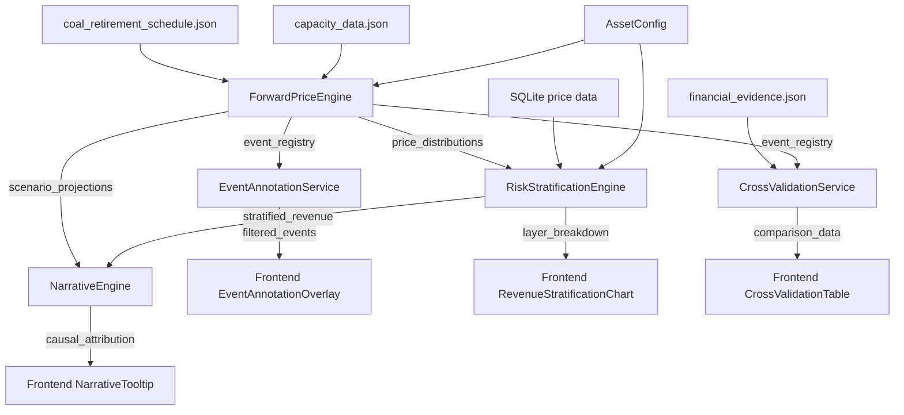

# Design Document: Investment Narrative Layer

## Overview

投资叙事层（Investment Narrative Layer）将平台从纯数据展示工具转型为结构化投资故事生成器。本设计在现有 ForwardPriceEngine、CostStructureEngine、TaxModel 基础上新增 4 个后端引擎/服务和 7 个前端组件，通过因果归因、风险分层、事件标注、假设透明、交叉验证和资产特异性 6 个叙事模式增强投资分析的说服力。

### 核心设计原则

1. **模板驱动叙事**：NarrativeEngine 使用结构化模板（非 LLM），确保可重复性和可测试性
2. **层级化风险**：收入按价格阈值分层，每层独立折现，避免高风险收入被低折现率高估
3. **事件驱动标注**：复用现有 EventRegistry 数据，不重复存储
4. **渐进式增强**：所有新组件通过 marketConfig 模块注册表集成，不破坏现有阶段结构
5. **序列化优先**：所有数据模型支持 JSON 序列化/反序列化往返，确保 API 传输无损

## Architecture

```
┌─────────────────────────────────────────────────────────────────────────┐
│                        Frontend (React + Recharts)                        │
├─────────────────────────────────────────────────────────────────────────┤
│  Investment Outlook Stage (Stage 4)                                      │
│    ├── ForwardSpreadCurve          (20年价差三情景线图)                    │
│    ├── EventAnnotationOverlay      (可复用事件标注层)                      │
│    └── RevenueStratificationChart  (收入分层堆叠面积图)                    │
│  Financial Modeling Stage (Stage 6)                                       │
│    ├── AssumptionPanel             (假设透明面板)                          │
│    ├── AssetConfigPanel            (资产配置面板)                          │
│    └── CrossValidationTable        (多源交叉验证表)                        │
│  Shared                                                                   │
│    └── NarrativeTooltip            (因果归因悬浮提示)                      │
├─────────────────────────────────────────────────────────────────────────┤
│                        Backend (FastAPI)                                   │
│  New Engines/Services:                                                    │
│    ├── narrative_engine.py         (因果归因文本生成)                      │
│    ├── risk_stratification_engine.py (收入风险分层)                        │
│    ├── event_annotation_service.py (事件标注过滤)                          │
│    └── cross_validation_service.py (多源交叉验证)                          │
│  Extended Engines:                                                        │
│    ├── forward_price_engine.py     (+燃料敏感性 +网络增强)                  │
│    └── models/narrative_models.py  (叙事层数据模型)                        │
│  New Routes:                                                              │
│    └── routes/narrative_routes.py  (叙事层 API 端点)                       │
├─────────────────────────────────────────────────────────────────────────┤
│  Data Layer                                                               │
│    ├── coal_retirement_schedule.json (煤电退役时间表)                      │
│    ├── capacity_data.json            (BESS 容量数据)                       │
│    ├── financial_evidence.json       (多源证据引用)                         │
│    └── SQLite trading_price_{year}   (历史价格数据)                        │
└─────────────────────────────────────────────────────────────────────────┘
```

### 数据流架构



## Components and Interfaces

### 1. NarrativeEngine（因果归因引擎）

**职责：** 为每个分析模块的关键指标生成结构化因果归因文本。

**设计决策：** 使用模板驱动方式而非 LLM，原因：
- 可重复性：相同输入始终产生相同输出
- 可测试性：模板输出可通过属性测试验证
- 低延迟：无需外部 API 调用
- 可审计：模板逻辑透明可追溯

```python
class NarrativeEngine:
    """因果归因文本生成引擎。"""

    def __init__(self, event_registry: EventRegistry):
        self.event_registry = event_registry
        self.templates = self._load_templates()

    def generate_spread_attribution(
        self, region: str, year: int, scenario: ScenarioType,
        current_spread: float, base_spread: float
    ) -> CausalAttribution:
        """生成价差因果归因。"""
        ...

    def generate_revenue_change_attribution(
        self, region: str, year_from: int, year_to: int,
        revenue_from: float, revenue_to: float,
        scenario: ScenarioType
    ) -> CausalAttribution:
        """生成年度收入变化归因。"""
        ...

    def generate_module_conclusion(
        self, module_name: str, region: str,
        metrics: dict
    ) -> CausalAttribution:
        """为指定模块输出生成结论性归因文本。"""
        ...
```

### 2. RiskStratificationEngine（风险分层引擎）

**职责：** 将年度收入按价格阈值拆分为三层，各层独立折现计算 NPV。

**设计决策：**
- Layer 1（基础套利）：价格 < Spread_Threshold 的区间收入，HIGH 置信度，8% 折现
- Layer 2（FCAS 辅助服务）：独立于价格阈值，MEDIUM 置信度，10% 折现
- Layer 3（极端事件）：价格 > Spread_Threshold 的区间收入，LOW 置信度，12% 折现
- 默认 Spread_Threshold = $300/MWh（NEM 市场价格上限 $16,600/MWh）

```python
class RiskStratificationEngine:
    """收入风险分层引擎。"""

    def __init__(
        self,
        spread_threshold: float = 300.0,
        layer_discount_rates: LayerDiscountRates = None,
    ):
        self.spread_threshold = spread_threshold
        self.discount_rates = layer_discount_rates or LayerDiscountRates()

    def stratify_historical_revenue(
        self, price_data: list[PriceInterval], fcas_revenue: float,
        battery: BatterySpecs
    ) -> StratifiedRevenue:
        """基于历史价格数据计算分层收入。"""
        ...

    def stratify_forward_revenue(
        self, projection: ScenarioProjection,
        spike_frequency: float, fcas_annual: float
    ) -> list[AnnualStratifiedRevenue]:
        """基于前瞻预测估算 20 年分层收入。"""
        ...

    def calculate_layer_weighted_npv(
        self, annual_layers: list[AnnualStratifiedRevenue]
    ) -> LayerWeightedNPV:
        """计算分层加权 NPV。"""
        ...
```

### 3. EventAnnotationService（事件标注服务）

**职责：** 从 ForwardPriceEngine 的 EventRegistry 中过滤事件，为前端图表提供标注数据。

**设计决策：**
- 不重复存储事件数据，直接引用 ForwardPriceEngine.event_registry
- 支持按区域、时间范围、事件类型过滤
- 支持事件聚类（同一像素范围内多事件合并）
- 新增 NETWORK_AUGMENTATION 事件类型

```python
class EventAnnotationService:
    """事件标注过滤服务。"""

    def __init__(self, event_registry: EventRegistry):
        self.event_registry = event_registry

    def get_annotations(
        self, region: str, start_year: int, end_year: int,
        event_types: list[EventType] | None = None
    ) -> list[EventAnnotation]:
        """获取指定区域和时间范围的事件标注。"""
        ...

    def cluster_annotations(
        self, annotations: list[EventAnnotation],
        pixel_threshold: int = 20
    ) -> list[EventAnnotation | EventCluster]:
        """聚类相近事件为单一标记。"""
        ...
```

### 4. CrossValidationService（交叉验证服务）

**职责：** 聚合多数据源对同一数据点的估计值，计算差异百分比。

**设计决策：**
- 数据源引用存储在 financial_evidence.json（已有）
- 支持三类交叉验证：煤电退役日期、收入基准、价格预测
- 超过 12 个月未更新的外部源标记为 stale

```python
class CrossValidationService:
    """多源交叉验证服务。"""

    def __init__(self, evidence_path: Path, event_registry: EventRegistry):
        self.evidence = self._load_evidence(evidence_path)
        self.event_registry = event_registry

    def compare_coal_retirements(self) -> list[CrossValidationEntry]:
        """对比煤电退役日期：平台 vs AEMO ISP vs 运营商公告。"""
        ...

    def compare_revenue_benchmarks(
        self, region: str, model_revenue: float
    ) -> list[CrossValidationEntry]:
        """对比收入基准：平台模型 vs Modo Energy 报告。"""
        ...

    def compare_price_forecasts(
        self, region: str, scenario: ScenarioType
    ) -> list[CrossValidationEntry]:
        """对比价格预测：平台情景 vs AEMO ISP 情景。"""
        ...
```

### 5. FuelCostSensitivityModel（燃料成本敏感性模型）

**职责：** 建模天然气价格变化对峰值电价和 BESS 收入的传导效应。

**设计决策：**
- 作为 ForwardPriceEngine 的扩展方法实现（不新建引擎）
- 默认传导系数：1 $/GJ 天然气涨价 → 7-12 $/MWh 峰值电价上涨
- 敏感性分析输出 5 个情景：-20%, -10%, base, +10%, +20%

```python
# 扩展 ForwardPriceEngine
class ForwardPriceEngine:
    ...

    def calculate_fuel_sensitivity(
        self, region: str, scenario: ScenarioType,
        battery: BatterySpecs,
        gas_base_price: float = 10.0,  # $/GJ
        gas_escalation_rate: float = 0.02,  # 2% p.a.
        pass_through_coefficient: float = 9.5,  # $/MWh per $/GJ
    ) -> FuelSensitivityResult:
        """计算燃料成本敏感性分析。"""
        ...
```

### 6. NetworkAugmentationModel（网络增强模型）

**职责：** 建模新互联线投运对区域价差的压缩效应。

**设计决策：**
- 新增 EventType.NETWORK_AUGMENTATION 到现有枚举
- 网络增强事件的 spread_impact_factor < 1（压缩价差）
- convergence_factor 范围 0.05-0.30，表示价差收敛程度
- 事件数据存储在 capacity_data.json 的新 `interconnectors` 字段

```python
# 扩展 EventType 枚举
class EventType(str, Enum):
    COAL_CLOSURE = "coal_closure"
    BESS_COMMISSIONING = "bess_commissioning"
    RENEWABLE_BUILDOUT = "renewable_buildout"
    NETWORK_AUGMENTATION = "network_augmentation"  # 新增
```

### 7. Frontend Components

#### 7.1 ForwardSpreadCurve（前瞻价差曲线）

**职责：** 展示 20 年价差预测三情景线图 + 历史 3 年实际数据。

**技术选型：** Recharts LineChart + Area（置信带）

```jsx
// Props 接口
interface ForwardSpreadCurveProps {
  region: string;
  data: {
    historical: Array<{ year: number; spread: number }>;
    projection: Array<{
      year: number;
      central_spread: number;
      high_spread: number;
      low_spread: number;
    }>;
  };
  annotations: EventAnnotation[];
}
```

**视觉设计：**
- 历史数据：实线（黑色）
- Central 情景：蓝色虚线
- High/Low 情景：灰色虚线 + 浅蓝色填充置信带
- 事件标注：通过 EventAnnotationOverlay 叠加

#### 7.2 RevenueStratificationChart（收入分层图）

**职责：** 20 年收入分层堆叠面积图。

**技术选型：** Recharts StackedAreaChart

```jsx
interface RevenueStratificationChartProps {
  data: Array<{
    year: number;
    layer1_amount: number;  // 基础套利（蓝色）
    layer2_amount: number;  // FCAS（琥珀色）
    layer3_amount: number;  // 极端事件（红色）
  }>;
  layerWeightedNpv: number;
  standardNpv: number;
  discountRates: { layer1: number; layer2: number; layer3: number };
}
```

#### 7.3 EventAnnotationOverlay（事件标注叠加层）

**职责：** 可复用的 Recharts 自定义组件，在任意时间序列图上叠加事件标记。

```jsx
interface EventAnnotationOverlayProps {
  annotations: EventAnnotation[];
  chartWidth: number;
  chartHeight: number;
  xScale: (year: number) => number;  // Recharts x 轴比例尺
  onEventClick: (event: EventAnnotation) => void;
}
```

**视觉标记：**
- 煤电退役：红色倒三角 ▼
- BESS 投运：蓝色正三角 ▲
- 网络增强：绿色菱形 ◆
- 聚类标记：圆形 + 数字计数

#### 7.4 AssumptionPanel（假设面板）

**职责：** 展示所有模型输入假设，支持用户覆盖和重置。

```jsx
interface AssumptionPanelProps {
  assumptions: Array<{
    category: string;  // battery | cost | tax | forward_price | scenario
    key: string;
    label: { zh: string; en: string };
    currentValue: number | string;
    defaultValue: number | string;
    range: { min: number; max: number } | null;
    source: string;  // financial_evidence.json 引用
  }>;
  onAssumptionChange: (key: string, value: number | string) => void;
  onReset: () => void;
}
```

#### 7.5 AssetConfigPanel（资产配置面板）

**职责：** 用户定义项目特定参数，所有下游计算使用该配置。

```jsx
interface AssetConfigPanelProps {
  config: {
    region: string;        // NEM region or WEM
    power_mw: number;      // 1-2000 MW
    duration_hours: number; // 0.5-12 hours
    round_trip_efficiency: number; // 0.70-0.95
    mlf: number;           // 0.80-1.10
    connection_point: string;
  };
  onConfigChange: (config: AssetConfig) => void;
  onSave: () => void;
}
```

#### 7.6 CrossValidationTable（交叉验证表）

**职责：** 展示多源数据对比，高亮差异超过 10% 的数据点。

```jsx
interface CrossValidationTableProps {
  entries: Array<{
    dataPoint: string;
    sources: Array<{
      name: string;
      date: string;
      value: string | number;
      discrepancy_pct: number | null;
      is_stale: boolean;
    }>;
    platformValue: string | number;
    maxDiscrepancy: number;
  }>;
}
```

#### 7.7 NarrativeTooltip（因果归因提示）

**职责：** 可展开的悬浮提示，展示指标的因果归因链。

```jsx
interface NarrativeTooltipProps {
  attribution: CausalAttribution;
  trigger: React.ReactNode;  // 触发元素（指标数值）
}
```

## Data Models

### 因果归因模型

```python
from pydantic import BaseModel, Field
from typing import List, Optional
from enum import Enum


class DriverType(str, Enum):
    """因果驱动因素类型。"""
    COAL_CLOSURE = "coal_closure"
    BESS_SATURATION = "bess_saturation"
    NETWORK_AUGMENTATION = "network_augmentation"
    GAS_PRICE = "gas_price"
    DEMAND_GROWTH = "demand_growth"
    FCAS_COLLAPSE = "fcas_collapse"


class CausalFactor(BaseModel):
    """单个因果因素。"""
    driver_name: str = Field(description="驱动因素名称，如 'Eraring closure'")
    driver_type: DriverType
    contribution_amount: float = Field(description="对指标的贡献量（$/MWh 或 $）")
    contribution_pct: Optional[float] = Field(None, description="贡献百分比")
    source_reference: str = Field(description="数据来源引用")


class CausalAttribution(BaseModel):
    """因果归因对象，可序列化为 JSON。"""
    metric_name: str = Field(description="指标名称，如 'mean_spread'")
    metric_value: float
    metric_unit: str = Field(default="$/MWh")
    narrative_text: str = Field(description="人类可读的因果解释文本")
    causal_factors: List[CausalFactor]
    region: str
    year: int
    scenario: Optional[str] = None
```

### 风险分层模型

```python
class ConfidenceLevel(str, Enum):
    HIGH = "high"
    MEDIUM = "medium"
    LOW = "low"


class LayerDiscountRates(BaseModel):
    """各层折现率配置。"""
    layer1: float = Field(default=0.08, ge=0.0, le=1.0, description="基础套利层折现率")
    layer2: float = Field(default=0.10, ge=0.0, le=1.0, description="FCAS 层折现率")
    layer3: float = Field(default=0.12, ge=0.0, le=1.0, description="极端事件层折现率")


class RevenueLayer(BaseModel):
    """单层收入数据。"""
    layer_number: int = Field(ge=1, le=3)
    name: str
    confidence: ConfidenceLevel
    discount_rate: float = Field(ge=0.0, le=1.0)
    amount: float = Field(ge=0.0)
    percentage: float = Field(ge=0.0, le=100.0)


class AnnualStratifiedRevenue(BaseModel):
    """单年分层收入。"""
    year: int
    layer1: RevenueLayer
    layer2: RevenueLayer
    layer3: RevenueLayer
    total_revenue: float = Field(ge=0.0)


class StratifiedRevenue(BaseModel):
    """完整分层收入结果（可序列化）。"""
    region: str
    scenario: str
    spread_threshold: float = Field(default=300.0, ge=0.0, le=16600.0)
    discount_rates: LayerDiscountRates
    annual_layers: List[AnnualStratifiedRevenue]
    layer_weighted_npv: float
    standard_npv: float
    npv_difference: float  # layer_weighted - standard


class LayerWeightedNPV(BaseModel):
    """分层加权 NPV 结果。"""
    layer1_npv: float
    layer2_npv: float
    layer3_npv: float
    total_layer_weighted_npv: float
    standard_single_rate_npv: float
    difference_pct: float
```

### 事件标注模型

```python
class EventAnnotation(BaseModel):
    """单个事件标注。"""
    event_name: str
    event_type: EventType
    region: str
    date: date
    capacity_mw: float
    confidence: EventConfidence
    spread_impact_factor: float
    description: Optional[str] = None


class EventCluster(BaseModel):
    """聚类事件标记。"""
    center_date: date
    event_count: int
    events: List[EventAnnotation]
    dominant_type: EventType


class EventAnnotationResponse(BaseModel):
    """事件标注 API 响应。"""
    region: str
    start_year: int
    end_year: int
    annotations: List[EventAnnotation]
    total_count: int
```

### 交叉验证模型

```python
class CrossValidationEntry(BaseModel):
    """单个交叉验证条目。"""
    data_point: str = Field(description="数据点名称")
    category: str = Field(description="coal_retirements | revenue_benchmarks | price_forecasts")
    source_name: str
    source_date: date
    source_url: Optional[str] = None
    reported_value: str
    platform_value: str
    discrepancy_pct: Optional[float] = Field(None, description="差异百分比")
    is_stale: bool = Field(default=False, description="来源超过 12 个月未更新")


class CrossValidationResponse(BaseModel):
    """交叉验证 API 响应。"""
    category: str
    entries: List[CrossValidationEntry]
    last_updated: date
```

### 燃料敏感性模型

```python
class GasPriceAssumptions(BaseModel):
    """天然气价格假设。"""
    base_price_per_gj: float = Field(default=10.0, gt=0, description="基础气价 $/GJ")
    annual_escalation_rate: float = Field(default=0.02, ge=0.0, le=0.20)
    pass_through_coefficient: float = Field(
        default=9.5, gt=0,
        description="传导系数：$/MWh per $/GJ (范围 7-12)"
    )


class FuelSensitivityResult(BaseModel):
    """燃料敏感性分析结果。"""
    region: str
    scenario: str
    base_revenue: float
    sensitivity_coefficient: float = Field(
        description="BESS 年收入变化% / 气价变化 10%"
    )
    scenarios: List[FuelSensitivityScenario]


class FuelSensitivityScenario(BaseModel):
    """单个敏感性情景。"""
    gas_price_change_pct: float  # -20, -10, 0, +10, +20
    gas_price: float
    peak_price_impact: float  # $/MWh 变化
    revenue_impact: float  # $ 变化
    revenue_change_pct: float
```

### 资产配置模型

```python
class AssetConfiguration(BaseModel):
    """用户资产配置。"""
    region: str = Field(description="NEM region or WEM")
    power_mw: float = Field(ge=1.0, le=2000.0)
    duration_hours: float = Field(ge=0.5, le=12.0)
    round_trip_efficiency: float = Field(ge=0.70, le=0.95)
    mlf: float = Field(ge=0.80, le=1.10)
    connection_point: str = Field(default="", description="接入点标识")

    @property
    def capacity_mwh(self) -> float:
        return self.power_mw * self.duration_hours

    @property
    def label(self) -> str:
        return f"{self.power_mw:.0f}MW/{self.duration_hours:.0f}h BESS at {self.region}"
```

### 前瞻价差曲线 API 响应模型

```python
class ForwardSpreadCurveResponse(BaseModel):
    """前瞻价差曲线 API 响应。"""
    region: str
    historical_available: bool
    historical: List[dict]  # [{year, spread}]
    projection: List[dict]  # [{year, central_spread, high_spread, low_spread}]
    annotations: List[EventAnnotation]


class NetworkAugmentationEvent(BaseModel):
    """网络增强事件。"""
    name: str
    from_region: str
    to_region: str
    capacity_mw: float
    expected_date: date
    convergence_factor: float = Field(ge=0.05, le=0.30)
    spread_impact_factor: float = Field(lt=1.0, description="< 1 表示价差压缩")


class NetworkImpactComparison(BaseModel):
    """网络增强前后对比。"""
    project_name: str
    region: str
    spread_before: List[dict]  # [{year, spread}]
    spread_after: List[dict]   # [{year, spread}]
    reduction_pct: float
```

## API Endpoints

### 新增路由：`routes/narrative_routes.py`

| 端点 | 方法 | 描述 | 对应需求 |
|------|------|------|----------|
| `/api/v1/narrative/attribution/{region}` | GET | 获取指定区域的因果归因数据 | Req 1, 15, 18.1 |
| `/api/v1/narrative/stratification/{region}` | GET | 获取分层收入数据 | Req 2, 9, 16, 18.2 |
| `/api/v1/narrative/events/{region}` | GET | 获取事件标注 | Req 4, 11, 18.3 |
| `/api/v1/narrative/cross-validation/{category}` | GET | 获取交叉验证数据 | Req 7, 12, 18.4 |
| `/api/v1/narrative/asset-config` | GET/POST | 获取/保存资产配置 | Req 8, 18.5 |
| `/api/v1/narrative/forward-spread/{region}` | GET | 获取前瞻价差曲线数据 | Req 5, 10 |
| `/api/v1/narrative/fuel-sensitivity/{region}` | GET | 获取燃料敏感性分析 | Req 13, 18.6 |
| `/api/v1/narrative/network-impact/{region}` | GET | 获取网络增强影响 | Req 14 |

### 端点详细定义

```python
router = APIRouter(prefix="/api/v1/narrative", tags=["Investment Narrative Layer"])

@router.get("/attribution/{region}")
async def get_causal_attribution(
    region: str = Path(description="NEM region or WEM"),
    module: str = Query(default="forward_price", description="模块名称"),
    year: int = Query(default=None, description="目标年份"),
    scenario: ScenarioType = Query(default=ScenarioType.CENTRAL),
) -> CausalAttribution:
    """获取指定模块输出的因果归因数据。"""
    ...

@router.get("/stratification/{region}")
async def get_stratified_revenue(
    region: str = Path(...),
    scenario: ScenarioType = Query(default=ScenarioType.CENTRAL),
    spread_threshold: float = Query(default=300.0, ge=0.0, le=16600.0),
    layer1_discount: float = Query(default=0.08, ge=0.0, le=1.0),
    layer2_discount: float = Query(default=0.10, ge=0.0, le=1.0),
    layer3_discount: float = Query(default=0.12, ge=0.0, le=1.0),
) -> StratifiedRevenue:
    """获取分层收入数据。"""
    ...

@router.get("/events/{region}")
async def get_event_annotations(
    region: str = Path(...),
    start_year: int = Query(default=None),
    end_year: int = Query(default=None),
    event_types: str = Query(default=None, description="逗号分隔的事件类型"),
) -> EventAnnotationResponse:
    """获取事件标注数据。"""
    ...

@router.get("/cross-validation/{category}")
async def get_cross_validation(
    category: str = Path(description="coal_retirements | revenue_benchmarks | price_forecasts"),
    region: str = Query(default=None),
) -> CrossValidationResponse:
    """获取多源交叉验证数据。"""
    ...

@router.post("/asset-config")
async def save_asset_config(config: AssetConfiguration) -> AssetConfiguration:
    """保存资产配置。"""
    ...

@router.get("/asset-config")
async def get_asset_config() -> AssetConfiguration:
    """获取当前资产配置。"""
    ...

@router.get("/forward-spread/{region}")
async def get_forward_spread_curve(
    region: str = Path(...),
    include_historical: bool = Query(default=True),
) -> ForwardSpreadCurveResponse:
    """获取前瞻价差曲线数据（含事件标注）。"""
    ...

@router.get("/fuel-sensitivity/{region}")
async def get_fuel_sensitivity(
    region: str = Path(...),
    scenario: ScenarioType = Query(default=ScenarioType.CENTRAL),
    gas_base_price: float = Query(default=10.0, gt=0),
    pass_through_coefficient: float = Query(default=9.5, gt=0),
) -> FuelSensitivityResult:
    """获取燃料成本敏感性分析。"""
    ...

@router.get("/network-impact/{region}")
async def get_network_impact(
    region: str = Path(...),
) -> NetworkImpactComparison:
    """获取网络增强对区域价差的影响对比。"""
    ...
```

## Correctness Properties

*A property is a characteristic or behavior that should hold true across all valid executions of a system—essentially, a formal statement about what the system should do. Properties serve as the bridge between human-readable specifications and machine-verifiable correctness guarantees.*

### Property 1: CausalAttribution serialization round-trip

*For any* valid CausalAttribution object (with arbitrary metric_name, metric_value, causal_factors list, region, and year), serializing to JSON and then deserializing back SHALL produce an object equivalent to the original.

**Validates: Requirements 15.1, 15.2, 15.3**

### Property 2: StratifiedRevenue serialization round-trip

*For any* valid StratifiedRevenue object (with arbitrary region, scenario, spread_threshold, discount_rates, and annual_layers), serializing to JSON and then deserializing back SHALL produce an object equivalent to the original.

**Validates: Requirements 16.1, 16.2, 16.3**

### Property 3: Revenue layer partitioning is exhaustive and exclusive

*For any* set of price intervals and a spread threshold, the sum of Layer 1 revenue (intervals below threshold) plus Layer 3 revenue (intervals above threshold) plus Layer 2 revenue (FCAS, independent) SHALL equal the total revenue. Additionally, no price interval SHALL contribute to both Layer 1 and Layer 3.

**Validates: Requirements 2.1, 2.5, 9.1, 9.2**

### Property 4: Layer-weighted NPV calculation correctness

*For any* sequence of annual stratified revenues and per-layer discount rates, the layer-weighted NPV SHALL equal the sum of NPV(layer1_cashflows, rate1) + NPV(layer2_cashflows, rate2) + NPV(layer3_cashflows, rate3), where each NPV is computed as the standard discounted cash flow formula.

**Validates: Requirements 2.3, 2.4**

### Property 5: Event filtering returns only matching region and time range

*For any* event registry, region, start_year, and end_year, all events returned by EventAnnotationService.get_annotations SHALL have event.region == requested_region AND start_year <= event.date.year <= end_year.

**Validates: Requirements 4.1, 4.5, 11.2**

### Property 6: Event clustering preserves total count

*For any* list of event annotations and a pixel threshold, the sum of all cluster sizes plus unclustered individual events SHALL equal the original annotation count.

**Validates: Requirements 11.4**

### Property 7: Network augmentation reduces spread monotonically

*For any* region with a network augmentation event (convergence_factor in [0.05, 0.30]), the projected mean spread for years after the event date SHALL be less than or equal to the projected mean spread without the event. The spread_impact_factor for network augmentation events SHALL always be less than 1.0.

**Validates: Requirements 14.1, 14.2, 14.3**

### Property 8: Fuel cost pass-through is linear

*For any* gas price change (delta_gas in $/GJ) and pass-through coefficient (coeff > 0), the resulting peak electricity price impact SHALL equal delta_gas × coeff ($/MWh). The sensitivity coefficient SHALL equal (revenue_change_pct / gas_price_change_pct) and be consistent across all 5 sensitivity scenarios.

**Validates: Requirements 13.1, 13.5**

### Property 9: Invalid inputs are rejected with validation errors

*For any* spread_threshold outside [0, 16600], OR discount_rate outside [0, 1], OR power_mw <= 0, OR gas pass-through coefficient < 0, OR convergence_factor outside [0, 1], the respective engine/model SHALL raise a validation error and not produce a result.

**Validates: Requirements 17.1, 17.2, 17.3, 17.4, 17.5**

### Property 10: Asset label contains all identifying parameters

*For any* valid AssetConfiguration (power_mw in [1, 2000], duration_hours in [0.5, 12], region in supported regions), the generated label string SHALL contain the power_mw value, duration_hours value, and region identifier.

**Validates: Requirements 8.3, 8.4**

### Property 11: Staleness flag correctness

*For any* CrossValidationEntry with a source_date, the is_stale flag SHALL be True if and only if the source_date is more than 12 months before the current date.

**Validates: Requirements 12.5**

### Property 12: Layer 2 revenue is independent of spread threshold

*For any* set of price intervals and FCAS revenue, varying the spread_threshold SHALL NOT change the Layer 2 (FCAS) revenue amount. Layer 2 SHALL remain constant regardless of threshold value.

**Validates: Requirements 9.3**

### Property 13: Forward spread projection output format compliance

*For any* valid region and scenario combination, the forward spread curve response SHALL contain exactly 20 projection entries, each with fields: year (integer), central_spread (float >= 0), high_spread (float >= 0), low_spread (float >= 0), and high_spread >= central_spread >= low_spread for each year.

**Validates: Requirements 10.4**

## Error Handling

### 后端错误处理

| 错误场景 | HTTP 状态码 | 错误码 | 处理方式 |
|----------|------------|--------|----------|
| 区域不支持 | 422 | `INVALID_REGION` | 返回支持的区域列表 |
| Spread_Threshold 超出范围 | 422 | `INVALID_THRESHOLD` | 返回有效范围 [0, 16600] |
| 折现率超出范围 | 422 | `INVALID_DISCOUNT_RATE` | 返回有效范围 [0, 1] |
| 资产配置参数无效 | 422 | `INVALID_ASSET_CONFIG` | 返回各参数有效范围 |
| 气价传导系数为负 | 422 | `INVALID_COEFFICIENT` | 返回有效范围 (> 0) |
| 收敛因子超出范围 | 422 | `INVALID_CONVERGENCE_FACTOR` | 返回有效范围 [0, 1] |
| 历史价格数据不可用 | 200 | — | 返回 `historical_available: false`，仅含预测数据 |
| 区域无事件 | 200 | — | 返回空标注列表 `annotations: []` |
| 数据文件缺失 | 503 | `DATA_UNAVAILABLE` | 返回数据依赖不可用信息 |
| financial_evidence.json 解析失败 | 503 | `EVIDENCE_PARSE_ERROR` | 返回解析错误详情 |
| 外部源数据过期 | 200 | — | 在响应中设置 `is_stale: true` 标志 |

### 前端错误处理

| 错误场景 | 处理方式 |
|----------|----------|
| API 返回 422 | 在 AssumptionPanel/AssetConfigPanel 中显示字段级验证错误 |
| API 返回 503 | 显示"数据暂不可用"占位符，不阻塞其他模块 |
| 事件标注加载失败 | 图表正常渲染，不显示标注层 |
| 交叉验证数据为空 | 显示"暂无对比数据"提示 |
| 资产配置保存失败 | 显示错误提示，保留用户输入不清空 |

### 降级策略

```python
# NarrativeEngine 降级：如果事件注册表为空，生成通用归因文本
if not self.event_registry.events:
    return CausalAttribution(
        metric_name=metric_name,
        metric_value=metric_value,
        narrative_text="基于历史价格分布参数计算",
        causal_factors=[],
        region=region,
        year=year,
    )

# RiskStratificationEngine 降级：如果无历史数据，使用前瞻预测估算
if not historical_price_data:
    return self.stratify_forward_revenue(projection, spike_frequency, fcas_annual)

# CrossValidationService 降级：如果外部源不可用，仅返回平台数据
if not external_sources_available:
    return [CrossValidationEntry(
        source_name="Platform Model",
        reported_value=platform_value,
        discrepancy_pct=None,
        is_stale=False,
    )]
```

## Testing Strategy

### 属性测试（Property-Based Testing）

**框架：** Hypothesis（Python，已在项目中使用，见 `.hypothesis/` 目录）

**配置：** 每个属性测试最少 100 次迭代

**标签格式：** `Feature: investment-narrative-layer, Property {number}: {property_text}`

| 属性编号 | 测试目标 | 生成器策略 |
|----------|----------|-----------|
| Property 1 | CausalAttribution 序列化往返 | 生成随机 metric_name、metric_value、CausalFactor 列表 |
| Property 2 | StratifiedRevenue 序列化往返 | 生成随机 region、scenario、annual_layers（20年） |
| Property 3 | 收入层级分区完备性 | 生成随机价格区间列表 + 随机阈值 |
| Property 4 | 分层加权 NPV 计算 | 生成随机年度层级金额 + 随机折现率 |
| Property 5 | 事件过滤正确性 | 生成随机事件注册表 + 随机区域/时间范围 |
| Property 6 | 事件聚类保持总数 | 生成随机事件列表 + 随机像素阈值 |
| Property 7 | 网络增强单调降低价差 | 生成随机价差 + 随机收敛因子 |
| Property 8 | 燃料成本传导线性 | 生成随机气价变化 + 随机传导系数 |
| Property 9 | 无效输入拒绝 | 生成超出范围的随机参数值 |
| Property 10 | 资产标签包含必要信息 | 生成随机有效 AssetConfiguration |
| Property 11 | 过期标志正确性 | 生成随机日期 |
| Property 12 | Layer 2 独立于阈值 | 生成固定 FCAS 数据 + 变化的阈值 |
| Property 13 | 前瞻价差输出格式 | 生成随机区域和情景 |

### 单元测试（Example-Based）

| 测试类别 | 覆盖需求 | 测试数量 |
|----------|----------|----------|
| NarrativeEngine 模板输出 | Req 1.2, 1.4 | 5-8 |
| RiskStratification 默认值 | Req 2.7 | 2-3 |
| CrossValidation 源数量 | Req 7.1, 7.2, 7.3 | 3-5 |
| EventAnnotation 颜色映射 | Req 4.2, 11.3 | 3 |
| AssetConfig 默认配置 | Req 8.1 | 2-3 |
| ForwardSpreadCurve 历史缺失 | Req 10.5 | 1-2 |
| 前端组件渲染 | Req 3.x, 5.x, 6.x | 10-15 |

### 集成测试

| 测试类别 | 覆盖需求 | 测试数量 |
|----------|----------|----------|
| API 端点可用性 | Req 18.1-18.6 | 8 |
| 端到端数据流 | Req 9.5, 10.1-10.3 | 5-6 |
| 资产配置持久化 | Req 8.2 | 2-3 |
| 假设修改触发重算 | Req 6.3, 8.5 | 3-4 |

### 测试文件结构

```
backend/tests/
├── test_narrative_engine.py          # Property 1, 单元测试
├── test_risk_stratification.py       # Property 2, 3, 4, 12, 单元测试
├── test_event_annotation_service.py  # Property 5, 6, 单元测试
├── test_cross_validation_service.py  # Property 11, 单元测试
├── test_fuel_sensitivity.py          # Property 8, 单元测试
├── test_network_augmentation.py      # Property 7, 单元测试
├── test_narrative_validation.py      # Property 9, 10
├── test_forward_spread_format.py     # Property 13
└── test_narrative_routes.py          # 集成测试
```
