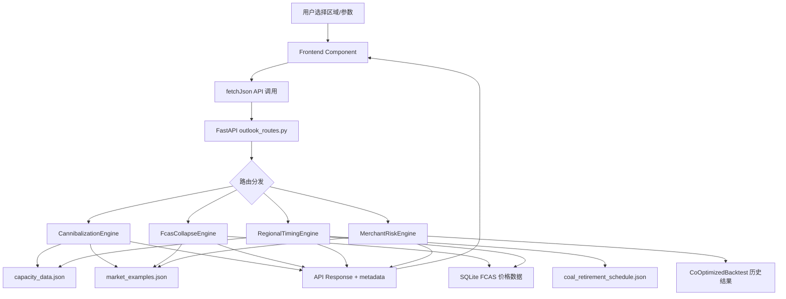

# Design Document: Investment Outlook Scenarios

## Overview

本设计文档定义 AEMO Intelligence 平台投资前景情景分析模块（Investment Outlook Scenarios）的技术架构。该功能新增 4 个方向性市场展望工具，帮助 BESS 投资者评估区域投资风险和时机：

1. **Cannibalization Simulator** — 基于幂律稀释曲线模拟容量增长对收入的蚕食效应
2. **FCAS Collapse Forecaster** — 基于供需比模型预测 FCAS 各服务类型的价格天花板
3. **Regional Timing Scorer** — 扩展现有 RegionalRanking，加入前瞻性因素（煤电退役、管道增长率）
4. **Merchant Risk Quantifier** — 基于蒙特卡洛重采样生成收入概率分布（P10/P50/P90）

这些模块不是价格预测模型，而是基于供需模型、历史统计和情景模拟的方向性分析工具。每个模块都包含真实市场数据注释，直接回答投资决策问题。

### 核心设计原则

- **数学模型透明**：所有模型参数可配置，公式在 API 响应中注明
- **真实数据锚定**：每个模块输出包含真实市场数据点作为信任锚
- **与现有平台一致**：遵循现有路由注册、ModuleRenderer、fetchJson 模式
- **渐进式集成**：新增独立 stage，不修改现有模块逻辑

## Architecture

### 系统架构概览

```
┌─────────────────────────────────────────────────────────────────────┐
│                        Frontend (React 19)                           │
├─────────────────────────────────────────────────────────────────────┤
│  MarketPage                                                          │
│    ├── ... (existing stages) ...                                     │
│    └── Stage 7: InvestmentOutlookStage (新增)                        │
│         ├── CannibalizationSimulator                                 │
│         ├── FcasCollapseForecaster                                   │
│         ├── RegionalTimingScorer                                     │
│         └── MerchantRiskQuantifier                                   │
├─────────────────────────────────────────────────────────────────────┤
│  marketConfig.js (MODULE_REGISTRY + stages 扩展)                     │
├─────────────────────────────────────────────────────────────────────┤
│                        Backend (FastAPI)                              │
│    ├── routes/outlook_routes.py (4 个新端点)                          │
│    ├── engines/cannibalization_engine.py                              │
│    ├── engines/fcas_collapse_engine.py                                │
│    ├── engines/regional_timing_engine.py                             │
│    └── engines/merchant_risk_engine.py                               │
├─────────────────────────────────────────────────────────────────────┤
│  Data Layer                                                          │
│    ├── data/capacity_data.json (现有，容量管道数据)                    │
│    ├── data/coal_retirement_schedule.json (新增)                      │
│    ├── data/market_examples.json (新增，真实市场数据注释)              │
│    └── SQLite (历史价格/FCAS 数据，现有)                              │
└─────────────────────────────────────────────────────────────────────┘
```

### 数据流



### 平台集成方式

- **路由注册**：在 `routes/__init__.py` 的 `ROUTE_MODULES` 列表中添加 `"routes.outlook_routes"`
- **前端注册**：在 `marketConfig.js` 的 `MODULE_REGISTRY` 中注册 4 个新组件
- **阶段配置**：在 NEM stages 数组中新增 `investment-outlook` 阶段（位于 `saturation-competition` 之后）
- **ModuleRenderer**：在 `ModuleRenderer.jsx` 的 `MODULE_REGISTRY` 中添加 lazy import
- **WEM 支持**：Cannibalization 和 Regional Timing 端点接受 market 参数（NEM/WEM），其余两个仅支持 NEM

## Components and Interfaces

### 1. Cannibalization Simulator (收入蚕食模拟器)

#### Backend Engine: `backend/engines/cannibalization_engine.py`

```python
class CannibalizationEngine:
    """基于幂律模型模拟容量增长对单位收入的蚕食效应。
    
    核心模型: revenue_per_mw = base_revenue / (capacity_mw / base_capacity) ^ alpha
    其中 alpha ≈ 0.5-0.7 控制稀释速度。
    """
    
    def __init__(self, capacity_loader: CapacityDataLoader):
        self.capacity_loader = capacity_loader
    
    def simulate(
        self,
        region: str,
        base_revenue_per_mw: float,
        base_capacity_mw: float,
        alpha: float = 0.6,
        projection_years: int = 3,
    ) -> CannibalizationResult:
        """执行蚕食模拟。"""
        ...
    
    def compute_dilution_curve(
        self,
        base_revenue: float,
        base_capacity: float,
        alpha: float,
        capacity_range: tuple[float, float],
        steps: int = 50,
    ) -> list[DilutionPoint]:
        """生成稀释曲线数据点。"""
        ...
```

#### API Route: `GET /api/v1/outlook/cannibalization`

```python
@router.get("/cannibalization")
async def get_cannibalization(
    market: str = Query(default="NEM", description="Market: NEM or WEM"),
    region: str = Query(..., description="Region: NSW1, QLD1, VIC1, SA1, TAS1, or WEM"),
    alpha: float = Query(default=0.6, ge=0.3, le=1.0, description="稀释指数"),
    base_revenue: Optional[float] = Query(default=None, description="基准收入 AUD/MW/yr"),
    projection_years: int = Query(default=3, ge=1, le=5, description="预测年数"),
) -> CannibalizationResponse:
    ...
```

#### Frontend Component: `web/src/components/modules/CannibalizationSimulator.jsx`

- 使用 Recharts LineChart 显示稀释曲线
- 标注真实市场数据点（QLD 收入下降案例）
- 显示年度预测时间线
- 超过 50% 稀释时显示警告指示器
- 底部显示纯文本结论摘要

### 2. FCAS Collapse Forecaster (FCAS 崩塌预判器)

#### Backend Engine: `backend/engines/fcas_collapse_engine.py`

```python
class FcasCollapseEngine:
    """基于供需比模型预测 FCAS 各服务类型的价格天花板。
    
    核心模型: price = max(0, base_price * (1 - (supply/demand - 1) ^ beta))
    其中 beta 控制崩塌陡峭度，supply/demand > 3.0 时价格趋近于零。
    """
    
    def __init__(self, db: DatabaseManager):
        self.db = db
    
    def forecast(
        self,
        region: str,
        year: int,
        beta: float = 1.5,
    ) -> FcasCollapseResult:
        """计算各 FCAS 服务的供需比和价格天花板。"""
        ...
    
    def compute_price_ceiling(
        self,
        supply_mw: float,
        demand_mw: float,
        base_price: float,
        beta: float,
    ) -> float:
        """计算单个服务的价格天花板。
        
        price = max(0, base_price * (1 - (supply/demand - 1) ^ beta))
        当 supply/demand <= 1 时返回 base_price（供不应求）。
        """
        ...
    
    def classify_service(self, supply_demand_ratio: float) -> str:
        """分类服务状态: healthy (<1.5), at_risk (1.5-3.0), collapsed (>3.0)"""
        ...
```

#### API Route: `GET /api/v1/outlook/fcas-collapse`

```python
@router.get("/fcas-collapse")
async def get_fcas_collapse(
    market: str = Query(default="NEM", description="Market: NEM or WEM"),
    region: str = Query(default="NSW1", description="Region"),
    year: int = Query(default=2025, description="分析年份"),
    beta: float = Query(default=1.5, ge=0.5, le=3.0, description="崩塌陡峭度参数"),
) -> FcasCollapseResponse:
    ...
```

#### Frontend Component: `web/src/components/modules/FcasCollapseForecaster.jsx`

- 汇总表格：10 种 FCAS 服务的供需比、分类、价格天花板
- 颜色编码：healthy=绿色, at_risk=橙色, collapsed=红色
- 历史收入轨迹折线图（2020→最新年份）
- 底部显示最大现实 FCAS 收入结论

### 3. Regional Timing Scorer (区域时机评分器)

#### Backend Engine: `backend/engines/regional_timing_engine.py`

```python
class RegionalTimingEngine:
    """扩展现有 RegionalRanking，加入前瞻性因素计算区域投资时机评分。
    
    评分维度:
    - coal_retirement_impact: 煤电退役带来的波动率增加预期
    - pipeline_growth_rate: 管道容量年增长率（负面因素）
    - renewable_penetration_trend: 可再生能源渗透率趋势
    - historical_revenue_trajectory: 历史收入变化方向
    """
    
    def __init__(
        self,
        db: DatabaseManager,
        capacity_loader: CapacityDataLoader,
        coal_schedule: CoalRetirementSchedule,
    ):
        self.db = db
        self.capacity_loader = capacity_loader
        self.coal_schedule = coal_schedule
    
    def score_regions(
        self,
        target_year: int,
        weights: Optional[dict[str, float]] = None,
    ) -> RegionalTimingResult:
        """计算各区域的前瞻性投资吸引力评分。"""
        ...
    
    def estimate_coal_retirement_impact(
        self,
        region: str,
        target_year: int,
    ) -> float:
        """估算煤电退役对区域波动率的影响（0-1 分）。"""
        ...
    
    def project_pipeline_growth(
        self,
        region: str,
        years_forward: int = 3,
    ) -> float:
        """预测管道容量年增长率。"""
        ...
```

#### API Route: `GET /api/v1/outlook/regional-timing`

```python
@router.get("/regional-timing")
async def get_regional_timing(
    market: str = Query(default="NEM", description="Market: NEM or WEM"),
    target_year: int = Query(default=2027, ge=2025, le=2032, description="目标投资年份"),
    weight_coal: float = Query(default=0.3, ge=0, le=1),
    weight_pipeline: float = Query(default=0.25, ge=0, le=1),
    weight_renewable: float = Query(default=0.2, ge=0, le=1),
    weight_revenue: float = Query(default=0.25, ge=0, le=1),
) -> RegionalTimingResponse:
    ...
```

#### Frontend Component: `web/src/components/modules/RegionalTimingScorer.jsx`

- 排名表格：区域、综合评分、各维度分数
- 雷达图对比各区域维度
- 真实案例注释（SA 煤电退役后收入变化）
- 底部显示推荐区域和时机结论

### 4. Merchant Risk Quantifier (商户风险量化器)

#### Backend Engine: `backend/engines/merchant_risk_engine.py`

```python
class MerchantRiskEngine:
    """基于蒙特卡洛重采样生成收入概率分布。
    
    方法: 从历史回测结果中随机抽取日收入样本，
    加入噪声扰动，生成 N 个年度收入情景，
    计算 P10/P50/P90 分位数和银行融资所需合约覆盖率。
    """
    
    def __init__(self, db: DatabaseManager):
        self.db = db
    
    def simulate(
        self,
        region: str,
        power_mw: float = 100,
        duration_hours: float = 4,
        n_simulations: int = 1000,
        noise_std_pct: float = 0.1,
        dscr: float = 1.3,
        bank_contract_pct: float = 0.7,
    ) -> MerchantRiskResult:
        """执行蒙特卡洛模拟。"""
        ...
    
    def compute_contract_coverage(
        self,
        p90_revenue: float,
        debt_service: float,
        dscr: float,
        bank_contract_pct: float,
    ) -> float:
        """计算满足银行融资门槛所需的最低合约覆盖率。"""
        ...
    
    def resample_daily_revenue(
        self,
        historical_daily_revenues: list[float],
        days_per_year: int = 365,
        noise_std_pct: float = 0.1,
    ) -> float:
        """从历史日收入中重采样生成一个年度收入情景。"""
        ...
```

#### API Route: `POST /api/v1/outlook/merchant-risk`

```python
@router.post("/merchant-risk")
async def post_merchant_risk(
    params: MerchantRiskRequest,
) -> MerchantRiskResponse:
    ...
```

#### Frontend Component: `web/src/components/modules/MerchantRiskQuantifier.jsx`

- 收入分布直方图（标注 P10/P50/P90 竖线）
- 合约覆盖率计算面板（可调 DSCR 和银行要求比例）
- 历史实际收入范围对比条
- 底部显示合约策略建议结论

### 5. Platform Integration Components

#### marketConfig.js MODULE_REGISTRY 扩展

```javascript
// 新增 4 个 outlook 模块
CannibalizationSimulator: { category: 'nem', description: 'Revenue cannibalization simulation' },
FcasCollapseForecaster: { category: 'nem', description: 'FCAS supply-demand collapse forecast' },
RegionalTimingScorer: { category: 'nem', description: 'Forward-looking regional timing score' },
MerchantRiskQuantifier: { category: 'nem', description: 'Monte Carlo merchant risk quantification' },
```

#### NEM Stages 新增阶段

```javascript
{
  id: 'investment-outlook',
  title: { zh: '投资前景情景', en: 'Investment Outlook Scenarios' },
  coreQuestion: { zh: '未来市场风险和机会如何演变？', en: 'How will future market risks and opportunities evolve?' },
  modules: [
    { component: 'CannibalizationSimulator', dataDependencies: ['/api/v1/nem/outlook/cannibalization'], loadPriority: 1, enabled: true },
    { component: 'FcasCollapseForecaster', dataDependencies: ['/api/v1/nem/outlook/fcas-collapse'], loadPriority: 2, enabled: true },
    { component: 'RegionalTimingScorer', dataDependencies: ['/api/v1/nem/outlook/regional-timing'], loadPriority: 2, enabled: true },
    { component: 'MerchantRiskQuantifier', dataDependencies: ['/api/v1/nem/outlook/merchant-risk'], loadPriority: 3, enabled: true },
  ],
}
```

该阶段插入在 `saturation-competition` 之后、`co-optimized-backtest` 之前。

#### ModuleRenderer.jsx 扩展

```javascript
// 新增 lazy import
CannibalizationSimulator: lazy(() => import('../modules/CannibalizationSimulator')),
FcasCollapseForecaster: lazy(() => import('../modules/FcasCollapseForecaster')),
RegionalTimingScorer: lazy(() => import('../modules/RegionalTimingScorer')),
MerchantRiskQuantifier: lazy(() => import('../modules/MerchantRiskQuantifier')),
```

#### routes/__init__.py 扩展

```python
ROUTE_MODULES = [
    ...
    "routes.outlook_routes",  # 新增
]
```

## Data Models

### 1. Coal Retirement Schedule (`data/coal_retirement_schedule.json`)

```json
{
  "metadata": {
    "last_updated": "2025-01-15",
    "source": "AEMO ISP 2024, operator announcements"
  },
  "retirements": [
    {
      "plant_name": "Yallourn",
      "region": "VIC1",
      "capacity_mw": 1480,
      "fuel_type": "brown_coal",
      "expected_closure_date": "2028-06-30",
      "confidence": "confirmed",
      "volatility_impact_estimate": 0.35
    },
    {
      "plant_name": "Eraring",
      "region": "NSW1",
      "capacity_mw": 2880,
      "fuel_type": "black_coal",
      "expected_closure_date": "2027-08-01",
      "confidence": "confirmed",
      "volatility_impact_estimate": 0.40
    },
    {
      "plant_name": "Bayswater",
      "region": "NSW1",
      "capacity_mw": 2640,
      "fuel_type": "black_coal",
      "expected_closure_date": "2030-12-31",
      "confidence": "announced",
      "volatility_impact_estimate": 0.30
    }
  ]
}
```

#### Pydantic Model

```python
class CoalRetirement(BaseModel):
    plant_name: str
    region: str
    capacity_mw: float = Field(gt=0)
    fuel_type: Literal["black_coal", "brown_coal", "gas"]
    expected_closure_date: date
    confidence: Literal["confirmed", "announced", "speculated"]
    volatility_impact_estimate: float = Field(ge=0, le=1.0)

class CoalRetirementSchedule(BaseModel):
    metadata: dict
    retirements: list[CoalRetirement]
    
    def get_retirements_before(self, region: str, target_date: date) -> list[CoalRetirement]:
        """获取指定区域在目标日期前的所有退役计划。"""
        return [r for r in self.retirements 
                if r.region == region and r.expected_closure_date <= target_date]
    
    def total_retiring_capacity(self, region: str, target_date: date) -> float:
        """计算指定区域在目标日期前退役的总容量。"""
        return sum(r.capacity_mw for r in self.get_retirements_before(region, target_date))
```

### 2. FCAS Supply-Demand Model Parameters

```python
class FcasServiceParams(BaseModel):
    """单个 FCAS 服务的供需参数。"""
    service_name: str  # e.g. "raise6sec"
    registered_capacity_mw: float = Field(ge=0)
    market_requirement_mw: float = Field(gt=0)
    supply_demand_ratio: float = Field(ge=0)
    historical_base_price: float = Field(ge=0, description="AUD/MW/hr 基准价格")
    classification: Literal["healthy", "at_risk", "collapsed"]
    price_ceiling: float = Field(ge=0, description="AUD/MW/hr 价格天花板")

class FcasCollapseParams(BaseModel):
    """FCAS 崩塌模型全局参数。"""
    beta: float = Field(default=1.5, ge=0.5, le=3.0, description="崩塌陡峭度")
    collapse_threshold: float = Field(default=3.0, description="供需比崩塌阈值")
    at_risk_threshold: float = Field(default=1.5, description="供需比风险阈值")
    enablement_probability: float = Field(default=0.3, ge=0, le=1.0, 
        description="FCAS 启用概率（用于加权年收入计算）")
```

### 3. Monte Carlo Simulation Parameters

```python
class MerchantRiskRequest(BaseModel):
    """蒙特卡洛模拟请求参数。"""
    market: Literal["NEM"] = "NEM"
    region: str = Field(..., description="NEM region")
    power_mw: float = Field(default=100, gt=0)
    duration_hours: float = Field(default=4, gt=0)
    round_trip_efficiency: float = Field(default=0.87, gt=0, le=1)
    
    # Monte Carlo 参数
    n_simulations: int = Field(default=1000, ge=100, le=10000)
    noise_std_pct: float = Field(default=0.10, ge=0, le=0.5, 
        description="日收入噪声标准差比例")
    
    # 银行融资参数
    dscr: float = Field(default=1.3, ge=1.0, le=2.0, 
        description="债务偿还覆盖率")
    bank_contract_pct: float = Field(default=0.70, ge=0.5, le=0.9, 
        description="银行要求合约覆盖比例")
    annual_debt_service: Optional[float] = Field(default=None, ge=0,
        description="年度债务偿还额 AUD/MW，默认按 capex 推算")

class MonteCarloConfig(BaseModel):
    """内部蒙特卡洛配置。"""
    seed: Optional[int] = None
    min_historical_years: int = Field(default=2, ge=1)
    days_per_year: int = Field(default=365)
```

### 4. API Response Schemas

#### CannibalizationResponse

```python
class DilutionPoint(BaseModel):
    capacity_mw: float
    revenue_per_mw: float  # AUD/MW/year
    dilution_pct: float    # 相对基准的稀释百分比

class YearlyProjection(BaseModel):
    year: int
    projected_capacity_mw: float
    projected_revenue_per_mw: float
    dilution_pct: float
    new_projects: list[str]  # 该年预计投产的项目名

class MarketExample(BaseModel):
    region: str
    description: str
    data_year: int
    actual_value: float
    label: str  # "actual" or "projected"

class CannibalizationResponse(BaseModel):
    metadata: dict  # {market, region, timezone, currency, methodology_version}
    region: str
    alpha: float
    base_capacity_mw: float
    base_revenue_per_mw: float
    
    dilution_curve: list[DilutionPoint]
    yearly_projections: list[YearlyProjection]
    current_dilution_pct: float
    warning_triggered: bool  # True if dilution > 50%
    
    market_examples: list[MarketExample]
    conclusion: str  # 纯文本结论摘要
```

#### FcasCollapseResponse

```python
class FcasServiceResult(BaseModel):
    service_name: str
    supply_mw: float
    demand_mw: float
    supply_demand_ratio: float
    classification: Literal["healthy", "at_risk", "collapsed"]
    price_ceiling_per_mwh: float  # AUD/MW/hr
    historical_price_per_mwh: Optional[float] = None

class FcasCollapseResponse(BaseModel):
    metadata: dict
    region: str
    year: int
    beta: float
    
    services: list[FcasServiceResult]
    total_fcas_ceiling_per_mw_year: float  # 所有服务加权求和
    
    historical_trajectory: list[dict]  # [{year, total_fcas_revenue_per_mw}]
    market_examples: list[MarketExample]
    conclusion: str
```

#### RegionalTimingResponse

```python
class RegionTimingScore(BaseModel):
    region: str
    rank: int
    total_score: float
    dimensions: dict  # {coal_retirement, pipeline_growth, renewable_penetration, revenue_trajectory}
    key_events: list[str]  # 该区域的关键事件描述

class RegionalTimingResponse(BaseModel):
    metadata: dict
    target_year: int
    weights_used: dict
    
    rankings: list[RegionTimingScore]
    coal_data_available: bool
    
    market_examples: list[MarketExample]
    conclusion: str  # 推荐区域和时机
```

#### MerchantRiskResponse

```python
class RevenueDistribution(BaseModel):
    p10: float  # AUD/MW/year
    p50: float
    p90: float
    mean: float
    std: float
    min_observed: float
    max_observed: float

class MerchantRiskResponse(BaseModel):
    metadata: dict
    region: str
    power_mw: float
    duration_hours: float
    n_simulations: int
    
    distribution: RevenueDistribution
    histogram_bins: list[dict]  # [{bin_start, bin_end, count, frequency}]
    
    # 银行融资分析
    min_contract_coverage_pct: float
    contract_revenue_needed: float  # AUD/MW/year
    bankability_met: bool
    
    # 历史对比
    historical_revenue_range: dict  # {min, max, years_used}
    years_of_data: int
    data_warning: Optional[str] = None  # 数据不足时的警告
    
    market_examples: list[MarketExample]
    conclusion: str
```

### 5. Market Examples Data (`data/market_examples.json`)

```json
{
  "metadata": {
    "last_updated": "2025-01-15",
    "source": "AEMO market data, operator reports, public filings"
  },
  "examples": {
    "cannibalization": [
      {
        "region": "QLD1",
        "description": "QLD BESS revenue declined from $280k/MW/yr to $73k/MW/yr as capacity tripled from 200MW to 600MW (2022-2024)",
        "data_year": 2024,
        "before_capacity_mw": 200,
        "after_capacity_mw": 600,
        "before_revenue": 280000,
        "after_revenue": 73000,
        "label": "actual"
      }
    ],
    "fcas_collapse": [
      {
        "region": "NEM-wide",
        "description": "Total FCAS revenue per MW declined from $384k/yr (2020) to $11k/yr (2025) as BESS registrations grew from 200MW to 2500MW",
        "trajectory": [
          {"year": 2020, "revenue_per_mw": 384000, "registered_bess_mw": 200},
          {"year": 2021, "revenue_per_mw": 180000, "registered_bess_mw": 500},
          {"year": 2022, "revenue_per_mw": 95000, "registered_bess_mw": 900},
          {"year": 2023, "revenue_per_mw": 45000, "registered_bess_mw": 1500},
          {"year": 2024, "revenue_per_mw": 22000, "registered_bess_mw": 2000},
          {"year": 2025, "revenue_per_mw": 11000, "registered_bess_mw": 2500}
        ],
        "label": "actual"
      }
    ],
    "regional_timing": [
      {
        "region": "SA1",
        "description": "SA outperformed other regions by 40% in 2022-2023 due to Northern Power Station closure increasing price volatility",
        "data_year": 2023,
        "event": "Northern Power Station closure (2016)",
        "revenue_premium_pct": 40,
        "label": "actual"
      }
    ],
    "merchant_risk": [
      {
        "region": "NSW1",
        "description": "NSW BESS merchant revenue ranged from $45k-$180k/MW/yr across 2022-2024, with bankability threshold at $80k/MW/yr requiring 40% contract coverage",
        "data_year": 2024,
        "p10_observed": 45000,
        "p50_observed": 95000,
        "p90_observed": 180000,
        "bankability_threshold": 80000,
        "label": "actual"
      }
    ]
  }
}
```

### 6. Key Design Decisions

#### 6.1 稀释曲线模型：幂律关系

**决策**：使用 `revenue_per_mw = base_revenue / (capacity / base_capacity) ^ alpha`

**理由**：
- 幂律比线性模型更符合实际市场行为（初始容量增加影响大，后续边际递减）
- alpha ≈ 0.5-0.7 的范围基于 QLD 实际数据拟合（容量 3x → 收入下降 74%，对应 alpha ≈ 0.6）
- 参数可配置，允许用户探索不同假设

#### 6.2 FCAS 崩塌模型：非线性供需函数

**决策**：使用 `price = max(0, base_price * (1 - (supply/demand - 1) ^ beta))`

**理由**：
- 当 supply/demand 接近 1 时价格接近 base_price（供需平衡）
- 当 supply/demand > 3 时价格趋近于零（市场崩塌）
- beta 参数控制崩塌速度，默认 1.5 基于 2020-2025 FCAS 价格轨迹拟合
- max(0, ...) 确保价格非负

#### 6.3 区域时机评分：扩展现有 RegionalRanking

**决策**：不修改现有 RegionalRanking，新建独立的 RegionalTimingEngine

**理由**：
- 现有 RegionalRanking 基于历史数据（后视），新模块基于前瞻性因素
- 避免修改已稳定的现有模块
- 两个模块可以并存，用户可对比历史排名和前瞻排名

#### 6.4 蒙特卡洛方法：历史重采样 + 噪声

**决策**：从历史回测日收入中随机抽样 365 天，加入 ±10% 高斯噪声

**理由**：
- 利用现有 CoOptimizedBacktest 的历史结果，无需重新运行优化
- 随机年份选择 + 噪声扰动模拟年际变异性
- 1000 次模拟足以产生稳定的 P10/P50/P90 估计
- 噪声标准差可配置，允许用户调整不确定性假设

#### 6.5 POST vs GET for Merchant Risk

**决策**：Merchant Risk 使用 POST（其余 3 个使用 GET）

**理由**：
- Monte Carlo 参数较多且包含嵌套结构（BESS 配置 + 模拟参数 + 银行参数）
- POST body 比 query string 更适合复杂参数传递
- 与现有 CoOptimizedBacktest（POST）保持一致

## Correctness Properties

*A property is a characteristic or behavior that should hold true across all valid executions of a system—essentially, a formal statement about what the system should do. Properties serve as the bridge between human-readable specifications and machine-verifiable correctness guarantees.*

### Property 1: Dilution curve follows power-law model

*For any* valid base_revenue > 0, base_capacity > 0, alpha ∈ [0.3, 1.0], and target_capacity > 0, the computed revenue_per_mw SHALL equal `base_revenue / (target_capacity / base_capacity) ^ alpha` within floating-point tolerance, and dilution_pct SHALL equal `(1 - revenue_per_mw / base_revenue) * 100`.

**Validates: Requirements 1.1**

### Property 2: Yearly projections count matches parameter

*For any* valid projection_years ∈ [1, 5], the yearly_projections list in the response SHALL contain exactly projection_years entries, with year values incrementing sequentially from the current year.

**Validates: Requirements 1.5**

### Property 3: Warning threshold consistency

*For any* valid CannibalizationResponse, warning_triggered SHALL be True if and only if current_dilution_pct > 50.0.

**Validates: Requirements 1.6**

### Property 4: Supply-demand ratio calculation

*For any* FCAS service with supply_mw > 0 and demand_mw > 0, the computed supply_demand_ratio SHALL equal supply_mw / demand_mw within floating-point tolerance.

**Validates: Requirements 2.1**

### Property 5: FCAS service classification is deterministic

*For any* supply_demand_ratio value, the classification SHALL be: "healthy" when ratio < 1.5, "at_risk" when 1.5 ≤ ratio ≤ 3.0, and "collapsed" when ratio > 3.0. Additionally, when classified as "collapsed", the price_ceiling SHALL be less than or equal to 0.01 * base_price.

**Validates: Requirements 2.2, 2.3**

### Property 6: Total FCAS ceiling equals weighted sum of parts

*For any* set of FcasServiceResult entries and enablement_probability, the total_fcas_ceiling_per_mw_year SHALL equal the sum of each service's price_ceiling_per_mwh multiplied by enablement_probability multiplied by 8760 (hours per year), within floating-point tolerance.

**Validates: Requirements 2.6**

### Property 7: Regional scores have all dimensions in valid range

*For any* valid target_year and weight configuration, every region in the rankings output SHALL have exactly 4 dimension scores (coal_retirement, pipeline_growth, renewable_penetration, revenue_trajectory), each in the range [0.0, 1.0].

**Validates: Requirements 3.1**

### Property 8: Rankings are properly ordered

*For any* valid RegionalTimingResponse, the rankings list SHALL be sorted by total_score in descending order, and rank values SHALL be sequential integers from 1 to N (where N is the number of regions).

**Validates: Requirements 3.2**

### Property 9: Monte Carlo percentiles are ordered

*For any* valid MerchantRiskResponse with n_simulations ≥ 100, the revenue distribution SHALL satisfy: distribution.p10 ≤ distribution.p50 ≤ distribution.p90, and distribution.min_observed ≤ distribution.p10 and distribution.p90 ≤ distribution.max_observed.

**Validates: Requirements 4.1**

### Property 10: Contract coverage calculation consistency

*For any* valid P90 revenue, debt_service, and dscr values, if P90 * (1 - min_contract_coverage_pct/100) + contract_revenue_needed ≥ debt_service * dscr, then bankability_met SHALL be True. The min_contract_coverage_pct SHALL be in range [0, 100].

**Validates: Requirements 4.4**

### Property 11: API responses contain standard metadata

*For any* valid request to any of the 4 outlook endpoints that returns a successful response, the response SHALL contain a metadata object with non-empty fields: market, region, timezone, currency, and methodology_version.

**Validates: Requirements 5.4**

### Property 12: Market examples have valid structure

*For any* MarketExample object in any outlook response, it SHALL have a non-empty region string, a data_year that is a valid year (≥ 2015 and ≤ current_year + 1), and a label that is exactly one of "actual" or "projected".

**Validates: Requirements 6.5, 6.6**

## Error Handling

### 后端错误处理

| 错误场景 | error_code | HTTP Status | suggested_action |
|---------|-----------|-------------|-----------------|
| 容量数据文件不存在 | `CAPACITY_DATA_MISSING` | 500 | "Verify data/capacity_data.json exists" |
| 区域无项目数据 | `NO_PROJECTS_IN_REGION` | 404 | "Check region code or add projects to capacity data" |
| 煤电退役数据不可用 | `COAL_DATA_UNAVAILABLE` | 200 (降级) | 返回结果但 coal_data_available=False |
| FCAS 价格数据缺失 | `FCAS_DATA_GAP` | 200 (降级) | 返回部分结果，排除缺失服务 |
| 历史回测数据不足 | `INSUFFICIENT_HISTORY` | 200 (警告) | 返回结果但附带 data_warning |
| 无效区域代码 | `INVALID_REGION` | 400 | "Valid regions: NSW1, QLD1, VIC1, SA1, TAS1" |
| 无效参数范围 | `INVALID_PARAMETER` | 422 | Pydantic 自动验证 |
| Monte Carlo 超时 | `SIMULATION_TIMEOUT` | 500 | "Reduce n_simulations or try again" |

### 降级策略

所有 4 个模块遵循**优雅降级**原则：
- 数据部分缺失时，返回可用部分 + 明确标注缺失维度
- 煤电退役数据缺失 → Regional Timing 仍计算其余 3 个维度
- FCAS 某服务数据缺失 → 排除该服务，总收入天花板仅基于可用服务
- 历史数据不足 2 年 → Monte Carlo 仍运行但附带统计代表性警告

### 前端错误处理

遵循现有 SaturationTracker 模式：
- loading 状态：显示 skeleton 动画
- error 状态：显示错误消息 + 重试按钮
- 部分数据：正常渲染可用部分，缺失部分显示 "数据不可用" 占位

## Testing Strategy

### 双重测试方法

本功能采用 **单元测试 + 属性测试** 双重策略：

#### 属性测试 (Property-Based Testing)

- **库**：Python `hypothesis`（项目已使用）
- **最低迭代次数**：每个属性测试 100 次
- **标签格式**：`Feature: investment-outlook-scenarios, Property {N}: {description}`
- **覆盖范围**：12 个正确性属性（见上文）

每个属性测试对应设计文档中的一个 Correctness Property，使用 Hypothesis 生成随机有效输入验证属性是否成立。

#### 单元测试 (Example-Based)

- **库**：`pytest`
- **覆盖范围**：
  - 各引擎的具体计算示例（已知输入→已知输出）
  - 边界条件（alpha=0.3, alpha=1.0, ratio=1.5, ratio=3.0）
  - 错误处理路径（缺失数据、无效参数）
  - API 端点集成测试（FastAPI TestClient）
  - 前端组件渲染测试（React Testing Library）

#### 测试文件结构

```
tests/
├── test_cannibalization_engine.py      # 单元 + 属性测试
├── test_fcas_collapse_engine.py        # 单元 + 属性测试
├── test_regional_timing_engine.py      # 单元 + 属性测试
├── test_merchant_risk_engine.py        # 单元 + 属性测试
├── test_outlook_routes.py             # API 集成测试
└── test_outlook_properties.py         # 所有 12 个属性测试集中文件
```

#### 属性测试示例

```python
from hypothesis import given, settings
from hypothesis.strategies import floats, integers

@settings(max_examples=100)
@given(
    base_revenue=floats(min_value=10000, max_value=500000),
    base_capacity=floats(min_value=50, max_value=5000),
    alpha=floats(min_value=0.3, max_value=1.0),
    target_capacity=floats(min_value=50, max_value=10000),
)
def test_dilution_curve_follows_power_law(base_revenue, base_capacity, alpha, target_capacity):
    """Feature: investment-outlook-scenarios, Property 1: Dilution curve follows power-law model"""
    engine = CannibalizationEngine(mock_loader)
    result = engine.compute_dilution_point(base_revenue, base_capacity, alpha, target_capacity)
    
    expected_revenue = base_revenue / (target_capacity / base_capacity) ** alpha
    expected_dilution = (1 - expected_revenue / base_revenue) * 100
    
    assert abs(result.revenue_per_mw - expected_revenue) < 0.01
    assert abs(result.dilution_pct - expected_dilution) < 0.01
```

#### 单元测试平衡原则

- 属性测试覆盖通用正确性（大量随机输入）
- 单元测试聚焦于：
  - 具体已知案例（QLD 实际数据验证）
  - 边界值（alpha 极值、ratio 阈值边界）
  - 错误路径（缺失文件、空数据）
  - 集成点（API 端点、数据加载）
- 避免为属性测试已覆盖的场景编写大量重复单元测试
