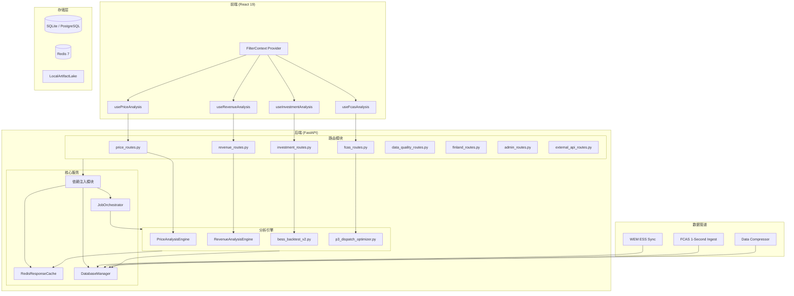
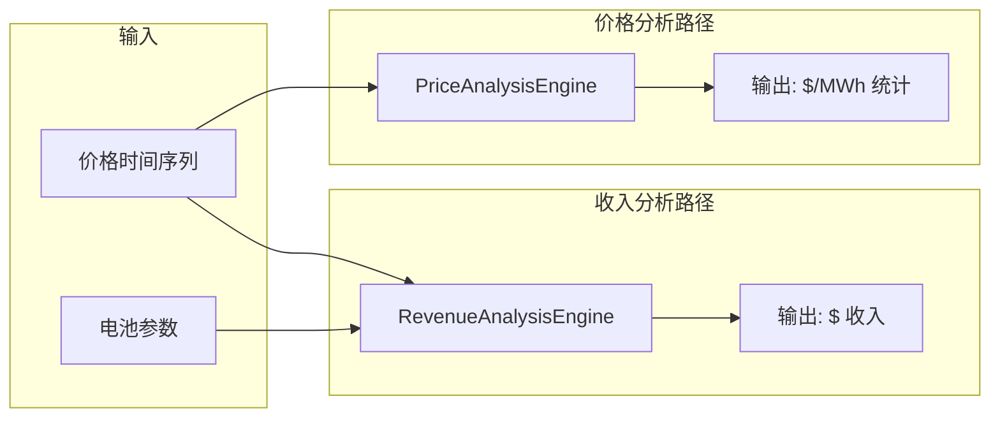
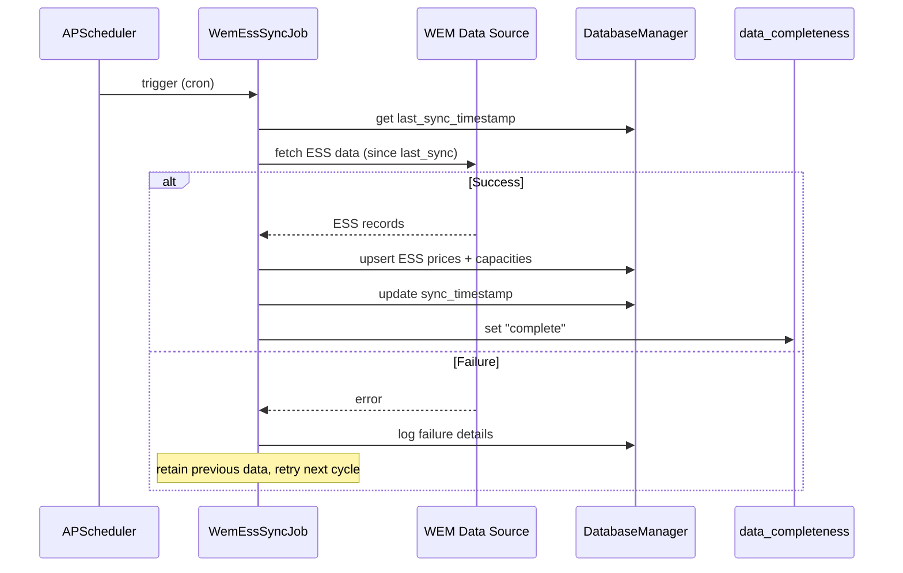
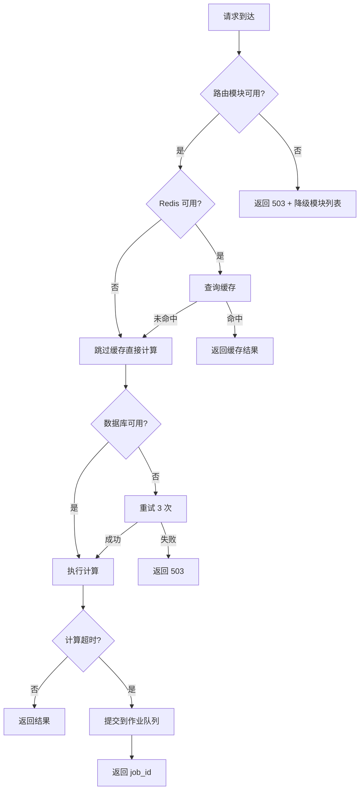

# Design Document

## Overview

本设计文档定义 AEMO Intelligence 平台优化的技术方案，覆盖四个阶段共 13 项需求的实现路径。设计目标是在保持现有 API 契约和用户体验不变的前提下，修复业务计算错误、改善代码架构、补全数据管道、建立生产级质量保障体系。

### 设计范围

| 阶段 | 范围 | 核心交付物 |
|------|------|-----------|
| Phase 1 | 业务正确性 | 价格/收入分离引擎、衰减率参数修复、WEM 边界标注 |
| Phase 2 | 架构重构 | 路由模块化、前端状态管理、过滤透传机制 |
| Phase 3 | 数据管道 | WEM ESS 同步、1 秒 FCAS 管道、回测约束强化 |
| Phase 4 | 质量保障 | 性能优化、测试体系完善 |

### 技术栈约束

- **后端**: FastAPI + Python 3.11, SQLite (WAL mode), Redis 7, PuLP (CBC solver)
- **前端**: React 19 + Vite 8 + Tailwind CSS v4 + Recharts + Framer Motion
- **部署**: Docker Compose (backend, worker, web/nginx, redis)
- **已有基础设施**: DatabaseManager 抽象层, RedisResponseCache, JobOrchestrator, OpenTelemetry, OpenLineage

---

## Architecture

### 系统架构总览



### Phase 1: 业务正确性架构

#### 价格/收入分离

当前问题：Revenue_Stacking_Engine 混合了价格统计（$/MWh）和收入计算（$），导致维度混淆。

设计方案：将计算路径拆分为两个独立引擎：



#### 衰减率修复

当前问题：用户自定义 `degradation_rate` 参数未被投资模型实际使用。

设计方案：在 `InvestmentParams` 模型中增加 `degradation_rate` 可选字段，投资计算逻辑优先使用用户值，回退到内置双因子模型。

### Phase 2: 架构重构

#### server.py 拆分策略

将 7000+ 行的 `server.py` 按业务域拆分为 8 个路由模块：

```
backend/
├── routes/
│   ├── __init__.py          # 路由注册器
│   ├── price_routes.py      # 价格分析 API
│   ├── revenue_routes.py    # 收入分析 API
│   ├── investment_routes.py # 投资分析 API
│   ├── fcas_routes.py       # FCAS 分析 API
│   ├── data_quality_routes.py # 数据质量 API
│   ├── finland_routes.py    # 芬兰市场 API
│   ├── admin_routes.py      # 系统管理 API
│   └── external_api_routes.py # 外部 API
├── deps.py                  # 依赖注入（DB, Cache, Auth）
├── server.py                # 精简后的 app 入口（<200 行）
└── ...
```

#### 前端状态管理重构

将 App.jsx 的 900+ 行集中式 useState 拆分为独立 hooks：

```
web/src/
├── hooks/
│   ├── useFilterContext.js    # 全局过滤条件（共享）
│   ├── usePriceAnalysis.js    # 价格分析状态
│   ├── useRevenueAnalysis.js  # 收入分析状态
│   ├── useFcasAnalysis.js     # FCAS 分析状态
│   ├── useInvestment.js       # 投资分析状态
│   └── useGridForecast.js     # 电网预测状态
├── contexts/
│   └── FilterContext.jsx      # React Context for 全局过滤
└── App.jsx                    # 精简后的布局组件
```

### Phase 3: 数据管道架构

#### WEM ESS 同步管道



#### 1 秒 FCAS 数据管道

数据生命周期管理：
- **0-90 天**: 保留 4 秒原始分辨率
- **90+ 天**: 降采样为 1 分钟分辨率存储
- **存储优化**: 使用时间分区表 + 批量写入
- **服务类型扩展**: 支持 RAISE1SEC/LOWER1SEC 的 5 分钟价格数据入库和分析

#### 回测引擎约束强化 (bess_backtest_v2)

在现有 `bess_backtest_v1.py` 基础上增加：

| 约束类型 | 约束项 | MILP 实现 |
|---------|--------|-----------|
| 物理约束 | 最大充放电功率 | `charge[t] <= P_max`, `discharge[t] <= P_max` |
| 物理约束 | SOC 边界 | `SOC_min <= soc[t] <= SOC_max` |
| 物理约束 | 循环效率 | `soc[t] = soc[t-1] + charge*η - discharge/η` |
| 物理约束 | 辅助功耗 | `soc[t] -= aux_power * dt` |
| 市场约束 | 最小持续时间 | 连续充/放电时段 >= min_duration |
| 市场约束 | 调度间隔对齐 | 决策变量对齐到 5min/30min 边界 |
| 市场约束 | 注册容量上限 | `charge[t] + discharge[t] <= registered_capacity` |

### Phase 4: 性能与测试

#### 性能优化策略

- **Redis 缓存**: 利用现有 `RedisResponseCache`，对相同参数请求实施 TTL 缓存
- **后台作业**: 计算超过 5 秒的任务通过 `JobOrchestrator` 异步执行，返回 job_id 供轮询
- **响应时间目标**: 价格/收入分析 < 3s，投资分析 < 10s（基于现有硬件配置）
- **computation_time_ms**: 所有分析响应 metadata 中记录实际计算耗时

---

## Components and Interfaces

### Phase 1 组件

#### PriceAnalysisEngine

```python
class PriceAnalysisEngine:
    """价格分析引擎 — 输出单位固定为 $/MWh"""

    def analyze(
        self,
        prices: list[dict],  # [{timestamp, price}]
        *,
        region: str,
        market: str,
        interval_minutes: int = 5,
    ) -> PriceAnalysisResult:
        """
        纯价格统计分析，不涉及电池参数。
        返回结果 metadata.unit 固定为 "$/MWh"。
        """
        ...

class PriceAnalysisResult(BaseModel):
    statistics: dict          # mean, median, p25, p75, max, min
    distribution: list[dict]  # 价格分布直方图
    time_series: list[dict]   # 时间序列统计
    metadata: AnalysisMetadata  # 含 unit="$/MWh"
```

#### RevenueAnalysisEngine

```python
class RevenueAnalysisEngine:
    """收入分析引擎 — 输出单位固定为 $"""

    def calculate(
        self,
        prices: list[dict],
        *,
        power_mw: float,
        energy_mwh: float,
        round_trip_efficiency: float,
        degradation_rate: float | None = None,
        network_fee_per_mwh: float = 0.0,
    ) -> RevenueAnalysisResult:
        """
        基于价格数据和电池物理参数计算收入。
        输入维度校验：拒绝已标记为 $/MWh 统计结果的输入。
        返回结果 metadata.unit 固定为 "$"。
        """
        ...

    def validate_input_dimensions(self, input_data: dict) -> None:
        """校验输入维度，如果检测到 $/MWh 统计结果则抛出 DimensionMismatchError"""
        if input_data.get("metadata", {}).get("unit") == "$/MWh":
            raise DimensionMismatchError(
                expected_unit="raw_price_series",
                received_unit="$/MWh",
                message="价格统计结果不能直接用于收入计算，请使用原始价格序列"
            )
```

#### DegradationModel

```python
class DegradationModel(BaseModel):
    model_type: str  # "user-linear" | "dual-factor-default"
    annual_rate: float | None = None  # 用户提供时有值
    parameters: dict = {}  # 模型具体参数

    @classmethod
    def from_user_input(cls, degradation_rate: float | None) -> "DegradationModel":
        if degradation_rate is not None:
            if not (0.0 <= degradation_rate <= 0.15):
                raise ValueError(f"degradation_rate must be between 0 and 0.15, got {degradation_rate}")
            return cls(model_type="user-linear", annual_rate=degradation_rate)
        return cls(model_type="dual-factor-default", parameters={"calendar": 0.015, "cyclic_per_cycle": 0.0000333})

    def capacity_at_year(self, year: int, cycles_per_year: float) -> float:
        """返回第 N 年的剩余容量比例 (0-1)"""
        if self.model_type == "user-linear":
            return max(0.0, 1.0 - self.annual_rate * year)
        # dual-factor: calendar + cyclic degradation (aligned with existing server.py logic)
        calendar_loss = self.parameters["calendar"] * year
        cyclic_loss = self.parameters["cyclic_per_cycle"] * cycles_per_year * year
        return max(0.0, 1.0 - calendar_loss - cyclic_loss)
```

### Phase 2 组件

#### 依赖注入模块 (deps.py)

```python
# backend/deps.py
from functools import lru_cache
from database import DatabaseManager
from response_cache import RedisResponseCache

@lru_cache(maxsize=1)
def get_db() -> DatabaseManager:
    return DatabaseManager(os.getenv("AUS_ELE_DB_PATH"))

@lru_cache(maxsize=1)
def get_cache() -> RedisResponseCache:
    return RedisResponseCache()

@lru_cache(maxsize=1)
def get_job_orchestrator() -> JobOrchestrator:
    return JobOrchestrator(get_db(), registry=get_job_registry(), lake=get_lake())

# FastAPI Depends 注入
async def db_dependency() -> DatabaseManager:
    return get_db()

async def cache_dependency() -> RedisResponseCache:
    return get_cache()
```

#### 路由注册器

```python
# backend/routes/__init__.py
import importlib
import logging

logger = logging.getLogger(__name__)

ROUTE_MODULES = [
    "routes.price_routes",
    "routes.revenue_routes",
    "routes.investment_routes",
    "routes.fcas_routes",
    "routes.data_quality_routes",
    "routes.finland_routes",
    "routes.admin_routes",
    "routes.external_api_routes",
]

def register_all_routes(app, *, degraded_modules: list[str] | None = None):
    """注册所有路由模块，单个模块失败不影响其他模块启动"""
    degraded = degraded_modules if degraded_modules is not None else []
    for module_path in ROUTE_MODULES:
        try:
            mod = importlib.import_module(module_path)
            app.include_router(mod.router)
        except Exception as exc:
            logger.error(f"Failed to load route module {module_path}: {exc}")
            degraded.append(module_path)
    return degraded
```

#### FilterContext (前端)

```javascript
// web/src/contexts/FilterContext.jsx
import { createContext, useContext, useReducer, useCallback } from 'react';

const FilterContext = createContext(null);

const initialState = {
  market: 'NEM',
  region: 'NSW1',
  year: new Date().getFullYear(),
  quarter: 'ALL',
  dayType: 'ALL',
  months: ['ALL'],
};

function filterReducer(state, action) {
  switch (action.type) {
    case 'SET_FILTER':
      return { ...state, [action.key]: action.value };
    case 'RESET':
      return initialState;
    default:
      return state;
  }
}

export function FilterProvider({ children }) {
  const [filters, dispatch] = useReducer(filterReducer, initialState);
  const setFilter = useCallback((key, value) => {
    dispatch({ type: 'SET_FILTER', key, value });
  }, []);
  return (
    <FilterContext.Provider value={{ filters, setFilter }}>
      {children}
    </FilterContext.Provider>
  );
}

export function useFilters() {
  const ctx = useContext(FilterContext);
  if (!ctx) throw new Error('useFilters must be used within FilterProvider');
  return ctx;
}
```

### Phase 3 组件

#### WEM ESS Sync Job

```python
class WemEssSyncJob:
    """WEM ESS 数据增量同步作业"""

    def __init__(self, db: DatabaseManager, source_client):
        self.db = db
        self.source = source_client

    def run(self, context: JobContext) -> dict:
        last_sync = self.db.get_system_status("wem_ess_last_sync")
        since = last_sync or "2020-01-01T00:00:00Z"

        context.set_progress(10, "Fetching ESS data since " + since)
        records = self.source.fetch_ess_data(since=since)

        context.set_progress(50, f"Upserting {len(records)} ESS records")
        self.db.upsert_ess_market_data(records)

        now_iso = datetime.now(timezone.utc).isoformat()
        self.db.set_system_status("wem_ess_last_sync", now_iso)
        self.db.set_system_status("wem_ess_data_completeness", "complete")

        context.set_progress(100, "ESS sync complete")
        return {"records_synced": len(records), "sync_timestamp": now_iso}
```

#### FCAS 1-Second Data Compressor

```python
class FcasDataCompressor:
    """FCAS 4 秒数据压缩策略：90 天后降采样为 1 分钟"""

    RETENTION_DAYS = 90
    TARGET_INTERVAL_SECONDS = 60

    def compress(self, db: DatabaseManager) -> dict:
        cutoff = datetime.now(timezone.utc) - timedelta(days=self.RETENTION_DAYS)
        old_records = db.fetch_fcas_4s_before(cutoff)

        downsampled = self._downsample(old_records, self.TARGET_INTERVAL_SECONDS)
        db.replace_fcas_records(before=cutoff, new_records=downsampled)

        return {
            "original_count": len(old_records),
            "compressed_count": len(downsampled),
            "compression_ratio": len(downsampled) / max(len(old_records), 1),
        }

    def _downsample(self, records: list[dict], target_seconds: int) -> list[dict]:
        """将 4 秒数据按 target_seconds 窗口取均值"""
        ...
```

#### Backtest V2 约束接口

```python
@dataclass
class BacktestConstraints:
    """回测引擎 V2 约束配置"""
    # 物理约束
    max_charge_mw: float
    max_discharge_mw: float
    min_soc_pct: float
    max_soc_pct: float
    round_trip_efficiency: float
    auxiliary_power_mw: float = 0.0  # 辅助功耗

    # 市场约束
    min_duration_intervals: int = 1       # 最小持续时间（间隔数）
    dispatch_alignment_minutes: int = 5   # 调度间隔对齐
    registered_capacity_mw: float | None = None  # 市场注册容量上限

    def validate(self) -> list[str]:
        """返回约束冲突列表，空列表表示无冲突"""
        issues = []
        if self.min_soc_pct >= self.max_soc_pct:
            issues.append("min_soc_pct >= max_soc_pct: infeasible SOC range")
        if self.auxiliary_power_mw >= self.max_discharge_mw:
            issues.append("auxiliary_power >= max_discharge: no usable capacity")
        return issues
```

---

## Data Models

### 分析结果 Metadata 模型

```python
class AnalysisMetadata(BaseModel):
    """所有分析结果的标准 metadata"""
    market: str
    region_or_zone: str
    timezone: str = "Australia/Sydney"
    currency: str = "AUD"
    unit: str                          # "$/MWh" | "$" | "MW" | "MWh"
    interval_minutes: int | None = None
    interval_seconds: int | None = None  # 1 秒 FCAS 场景
    data_grade: str = "production"
    data_quality_score: float | None = None
    data_completeness: str = "complete"  # "complete" | "preview"
    coverage: dict | None = None
    freshness: str | None = None
    source_name: str | None = None
    source_version: str | None = None
    methodology_version: str | None = None
    computation_time_ms: int | None = None
    ignored_filters: list[str] | None = None
    warnings: list[str] | None = None
```

### 衰减模型响应

```python
class InvestmentAnalysisResponse(BaseModel):
    """投资分析响应 — 包含衰减模型信息"""
    npv: float
    irr: float | None
    payback_years: float | None
    annual_cashflows: list[dict]
    degradation_model: DegradationModel  # 新增：实际使用的衰减模型
    metadata: AnalysisMetadata
```

### 回测结果模型 (V2)

```python
class BacktestV2Result(BaseModel):
    """回测引擎 V2 结果 — 含约束标注"""
    timeline: list[dict]
    summary: BacktestSummary
    binding_constraints: list[BindingConstraintRecord] | None = None
    metadata: AnalysisMetadata

class BindingConstraintRecord(BaseModel):
    constraint_name: str       # "soc_min" | "soc_max" | "power_limit" | "min_duration"
    intervals_active: int      # 约束激活的时段数
    first_active_timestamp: str
    last_active_timestamp: str
```

### WEM 数据完整性状态

```python
class DataCompletenessStatus(BaseModel):
    """WEM 模块数据完整性状态"""
    module: str                # "wem_ess" | "wem_fcas"
    status: str                # "complete" | "preview"
    label: str                 # 显示标注文本
    last_sync: str | None      # 最后同步时间
    pipeline_connected: bool   # 管道是否已连接
```

### 过滤上下文模型

```python
class FilterContext(BaseModel):
    """全局过滤条件"""
    market: str = "NEM"
    region: str = "NSW1"
    year: int | None = None
    quarter: str = "ALL"
    day_type: str = "ALL"
    months: list[str] = ["ALL"]

    def to_query_params(self) -> dict:
        """转换为 API 查询参数"""
        params = {"market": self.market, "region": self.region}
        if self.year:
            params["year"] = self.year
        if self.quarter != "ALL":
            params["quarter"] = self.quarter
        if self.day_type != "ALL":
            params["day_type"] = self.day_type
        if self.months != ["ALL"]:
            params["months"] = ",".join(self.months)
        return params
```

---

## Correctness Properties

*A property is a characteristic or behavior that should hold true across all valid executions of a system-essentially, a formal statement about what the system should do. Properties serve as the bridge between human-readable specifications and machine-verifiable correctness guarantees.*

### Redundancy Analysis

在 prework 分析中识别出以下可合并/冗余的属性：

1. **1.1 + 1.4 合并**: "价格路径输出 $/MWh" 和 "metadata 包含 unit 字段" 可合并为一个更强的属性：价格分析输出的 unit 字段始终为 "$/MWh"。
2. **1.2 + 1.3 合并**: "价格分析不受电池参数影响" 和 "收入分析依赖电池参数" 是同一分离属性的两面，合并为维度不变量。
3. **9.1 + 9.5 合并**: "MILP 包含物理约束" 和 "SOC 轨迹满足边界" 是同一不变量的声明和验证，合并为 SOC 边界不变量。
4. **6.1 + 6.2 合并**: "过滤条件传递到所有模块" 和 "API 请求附加 Filter_Context" 是同一传播属性的前端和后端视角，合并为过滤传播一致性。
5. **2.1 + 2.2 合并**: "使用用户衰减率" 和 "响应包含 degradation_model" 合并为衰减模型一致性属性。
6. **10.3 + 10.5 合并**: "缓存策略" 和 "computation_time_ms" 是独立属性，保留分开。

最终保留 10 个独立属性。

---

### Property 1: 价格分析维度不变量

*For any* 价格时间序列和任意电池参数组合（power_mw, energy_mwh, round_trip_efficiency），PriceAnalysisEngine 的输出应始终相同，且 metadata.unit 固定为 "$/MWh"。即：价格分析结果不受电池物理参数影响。

**Validates: Requirements 1.1, 1.2, 1.4**

### Property 2: 收入计算维度正确性

*For any* 有效价格序列和有效电池参数，RevenueAnalysisEngine 的输出 metadata.unit 固定为 "$"，且收入值与电池容量单调递增（capacity 增大则收入不减少，在相同价格序列和调度策略下）。

**Validates: Requirements 1.3, 1.4**

### Property 3: 维度不匹配拒绝

*For any* 带有 metadata.unit="$/MWh" 标记的输入数据，当传入 RevenueAnalysisEngine 时，系统应返回 DimensionMismatchError 而非计算结果。

**Validates: Requirements 1.5**

### Property 4: 衰减模型一致性

*For any* 有效的 degradation_rate 值（0 ≤ rate ≤ 0.15），Investment_Model 的响应中 degradation_model.model_type 应为 "user-linear" 且 degradation_model.annual_rate 等于输入值；对于无效值（rate < 0 或 rate > 0.15），系统应返回参数校验错误。

**Validates: Requirements 2.1, 2.2, 2.4, 2.5**

### Property 5: SOC 边界不变量

*For any* 有效的电池参数（power_mw > 0, energy_mwh > 0, 0 < min_soc_pct < max_soc_pct ≤ 100）和任意非空价格序列，Backtest_Engine 的结果 timeline 中每个时刻的 soc_mwh 应满足：`energy_mwh * min_soc_pct/100 ≤ soc_mwh ≤ energy_mwh * max_soc_pct/100`。

**Validates: Requirements 9.1, 9.5**

### Property 6: 回测收入非负性（在正价差市场）

*For any* 价格序列中存在正价差（max(prices) - min(prices) > 0）的情况，且电池参数有效，且终端 SOC 约束存在（soc[-1] >= initial_soc）时，Backtest_Engine 的 net_revenue 应 ≥ 0（优化器可以选择不操作，因此不会主动选择亏损策略）。

**Validates: Requirements 9.1, 9.2**

### Property 7: 过滤条件传播一致性

*For any* FilterContext 状态变更和任意活跃分析模块集合，每个模块发出的 API 请求应包含当前 FilterContext 的所有支持维度参数；对于不支持的维度，API 响应 metadata.ignored_filters 应列出被忽略的维度名称。

**Validates: Requirements 6.1, 6.2, 6.3**

### Property 8: 数据分辨率回退正确性

*For any* FCAS 分析请求，当 4 秒数据不可用时，系统应回退到 5 分钟分辨率，且响应 metadata.interval_seconds 应反映实际使用的分辨率而非请求的分辨率。

**Validates: Requirements 8.3, 8.4**

### Property 9: 数据压缩保留策略

*For any* 4 秒 FCAS 数据集，压缩操作后：(a) 90 天内的数据保持 4 秒分辨率不变，(b) 超过 90 天的数据降采样为 1 分钟分辨率，(c) 降采样后的数据点数量约为原始数据的 1/15。

**Validates: Requirements 8.5**

### Property 10: API 契约向后兼容

*For any* 在路由模块拆分前有效的 API 请求（URL + 参数组合），拆分后应返回相同结构的响应（相同 HTTP 状态码、相同 JSON 字段集合、相同数据类型）。

**Validates: Requirements 4.3**

---

## Error Handling

### 错误分类与处理策略

| 错误类型 | HTTP 状态码 | 处理策略 | 示例 |
|---------|------------|---------|------|
| 维度不匹配 | 422 | 返回明确错误信息，说明期望和实际维度 | 价格统计结果传入收入接口 |
| 参数校验失败 | 422 | 返回字段级错误，说明有效范围 | degradation_rate > 0.15 |
| MILP 不可行 | 200 + status="infeasible" | 返回不可行状态和约束冲突列表 | min_soc > max_soc |
| 数据管道失败 | N/A (后台) | 记录日志、保留旧数据、下次重试 | WEM 数据源不可用 |
| 路由模块加载失败 | N/A (启动时) | 记录错误、继续启动、/health 报告降级 | 模块 import 错误 |
| 数据库连接失败 | 503 | 重试 3 次，全部失败返回 503 | SQLite 文件锁定 |
| 缓存不可用 | N/A (透明降级) | 跳过缓存直接计算，不影响功能 | Redis 连接断开 |
| 过滤条件无数据 | 200 + empty result | 返回空结果集 + 提示信息 | WEM + 2019 无数据 |

### 错误响应格式

```python
class ErrorResponse(BaseModel):
    error_code: str           # "DIMENSION_MISMATCH" | "PARAM_VALIDATION" | "INFEASIBLE"
    message: str              # 用户可读的中文错误描述
    details: dict | None = None  # 结构化错误详情
    suggestion: str | None = None  # 建议的修复操作

# 示例
{
    "error_code": "DIMENSION_MISMATCH",
    "message": "输入维度不匹配：收入计算接口需要原始价格序列，但收到了价格统计结果（$/MWh）",
    "details": {"expected_unit": "raw_price_series", "received_unit": "$/MWh"},
    "suggestion": "请使用 /api/price-data 获取原始价格序列作为输入"
}
```

### 降级策略



---

## Testing Strategy

### 测试金字塔

```
┌─────────────────────────────┐
│     E2E Tests (Playwright)   │  ← 5-10 个关键用户流程
├─────────────────────────────┤
│   Integration Tests (pytest) │  ← API 契约验证、模块间交互
├─────────────────────────────┤
│  Property Tests (Hypothesis) │  ← 核心不变量验证 (100+ iterations)
├─────────────────────────────┤
│    Unit Tests (pytest)       │  ← 引擎逻辑、工具函数、边界条件
└─────────────────────────────┘
```

### 属性测试 (Property-Based Testing)

**库选择**: [Hypothesis](https://hypothesis.readthedocs.io/) (Python PBT 标准库)

**配置要求**:
- 每个属性测试最少 100 次迭代
- 使用 `@settings(max_examples=200)` 确保充分覆盖
- 每个测试标注对应的设计属性编号

**标注格式**: `Feature: platform-optimization, Property {number}: {property_text}`

**属性测试清单**:

| Property | 测试文件 | 生成器策略 |
|----------|---------|-----------|
| P1: 价格维度不变量 | `tests/test_price_revenue_properties.py` | 随机价格序列 + 随机电池参数 |
| P2: 收入维度正确性 | `tests/test_price_revenue_properties.py` | 随机价格 + 随机容量 |
| P3: 维度不匹配拒绝 | `tests/test_price_revenue_properties.py` | 随机 $/MWh 标记数据 |
| P4: 衰减模型一致性 | `tests/test_degradation_properties.py` | 随机 float [0, 0.15] + 越界值 |
| P5: SOC 边界不变量 | `tests/test_backtest_properties.py` | 随机电池参数 + 随机价格序列 |
| P6: 回测收入非负性 | `tests/test_backtest_properties.py` | 含正价差的随机价格序列 |
| P7: 过滤传播一致性 | `tests/test_filter_properties.py` | 随机 FilterContext + 随机模块集 |
| P8: 分辨率回退 | `tests/test_fcas_resolution_properties.py` | 随机数据可用性状态 |
| P9: 数据压缩策略 | `tests/test_fcas_resolution_properties.py` | 随机时间戳分布的 4 秒数据 |
| P10: API 契约兼容 | `tests/test_api_contract_properties.py` | 随机有效 API 请求参数 |

### 单元测试

**重点覆盖**:
- PriceAnalysisEngine: 统计计算正确性（均值、中位数、分位数）
- RevenueAnalysisEngine: 收入计算公式验证
- DegradationModel: 各年容量衰减计算
- BacktestConstraints: 约束冲突检测
- FcasDataCompressor: 降采样算法正确性
- FilterContext: 参数序列化

### 集成测试

**重点覆盖**:
- 路由模块拆分后的 API 端点可达性
- 过滤条件端到端传递
- Redis 缓存命中/未命中路径
- 作业队列提交和结果轮询
- 路由模块加载失败的降级行为

### E2E 测试 (Playwright)

**关键流程**:
1. 用户登录 → 选择市场/区域 → 查看价格分析 → 切换到收入分析
2. 用户修改全局过滤条件 → 验证所有模块刷新
3. 用户运行投资分析（含自定义衰减率）→ 验证结果包含衰减模型信息
4. WEM 市场页面 → 验证数据完整性标注显示

### 性能基准测试

| 端点 | 数据量 | 目标响应时间 | 测试方法 |
|------|--------|------------|---------|
| /api/price-trend | 1 年 5 分钟 (105,120 点) | < 3s | pytest-benchmark |
| /api/revenue-analysis | 1 年 5 分钟 | < 3s | pytest-benchmark |
| /api/investment-analysis | 20 年生命周期 | < 10s | pytest-benchmark |
| /api/fcas-analysis (4s) | 1 天 (21,600 点) | < 5s | pytest-benchmark |
