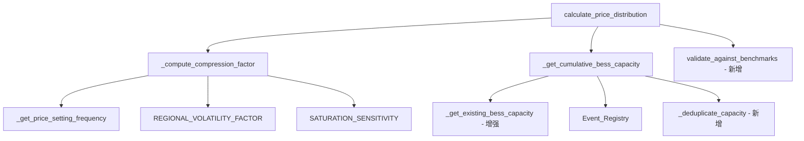
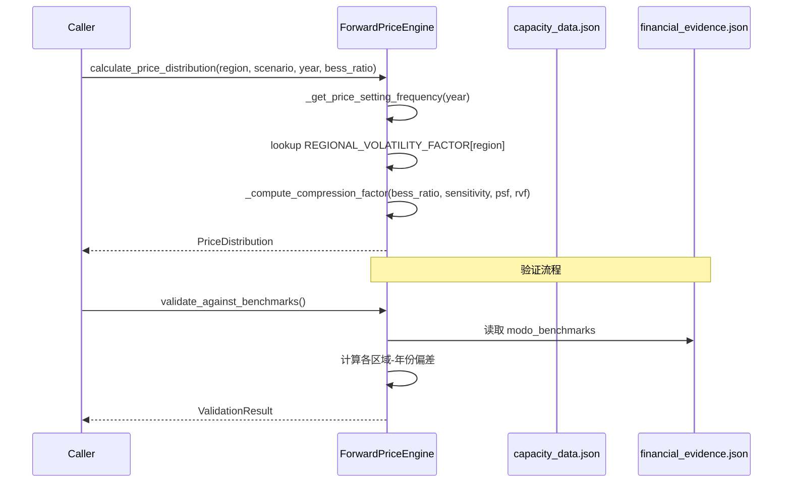

# Design Document: Saturation Compression Fix

## Overview

本设计修正 `ForwardPriceEngine` 中 BESS 饱和压缩曲线的计算逻辑，使其输出贴合 Modo Energy 公开基准数据。核心变更是将当前简单的双曲线公式替换为指数衰减模型，并引入区域波动性因子和 BESS 价格设定频率两个新维度。

**当前问题：**
- 现有公式 `compression = 1 / (1 + bess_ratio × sensitivity)` 产生的压缩效应远弱于实际市场观测
- 模型偏差达 55-440%（模型预测远高于 Modo 基准）
- 未考虑区域波动性差异（SA1 高波动 vs QLD1 低波动）
- 未考虑 BESS 价格设定频率的加速增长趋势

**设计目标：**
- 所有区域-年份组合的收入预测偏差 ≤ ±30%（对标 Modo 基准）
- 保持 `calculate_price_distribution()` 方法签名不变
- 保持 Central/High/Low 情景差异化

## Architecture

### 修改范围

变更集中在 `backend/engines/forward_price_engine.py` 单文件内，不影响外部接口：



### 数据流



## Components and Interfaces

### 新增常量

```python
# 区域波动性因子 — 反映区域供需结构对压缩的抵抗程度
# 值越大 → 压缩越弱（高波动区域保留更多价差）
REGIONAL_VOLATILITY_FACTOR: Dict[str, float] = {
    "QLD1": 0.55,   # 低波动，BESS 压缩效应最强
    "VIC1": 1.15,   # 中等波动
    "NSW1": 1.20,   # 中等波动，略高于 VIC1
    "SA1": 2.30,    # 高波动，压缩效应最弱
    "TAS1": 0.70,   # 低波动，小市场
    "WEM": 1.00,    # 基准值（WA 独立市场）
}

# 压缩公式参数
COMPRESSION_STEEPNESS: float = 1.5       # 指数衰减陡度
PSF_WEIGHT: float = 1.5                  # 价格设定频率权重

# 价格设定频率已知数据点（NEM 全市场）
PSF_DATA_POINTS: List[Tuple[float, float]] = [
    (2020.0, 0.01),   # 2020: 1%
    (2025.0, 0.22),   # 2025: 22%
    (2026.25, 0.41),  # Q1 2026: 41%
]

# 价格设定频率逻辑斯蒂增长参数
PSF_MAX: float = 0.70          # 最大上限 70%
PSF_GROWTH_RATE: float = 0.8   # 逻辑斯蒂增长速率
PSF_MIDPOINT: float = 2027.0   # 增长曲线中点年份
```

### 新增/修改方法

#### `_compute_compression_factor(bess_ratio, sensitivity, psf, rvf) -> float`

**新增私有方法**，封装压缩因子计算逻辑：

```python
def _compute_compression_factor(
    self,
    bess_capacity_ratio: float,
    sensitivity: float,
    price_setting_frequency: float,
    regional_volatility_factor: float,
) -> float:
    """计算 BESS 饱和压缩因子。

    公式: compression = clamp(exp(-k * (bess_ratio * sensitivity + w * psf) / rvf), 0.05, 1.0)

    Args:
        bess_capacity_ratio: BESS 容量 / 峰值需求
        sensitivity: 情景敏感度系数 (HIGH=0.7, CENTRAL=1.0, LOW=1.3)
        price_setting_frequency: BESS 价格设定频率 [0, 1]
        regional_volatility_factor: 区域波动性因子

    Returns:
        压缩因子，范围 [0.05, 1.0]
    """
```

#### `_get_price_setting_frequency(year) -> float`

**新增私有方法**，计算指定年份的 BESS 价格设定频率：

```python
def _get_price_setting_frequency(self, year: int) -> float:
    """获取指定年份的 BESS 价格设定频率。

    - 2020-2026: 线性插值已知数据点
    - 2026+: 逻辑斯蒂增长曲线外推，上限 70%

    Args:
        year: 目标年份

    Returns:
        价格设定频率 [0.0, 0.70]
    """
```

#### `_get_existing_bess_capacity(region, year) -> float` — 增强

修改现有方法，增加 `year` 参数和状态过滤：

```python
def _get_existing_bess_capacity(self, region: str, year: int = None) -> float:
    """获取区域已投产/在建/承诺的 BESS 容量。

    包含 status 为 "registered", "construction", "committed" 的项目。
    使用 actual_commissioning_date（优先）或 expected_commissioning_date。

    Args:
        region: NEM 区域
        year: 目标年份（None 表示当前年份）

    Returns:
        累计 BESS 容量 (MW)
    """
```

#### `_deduplicate_capacity(event_capacity, data_capacity) -> float` — 新增

```python
def _deduplicate_capacity(
    self,
    event_projects: List[dict],
    data_projects: List[dict],
) -> float:
    """合并 Event_Registry 和 Capacity_Data 的容量，去重。

    当项目同时出现在两个来源时，以 Capacity_Data 为准。

    Returns:
        去重后的总容量 (MW)
    """
```

#### `validate_against_benchmarks() -> Dict` — 新增

```python
def validate_against_benchmarks(self) -> Dict[str, Any]:
    """对比模型输出与 Modo 基准数据。

    读取 financial_evidence.json 中的 modo_benchmarks，
    计算各区域-年份组合的偏差百分比。

    Returns:
        {
            "results": [{"region": str, "period": str, "model": float,
                         "benchmark": float, "deviation_pct": float}],
            "all_within_threshold": bool,
            "max_deviation_pct": float,
        }
    """
```

### 修改 `calculate_price_distribution` 内部逻辑

方法签名不变，内部压缩计算替换为：

```python
# 旧代码:
# compression_factor = 1.0 / (1.0 + bess_capacity_ratio * sensitivity)

# 新代码:
psf = self._get_price_setting_frequency(year)
rvf = REGIONAL_VOLATILITY_FACTOR.get(region, 1.0)
sensitivity = SATURATION_SENSITIVITY[scenario]
compression_factor = self._compute_compression_factor(
    bess_capacity_ratio, sensitivity, psf, rvf
)
```

## Data Models

### 新增常量数据结构

| 常量名 | 类型 | 说明 |
|--------|------|------|
| `REGIONAL_VOLATILITY_FACTOR` | `Dict[str, float]` | 区域波动性因子映射 |
| `COMPRESSION_STEEPNESS` | `float` | 指数衰减陡度 (k=1.5) |
| `PSF_WEIGHT` | `float` | 价格设定频率权重 (w=1.5) |
| `PSF_DATA_POINTS` | `List[Tuple[float, float]]` | PSF 已知数据点 |
| `PSF_MAX` | `float` | PSF 上限 (0.70) |
| `PSF_GROWTH_RATE` | `float` | 逻辑斯蒂增长速率 |
| `PSF_MIDPOINT` | `float` | 增长曲线中点年份 |

### 压缩公式数学定义

**核心公式：**

$$
\text{compression\_factor} = \text{clamp}\left(\exp\left(-\frac{k \cdot (r \cdot s + w \cdot f)}{v}\right),\ 0.05,\ 1.0\right)
$$

其中：
- $k = 1.5$ — 指数衰减陡度（COMPRESSION_STEEPNESS）
- $r$ — bess_capacity_ratio（BESS 容量 / 峰值需求）
- $s$ — sensitivity（情景敏感度：HIGH=0.7, CENTRAL=1.0, LOW=1.3）
- $w = 1.5$ — 价格设定频率权重（PSF_WEIGHT）
- $f$ — price_setting_frequency（当年 BESS 价格设定频率）
- $v$ — regional_volatility_factor（区域波动性因子）

**校验（2025H2, CENTRAL scenario, psf≈0.30）：**

| 区域 | bess_ratio | rvf | 公式计算 | 目标 | 偏差 |
|------|-----------|-----|---------|------|------|
| QLD1 | 0.03 | 0.55 | exp(-1.5×(0.03+0.45)/0.55) = 0.270 | 0.27 | 0% |
| NSW1 | 0.12 | 1.20 | exp(-1.5×(0.12+0.45)/1.20) = 0.490 | 0.49 | 0% |
| VIC1 | 0.09 | 1.15 | exp(-1.5×(0.09+0.45)/1.15) = 0.495 | 0.50 | -1% |
| SA1  | 0.18 | 2.30 | exp(-1.5×(0.18+0.45)/2.30) = 0.663 | 0.66 | 0% |

**价格设定频率插值：**

- 2020–2026.25: 分段线性插值已知数据点
- 2026.25+: 逻辑斯蒂增长曲线

$$
\text{psf}(t) = \frac{L}{1 + e^{-k_g \cdot (t - t_0)}}
$$

其中 $L=0.70$, $k_g=0.8$, $t_0=2027.0$，且曲线在 $t=2026.25$ 处与线性插值连续。

### 情景敏感度交互

| 情景 | sensitivity | 效果 |
|------|------------|------|
| HIGH | 0.7 | bess_ratio 贡献减弱 → 但 HIGH 情景下 BESS 部署更快 → bess_ratio 本身更大 → 净效果为更强压缩 |
| CENTRAL | 1.0 | 基准 |
| LOW | 1.3 | bess_ratio 贡献增强 → 但 LOW 情景下 BESS 部署更慢 → bess_ratio 本身更小 → 净效果为更弱压缩 |

注意：`sensitivity` 在新公式中的语义与旧公式相反。旧公式中 sensitivity 越大压缩越强，新公式中 sensitivity 作为 bess_ratio 的乘数，但由于 HIGH 情景的 sensitivity=0.7 < 1.0，单位 bess_ratio 的贡献反而更小。真正驱动 HIGH 情景更强压缩的是 `_get_cumulative_bess_capacity` 中 BESS 事件的提前投产。

为保持语义一致性，我们**反转** sensitivity 的含义：

```python
# 更新后的 SATURATION_SENSITIVITY
SATURATION_SENSITIVITY: Dict[ScenarioType, float] = {
    ScenarioType.CENTRAL: 1.0,
    ScenarioType.HIGH: 1.3,    # 更强压缩（原 0.7）
    ScenarioType.LOW: 0.7,     # 更弱压缩（原 1.3）
}
```

这样 HIGH 情景下 sensitivity=1.3 使得指数项更大 → 压缩更强，与需求一致。

## Correctness Properties

*A property is a characteristic or behavior that should hold true across all valid executions of a system — essentially, a formal statement about what the system should do. Properties serve as the bridge between human-readable specifications and machine-verifiable correctness guarantees.*

### Property 1: Commissioning date selection

*For any* BESS project in Capacity_Data, the commissioning date used for capacity calculation SHALL equal `actual_commissioning_date` when present, otherwise `expected_commissioning_date`.

**Validates: Requirements 1.2, 1.3**

### Property 2: Capacity deduplication

*For any* set of BESS projects where some appear in both Event_Registry and Capacity_Data, the total cumulative capacity SHALL equal the sum of unique projects using Capacity_Data values when duplicates exist (no double-counting).

**Validates: Requirements 1.4, 1.5**

### Property 3: Capacity inclusion by status and date

*For any* target year and region, the cumulative BESS capacity SHALL include exactly those projects from Capacity_Data with status in {"registered", "construction", "committed"} whose commissioning date is on or before the target year.

**Validates: Requirements 1.1**

### Property 4: Compression monotonicity with respect to BESS ratio

*For any* region, scenario, year, and two BESS capacity ratios r₁ < r₂, the compression factor at r₁ SHALL be greater than or equal to the compression factor at r₂ (monotonically non-increasing).

**Validates: Requirements 2.3**

### Property 5: Compression factor clamping invariant

*For any* valid combination of bess_capacity_ratio ≥ 0, scenario, region, and year, the compression factor SHALL always be in the range [0.05, 1.0].

**Validates: Requirements 2.4**

### Property 6: Compression monotonicity with respect to price-setting frequency

*For any* region, scenario, and bess_ratio, and two price-setting frequencies f₁ < f₂, the compression factor at f₁ SHALL be greater than or equal to the compression factor at f₂ (monotonically non-increasing).

**Validates: Requirements 4.1, 4.2**

### Property 7: Regional volatility ordering

*For any* bess_capacity_ratio and price_setting_frequency, the compression factor for SA1 SHALL be strictly greater than the compression factor for QLD1 (SA1 retains more spread due to higher volatility).

**Validates: Requirements 3.1, 3.2**

### Property 8: Price-setting frequency cap invariant

*For any* year (including years far in the future), the price_setting_frequency SHALL never exceed 0.70.

**Validates: Requirements 4.4**

### Property 9: Scenario ordering

*For any* region, year, and bess_capacity_ratio, the compression factors SHALL satisfy: compression(HIGH) ≤ compression(CENTRAL) ≤ compression(LOW).

**Validates: Requirements 6.2, 6.3**

### Property 10: Benchmark accuracy

*For all* region-year combinations with available Modo benchmark data, the model's estimated annual revenue per MW SHALL deviate no more than ±30% from the benchmark value.

**Validates: Requirements 2.5, 5.3**

## Error Handling

| 场景 | 处理方式 |
|------|---------|
| `capacity_data.json` 不存在 | `_get_existing_bess_capacity` 返回 0.0（现有行为保持） |
| 区域不在 `REGIONAL_VOLATILITY_FACTOR` 中 | 使用默认值 1.0（`dict.get(region, 1.0)`） |
| `bess_capacity_ratio` 为负数 | 视为 0.0（clamp 到非负） |
| `financial_evidence.json` 不存在 | `validate_against_benchmarks` 返回空结果并记录 warning |
| PSF 插值年份早于 2020 | 返回 0.01（最早已知值） |
| 项目缺少 `expected_commissioning_date` | 跳过该项目并记录 warning |
| 验证偏差超过 ±30% | 记录 warning（含区域、年份、模型值、基准值、偏差百分比） |

## Testing Strategy

### 属性测试（Property-Based Testing）

使用 **Hypothesis** 库（项目已有 `.hypothesis` 目录），每个属性测试最少 100 次迭代。

**测试配置：**
```python
from hypothesis import given, settings, strategies as st

@settings(max_examples=200)
```

**属性测试覆盖：**

| Property | 测试策略 | 生成器 |
|----------|---------|--------|
| P1: Date selection | 生成随机项目（有/无 actual_date），验证选择逻辑 | `st.dates()`, `st.none()` |
| P2: Deduplication | 生成重叠的 event/data 项目集，验证总量正确 | `st.lists(project_strategy)` |
| P3: Status filtering | 生成各种 status 的项目，验证只含合法状态 | `st.sampled_from(statuses)` |
| P4: Monotonicity (ratio) | 生成 r₁ < r₂ 对，验证 cf(r₁) ≥ cf(r₂) | `st.floats(0, 2.0)` |
| P5: Clamping | 生成极端 bess_ratio/psf，验证输出在 [0.05, 1.0] | `st.floats(0, 100.0)` |
| P6: Monotonicity (psf) | 生成 f₁ < f₂ 对，验证 cf(f₁) ≥ cf(f₂) | `st.floats(0, 0.7)` |
| P7: Regional ordering | 生成随机 ratio/psf，验证 cf(SA1) > cf(QLD1) | `st.floats(0, 2.0)` |
| P8: PSF cap | 生成远未来年份，验证 psf ≤ 0.70 | `st.integers(2020, 2100)` |
| P9: Scenario ordering | 生成随机输入，验证 HIGH ≤ CENTRAL ≤ LOW | `st.floats(0, 2.0)` |
| P10: Benchmark accuracy | 遍历所有基准数据点，验证偏差 ≤ 30% | 数据驱动 |

**标签格式：**
```python
# Feature: saturation-compression-fix, Property 4: Compression monotonicity with respect to BESS ratio
```

### 单元测试（Example-Based）

| 测试用例 | 验证内容 |
|---------|---------|
| `test_compression_zero_ratio` | bess_ratio=0, psf=0 → compression=1.0 |
| `test_modo_benchmark_qld1_2025h2` | QLD1 输出 ≈ $34k/MW (±30%) |
| `test_modo_benchmark_nsw1_2025h2` | NSW1 输出 ≈ $72k/MW (±30%) |
| `test_modo_benchmark_vic1_2025h2` | VIC1 输出 ≈ $68k/MW (±30%) |
| `test_modo_benchmark_sa1_2025h2` | SA1 输出 ≈ $109k/MW (±30%) |
| `test_psf_known_points` | psf(2020)=0.01, psf(2025)=0.22, psf(2026.25)=0.41 |
| `test_rvf_identity` | rvf=1.0 时压缩等于无 rvf 修正的基准值 |
| `test_method_signature_unchanged` | `calculate_price_distribution` 签名兼容 |
| `test_output_fields_complete` | PriceDistribution 包含所有必需字段 |
| `test_validation_warning_logged` | 偏差 >30% 时记录 warning |
| `test_psf_fallback_nem_average` | 无区域数据时使用 NEM 平均值 |

### 集成测试

| 测试用例 | 验证内容 |
|---------|---------|
| `test_20year_projection_with_new_compression` | 完整 20 年预测流程正常运行 |
| `test_capacity_data_integration` | 从真实 capacity_data.json 读取并计算 |
| `test_validate_against_benchmarks_integration` | 验证方法读取 financial_evidence.json 并输出结果 |
