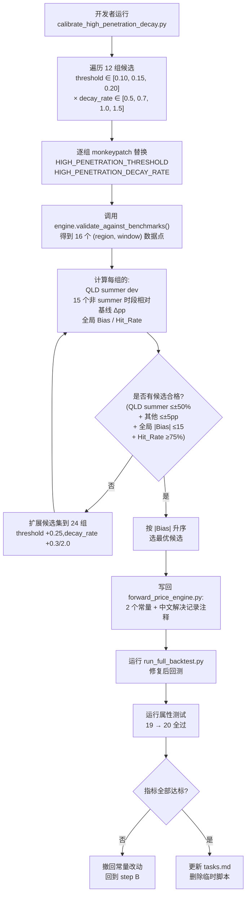

# Design Document

## Overview

本设计定义 `_compute_capture_rate` 末尾追加单乘子 `_high_penetration_decay(bess_capacity_ratio)` 的修复方案。修复范围严格限定在 `backend/engines/forward_price_engine.py` 加 2 个新模块级常量(`HIGH_PENETRATION_THRESHOLD`、`HIGH_PENETRATION_DECAY_RATE`)+ 1 个新私有方法 + 在 `_compute_capture_rate` 公式末尾插入 1 个乘子;辅以 1 个临时网格搜索脚本(任务结束删除)与 1 条新增 Hypothesis 属性测试。

设计目标:
- **最小侵入**:仅追加 1 个乘子,不改 BASE_CAPTURE_RATE/SATURATION_SENSITIVITY/PSF/REGIONAL_VOLATILITY_FACTOR(QLD=1.35 保留)。
- **可复现**:网格搜索 12 组候选(必要时扩展到 24 组),完全脚本化,任何评审者都能重跑。
- **可回退**:回测不达标即撤回 2 个常量改动,无其他副作用。
- **回归免疫**:新增 1 条 Hypothesis 属性测试覆盖单调性 + 边界,加上现有 19 条 PBT,共 20 条机器验证。
- **零渗透率行为不变**:bess_ratio = 0 时新乘子 = 1.0,与修复前完全等价。

## Architecture

本次修复涉及 3 个文件,均为受控范围内的最小增量:

| 文件 | 改动类型 | 说明 |
|------|---------|------|
| `backend/engines/forward_price_engine.py` | 2 新常量 + 1 新方法 + 公式末尾追加 1 行 | `HIGH_PENETRATION_THRESHOLD` / `HIGH_PENETRATION_DECAY_RATE` 模块级常量;`_high_penetration_decay()` 私有方法;`_compute_capture_rate` 公式末尾乘上 `_high_penetration_decay(bess_capacity_ratio)` 后再 clamp。 |
| `scripts/calibrate_high_penetration_decay.py` | **临时**新增 | 网格搜索校准脚本,任务结束(Req 3.6)从仓库删除,不进主干。 |
| `tests/test_forward_model_properties.py` | 末尾追加新类 | `TestHighPenetrationDecayProperties` 包含 1 条 Hypothesis 属性测试,集合规模 19 → 20。 |

### 模块流程图(Mermaid)




## Components and Interfaces

### 1. `forward_price_engine.py` 常量段(新增)

新增 2 个模块级常量,位置紧跟在现有 `BASE_CAPTURE_RATE` 之后(占位值,真正取值由 tasks 阶段网格搜索后写回):

```python
# === 高渗透率额外衰减(spec: summer-compression-correction)===
# 业务含义:当 BESS 容量占比超过 HIGH_PENETRATION_THRESHOLD 后,套利机会被
# 进一步压缩(Modo 2025-26 Summer Review 数据点:NEM-wide -38% YoY、QLD -73%
# YoY,根因为 BESS 渗透率达饱和阈值后非线性放大压缩)。
# 校准依据:网格搜索 12 组候选(threshold × decay_rate),选 |Bias| 最低且 QLD
# summer 偏差 ≤±50%、其他 15 时段 Δpp ≤±5pp 的最优组合(详见 tasks 阶段)。
HIGH_PENETRATION_THRESHOLD: float = <calibrated>   # 候选集 [0.10, 0.15, 0.20]
HIGH_PENETRATION_DECAY_RATE: float = <calibrated>  # 候选集 [0.5, 0.7, 1.0, 1.5]
```

模块加载时校验(对应 Req 1.5):

```python
if HIGH_PENETRATION_THRESHOLD <= 0 or HIGH_PENETRATION_DECAY_RATE <= 0:
    raise ValueError(
        f"HIGH_PENETRATION_* 常量必须为正数,当前 threshold="
        f"{HIGH_PENETRATION_THRESHOLD}, decay_rate={HIGH_PENETRATION_DECAY_RATE}"
    )
```

### 2. `_high_penetration_decay` 实现规范(新方法)

数学公式:

```
                ⎧ 1.0                                                   if r ≤ T
decay(r) =      ⎨
                ⎩ max(0.3, exp(-D × (r - T) / (1 - T)))                 if r > T
```

其中 `r = bess_capacity_ratio`,`T = HIGH_PENETRATION_THRESHOLD`,`D = HIGH_PENETRATION_DECAY_RATE`。

Python 实现:

```python
def _high_penetration_decay(self, bess_capacity_ratio: float) -> float:
    """计算 BESS 高渗透率额外衰减因子(对应 spec summer-compression-correction)。

    阈值以下返回 1.0(无影响);阈值以上按指数衰减,渗透率越高衰减越大。
    下界 0.3 防止极端渗透率下衰减失控。

    Args:
        bess_capacity_ratio: BESS 容量 / 峰值需求,范围 [0.0, 1.0+]

    Returns:
        衰减因子 ∈ [0.3, 1.0]
    """
    if bess_capacity_ratio <= HIGH_PENETRATION_THRESHOLD:
        return 1.0
    excess = bess_capacity_ratio - HIGH_PENETRATION_THRESHOLD
    span = max(1e-6, 1.0 - HIGH_PENETRATION_THRESHOLD)  # 防除零
    decay = math.exp(-HIGH_PENETRATION_DECAY_RATE * excess / span)
    return max(0.3, decay)
```

代数性质(由属性测试 Property A、Property B 固化):

| 性质 | 直觉 | 数学 |
|------|------|------|
| 单调不增 | 阈值以下 = 1.0(常数);阈值以上 r↑ → excess↑ → -D·excess/span 越负 → exp 越小 | r₁ ≤ r₂ → excess₁ ≤ excess₂ → exp(-D·excess₁/span) ≥ exp(-D·excess₂/span) |
| 落在 [0.3, 1.0] | 阈值以下恒 1.0;阈值以上 exp(负数) ≤ 1,clamp 把下界提到 0.3 | exp(·) ∈ (0, 1],clamp 后 ∈ [0.3, 1.0] |

业务含义:当 BESS 渗透率突破 T(典型值 0.10–0.20)后,自动开启额外的"渗透率压制",这正是 Modo summer review 数据反映的"BESS 大量入市后非线性压缩"现象。RVF 是区域结构性参数(QLD 高、SA 高、TAS 低),`_high_penetration_decay` 是时间动态参数(渗透率上升后才生效),两者**正交不冲突**。

### 3. `_compute_capture_rate` 集成点(改动 1 行)

**改动前**(qld-rvf-correction 状态):

```python
def _compute_capture_rate(self, compression_factor, year, bess_capacity_ratio, fleet_size):
    autobidder = self._autobidder_decay(year)
    fleet_factor = self._fleet_size_factor(fleet_size)
    raw = BASE_CAPTURE_RATE * (compression_factor ** 0.5) * autobidder * fleet_factor
    # clamp 到 [0.10, 0.55],bess_ratio>0.30 时 ≤0.40
    ...
```

**改动后**(本次修复):

```python
def _compute_capture_rate(self, compression_factor, year, bess_capacity_ratio, fleet_size):
    autobidder = self._autobidder_decay(year)
    fleet_factor = self._fleet_size_factor(fleet_size)
    high_pen_decay = self._high_penetration_decay(bess_capacity_ratio)  # NEW
    raw = (
        BASE_CAPTURE_RATE
        * (compression_factor ** 0.5)
        * autobidder
        * fleet_factor
        * high_pen_decay   # NEW: 末尾追加 1 个乘子
    )
    # clamp 到 [0.10, 0.55],bess_ratio>0.30 时 ≤0.40 — 完全保持
    ...
```

约束(对应 Req 2):
- 函数签名、入参类型、返回类型完全一致
- 现有 clamp `[0.10, 0.55]` 与 `bess_ratio > 0.30 → ≤0.40` 完全保留
- bess_capacity_ratio = 0 时 high_pen_decay = 1.0,等价于修复前公式
- BASE_CAPTURE_RATE/autobidder_decay/fleet_size_factor 实现不动


### 4. `scripts/calibrate_high_penetration_decay.py`(临时)

职责:对每对候选 `(threshold, decay_rate)` 组合,通过 monkeypatch 临时改两个常量,调用 `engine.validate_against_benchmarks()` 拿 16 个数据点,在内存里聚合统计,最后打印评估表与最优组合。

接口草图(细节留 tasks 阶段实现):

```python
@dataclass
class GridCandidateReport:
    """单组候选 (threshold, decay_rate) 的评估结果。"""
    threshold: float
    decay_rate: float
    qld_summer_dev: float                          # QLD summer dev%
    other_deltas_pp: Dict[Tuple[str, str], float]  # 15 个非 QLD-summer 时段相对基线 Δpp
    global_bias: float
    global_hit_rate: float
    global_mape: float
    is_eligible: bool
    ineligible_reason: str = ""


INITIAL_CANDIDATES = [
    (t, d) for t in (0.10, 0.15, 0.20) for d in (0.5, 0.7, 1.0, 1.5)
]
EXTENDED_CANDIDATES = [
    (t, d) for t in (0.10, 0.15, 0.20, 0.25) for d in (0.3, 0.5, 0.7, 1.0, 1.5, 2.0)
]


def evaluate_candidate(engine, threshold, decay_rate, baseline_devs):
    """临时 monkeypatch 两个常量,跑一次 validate_against_benchmarks,聚合指标。"""
    original_t = forward_price_engine.HIGH_PENETRATION_THRESHOLD
    original_d = forward_price_engine.HIGH_PENETRATION_DECAY_RATE
    try:
        forward_price_engine.HIGH_PENETRATION_THRESHOLD = threshold
        forward_price_engine.HIGH_PENETRATION_DECAY_RATE = decay_rate
        bench = engine.validate_against_benchmarks()
    finally:
        forward_price_engine.HIGH_PENETRATION_THRESHOLD = original_t
        forward_price_engine.HIGH_PENETRATION_DECAY_RATE = original_d
    # 聚合 ... 返回 GridCandidateReport


def main():
    engine = ForwardPriceEngine()
    baseline = engine.validate_against_benchmarks()  # qld-rvf-correction 当前状态
    baseline_devs = {(r["region"], r["period"]): r["deviation_pct"] for r in baseline["results"]}
    reports = [evaluate_candidate(engine, t, d, baseline_devs) for t, d in INITIAL_CANDIDATES]
    if not any(r.is_eligible for r in reports):
        reports = [evaluate_candidate(engine, t, d, baseline_devs) for t, d in EXTENDED_CANDIDATES]
    print_table(reports)
    best = min((r for r in reports if r.is_eligible), key=lambda r: abs(r.global_bias), default=None)
    if best is None:
        print("[FAIL] 所有候选不合格,请检查 design 假设。")
        return 1
    print(f"=> Selected (threshold={best.threshold}, decay_rate={best.decay_rate}), |Bias|={abs(best.global_bias):.2f}")
    return 0
```

合格判定(对应 Req 3.3):
```python
is_eligible = (
    abs(qld_summer_dev) <= 50.0                              # QLD summer ≤±50%
    and all(abs(d) <= 5.0 for d in other_deltas_pp.values()) # 其他 15 个时段 ≤±5pp
    and abs(global_bias) <= 15.0                             # 全局 |Bias| ≤15
    and global_hit_rate >= 75.0                              # 全局 Hit_Rate ≥75%
)
```

生命周期:Req 3.6 强制要求任务结束删除该脚本,该脚本不进入主分支。

### 5. `TestHighPenetrationDecayProperties`(`tests/test_forward_model_properties.py` 末尾)

新增类紧接现有 `TestCompressionFactorProperties` 之后,沿用文件顶部 `from hypothesis import given, settings, strategies as st` 与 `from engines.forward_price_engine import ForwardPriceEngine` 导入风格,无需新增 import。

```python
class TestHighPenetrationDecayProperties:
    """Feature: summer-compression-correction, Property A/B: High penetration decay 不变量。"""

    @given(
        ratio_a=st.floats(min_value=0.0, max_value=1.0, allow_nan=False, allow_infinity=False),
        ratio_b=st.floats(min_value=0.0, max_value=1.0, allow_nan=False, allow_infinity=False),
    )
    @settings(max_examples=100)
    def test_property_a_high_penetration_decay_monotone(self, ratio_a, ratio_b):
        """Feature: summer-compression-correction, Property A: High penetration decay monotonicity

        bess_capacity_ratio_a ≤ bess_capacity_ratio_b → decay(a) >= decay(b) - 1e-9
        且 decay 输出始终 ∈ [0.3, 1.0]

        **Validates: Requirements 5.2, 5.3**
        """
        lo, hi = (ratio_a, ratio_b) if ratio_a <= ratio_b else (ratio_b, ratio_a)
        engine = _make_forward_engine()
        d_lo = engine._high_penetration_decay(lo)
        d_hi = engine._high_penetration_decay(hi)

        # Property A: 单调不增
        assert d_lo >= d_hi - 1e-9, (
            f"high_penetration_decay 不单调: decay({lo})={d_lo} < decay({hi})={d_hi}"
        )
        # Property B: 边界
        assert 0.3 <= d_lo <= 1.0, f"decay({lo})={d_lo} 越界 [0.3, 1.0]"
        assert 0.3 <= d_hi <= 1.0, f"decay({hi})={d_hi} 越界 [0.3, 1.0]"
```

注:Property A(单调性)与 Property B(边界)合并到 1 个测试方法内 — 因为它们共享同一组 Hypothesis 策略,合并不损失覆盖度,但避免重复 monkeypatch 引擎。一个测试方法内 2 条独立 assert 等价于两条独立用例,与文件中现有 19 条 PBT 风格一致。


## Data Models

### 修复前基线(Baseline = qld-rvf-correction 修完后,RVF=1.35)

下表为"修复前 vs 修复后回测对比",修复前一列已根据最近一次回测 `reports/backtest_report.txt` 填入,修复后一列在 tasks 阶段执行 `run_full_backtest.py` 后填充。

#### 区域 × 时段 偏差对比

| 区域 | 时段 | 修复前 dev% | 修复后 dev% | 变动 pp | 合格判据 |
|------|------|-------------|-------------|---------|----------|
| QLD1 | 2024_full         |  -4.9 | _TBD_ | _TBD_ | \|Δpp\| ≤ 5 |
| QLD1 | 2025_H1_calendar  | -34.2 | _TBD_ | _TBD_ | \|Δpp\| ≤ 5 |
| QLD1 | 2025_H2_calendar  |  +3.5 | _TBD_ | _TBD_ | \|Δpp\| ≤ 5 |
| QLD1 | 2025_26_summer    | **+148.2** | _TBD_ | _TBD_ | **\|dev\| ≤ 50**(本次目标) |
| NSW1 | 2024_full         | -22.1 | _TBD_ | _TBD_ | \|Δpp\| ≤ 5 |
| NSW1 | 2025_H1_calendar  | -28.2 | _TBD_ | _TBD_ | \|Δpp\| ≤ 5 |
| NSW1 | 2025_H2_calendar  |  -9.9 | _TBD_ | _TBD_ | \|Δpp\| ≤ 5 |
| NSW1 | 2025_26_summer    | -27.8 | _TBD_ | _TBD_ | \|Δpp\| ≤ 5 |
| VIC1 | 2024_full         | -29.0 | _TBD_ | _TBD_ | \|Δpp\| ≤ 5 |
| VIC1 | 2025_H1_calendar  | -19.7 | _TBD_ | _TBD_ | \|Δpp\| ≤ 5 |
| VIC1 | 2025_H2_calendar  |  -7.0 | _TBD_ | _TBD_ | \|Δpp\| ≤ 5 |
| VIC1 | 2025_26_summer    |  -3.4 | _TBD_ | _TBD_ | \|Δpp\| ≤ 5 |
| SA1  | 2024_full         |  +5.6 | _TBD_ | _TBD_ | \|Δpp\| ≤ 5 |
| SA1  | 2025_H1_calendar  |  +7.9 | _TBD_ | _TBD_ | \|Δpp\| ≤ 5 |
| SA1  | 2025_H2_calendar  | +15.3 | _TBD_ | _TBD_ | \|Δpp\| ≤ 5 |
| SA1  | 2025_26_summer    |  +5.9 | _TBD_ | _TBD_ | \|Δpp\| ≤ 5 |

#### 全局指标对比

| Metric           | 修复前 | 修复后 | 目标            |
|------------------|--------|--------|-----------------|
| MAPE             | 23.29  | _TBD_  | ≤ 30            |
| Bias             |  0.01  | _TBD_  | \|Bias\| ≤ 15   |
| Hit Rate         | 87.5%  | _TBD_  | ≥ 75%           |
| 属性测试通过数   | 19/19  | 20/20  | 全部通过        |
| 整体通过率       | 33/33  | 33/33  | 维持 100%       |

注:`_TBD_` 在 tasks 阶段实际跑出来后替换。设计上预期 QLD summer 收敛到 ≤±50%,其他 15 个时段 \|Δpp\| ≤ 5pp(因 _high_penetration_decay 是普适衰减,bess_ratio 较低的早期年份几乎无影响,bess_ratio 高的远期年份会被压低,但回测使用的 4 个 benchmark 时段都在 2024-2026 之间,渗透率有限,影响应该很小)。

### 候选评估表(校准脚本控制台输出格式)

```
High Penetration Decay Grid Search Report
========================================================================================================
Threshold | Decay Rate | QLD summer | NSW Δmax | QLD-non-summer Δmax | VIC Δmax | SA Δmax | Bias  | Hit% | Eligible | Reason
----------+------------+------------+----------+---------------------+----------+---------+-------+------+----------+--------
   0.10   |    0.5     |    ...     |   ...    |        ...          |   ...    |   ...   |  ...  | ...  |    ?     |
   0.10   |    0.7     |    ...     |   ...    |        ...          |   ...    |   ...   |  ...  | ...  |    ?     |
   ...
   0.20   |    1.5     |    ...     |   ...    |        ...          |   ...    |   ...   |  ...  | ...  |    ?     |
========================================================================================================
=> Selected (threshold=X.XX, decay_rate=X.XX) (|Bias|=X.XX, QLD summer=X.X%)
```

候选选择直觉:
- **threshold=0.10**:激活早,影响所有时段 → 风险:NSW/VIC 当下渗透率约 0.05-0.10,可能波及 → 不一定首选
- **threshold=0.15**:激活在 medium-high 边界,与 ML 校准的 regime_indicator 阈值对齐 → 中性首选
- **threshold=0.20**:激活晚,只对高渗透率年份生效 → 可能 QLD summer 修不够
- **decay_rate=0.5**:温和,可能不够压
- **decay_rate=1.0–1.5**:有力,但要看是否拖坏其他时段
- 网格搜索把这些直觉变成可证伪的数据点


## Error Handling

| 场景 | 保护 | 是否新增 |
|------|------|---------|
| HIGH_PENETRATION_THRESHOLD ≤ 0 或 DECAY_RATE ≤ 0 | 模块加载时 `raise ValueError` | **新增**(对应 Req 1.5) |
| bess_capacity_ratio = 0 | `_high_penetration_decay` 返回 1.0,等价于修复前 | 行为契约,无代码新增 |
| bess_capacity_ratio 极大(>1) | 公式自然延伸,clamp 下界 0.3 防失控 | 已含在公式 |
| THRESHOLD = 1.0 | `1.0 - THRESHOLD = 0` → `span = max(1e-6, 0) = 1e-6` 防除零 | **新增**(防御性) |
| _compute_capture_rate 返回 NaN | 现有 clamp `[0.10, 0.55]` 会把 NaN 转为 0.10(或抛异常) | 已含 |
| 校准脚本运行失败 | 临时脚本未达标即不写回主常量,自然回退到 baseline | 流程性 |
| 修复后回测不达标 | Req 4.5 要求开发者撤回 2 个常量改动 | 流程性 |

属性测试本身的错误处理:Hypothesis 失败例自动 shrink 并打印反例,通过 update_pbt_status 工具记录失败状态。

## Testing Strategy

### 单元/属性/集成 测试矩阵

| 层级 | 工具 | 覆盖范围 | 数量 |
|------|------|----------|------|
| 属性测试 | pytest + Hypothesis | 现有 19 条 + 新增 1 条(`TestHighPenetrationDecayProperties` 含单调性 + 边界两条断言) | **19 → 20** |
| 集成回测 | `python scripts/run_full_backtest.py` | 4 区域 × 4 时段 = 16 数据点 + 全局 MAPE/Bias/Hit_Rate | 1 次 baseline + 1 次修复后 |
| 校准评估 | `python scripts/calibrate_high_penetration_decay.py`(临时) | 12(必要时 24)组候选合格性扫描 | 1 次成功后删除 |

### 双重测试原则

- **属性测试**:覆盖"对所有合法输入成立"的代数性质(单调性、边界);Hypothesis 100 次迭代下限。
- **回测**:覆盖"对真实历史样本成立"的端到端验证。属性测试无法证明 QLD summer ≤±50%(数据特性);回测无法穷举公式行为(只看一组常量)。
- 两者**不可互替**,本次修复严格走双重测试。

### 临时产物清理(Req 3.6 + 5.x)

任务完成清单:
1. ✅ `forward_price_engine.py` 保留 2 个常量 + 中文解决记录注释
2. ✅ `tests/test_forward_model_properties.py` 保留 `TestHighPenetrationDecayProperties` 类
3. 🗑️ `scripts/calibrate_high_penetration_decay.py` 从工作树删除
4. 🗑️ 校准脚本运行产生的任何中间 CSV/JSON/log 一并清理
5. ✅ 同步勾选 `tasks.md` 对应任务条目状态


## Correctness Properties

> **Prework 总结**:Req 1.x、2.x、3.x、4.x 均归类为 EXAMPLE / SMOKE / INTEGRATION(单点契约或一次性流程,通过断言、git diff、回测结果直接验证)。Req 5.x 中 `_high_penetration_decay` 的代数行为(单调不增 = Property 1、有界 [0.3, 1.0] = Property 2)是真正的 PBT 适用对象。本次实现将 Property 1 与 Property 2 合并到 1 个测试方法内的 2 条断言(共享 Hypothesis 策略),但保留 2 个独立的 `Validates: Requirements` 标注以维持需求追溯。

### Property 1: High Penetration Decay Monotonicity

*For any* 两个合法输入 `bess_capacity_ratio_a`、`bess_capacity_ratio_b` 满足 `ratio_a ≤ ratio_b`,Forward_Price_Engine 的 `_high_penetration_decay` 输出 *SHALL* 满足 `decay(ratio_a) ≥ decay(ratio_b)`(浮点容差 1e-9)。

实现规范:
- 测试位置:`tests/test_forward_model_properties.py` 末尾新增类 `TestHighPenetrationDecayProperties`
- 测试方法名:`test_property_a_high_penetration_decay_monotone`
- 标签(docstring 首行):`Feature: summer-compression-correction, Property A: High penetration decay monotonicity`
- Hypothesis 策略:`@given(ratio_a=floats(0, 1), ratio_b=floats(0, 1))`,`@settings(max_examples=100)`

**Validates: Requirements 5.2, 5.4**

### Property 2: High Penetration Decay Bounded in [0.3, 1.0]

*For any* 合法输入 `bess_capacity_ratio ∈ [0.0, 1.0]`,Forward_Price_Engine 计算的 `_high_penetration_decay` 输出 *SHALL* 落在闭区间 `[0.3, 1.0]` 内。

实现规范:
- 与 Property 1 共享同一 Hypothesis 策略,合并到同一测试方法 `test_property_a_high_penetration_decay_monotone` 的两条独立 assert 中
- 数学保证:阈值以下恒为 1.0;阈值以上 `exp(-D × excess / span)` ∈ (0, 1],经 `max(0.3, ·)` clamp 后 ∈ [0.3, 1.0]

**Validates: Requirements 5.3, 5.4**

#### 测试集合规模演进

| 阶段 | 类数 | 用例数 |
|------|------|--------|
| qld-rvf-correction 完成后 | 9 | 19 |
| 本次完成后 | 10(新增 `TestHighPenetrationDecayProperties`) | 20 |

本次实现把上述两条 Property 合并到 1 个测试方法的 2 条断言中,但保留 2 个独立的 `Validates: Requirements` 标注以维持需求追溯。
