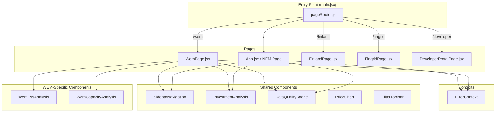
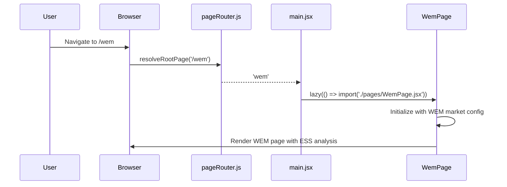
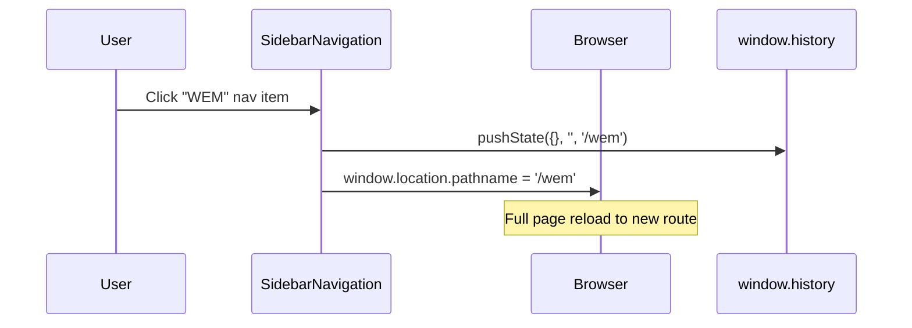

# Design Document: WEM Market Separation

## Overview

AEMO Intelligence 平台当前将 WEM（西澳电力市场）作为 NEM 的一个区域处理，但 WEM 和 NEM 是完全独立的市场，在结算间隔（30 分钟 vs 5 分钟）、辅助服务体系（ESS vs FCAS）、时区（AWST vs AEST）等方面存在根本差异。

本设计将 WEM 分离为独立的页面和路由（`/wem`），提供 WEM 专属的 ESS 分析组件，同时将侧边栏导航从 App.jsx 提取为共享组件，使 NEM 和 WEM 作为同级市场入口展示。共享分析组件（InvestmentAnalysis、DataQualityBadge 等）通过市场配置对象（market config）参数化，避免代码重复。

## Architecture



## Sequence Diagrams

### Page Navigation Flow



### Market Switch via Sidebar



## Components and Interfaces

### Component 1: pageRouter.js (Updated)

**Purpose**: 解析 URL 路径，返回页面标识符

```javascript
// web/src/lib/pageRouter.js
export function resolveRootPage(pathname = '/') {
  if (pathname.startsWith('/wem')) return 'wem';
  if (pathname.startsWith('/finland')) return 'finland';
  if (pathname.startsWith('/fingrid')) return 'fingrid';
  if (pathname.startsWith('/developer')) return 'developer';
  return 'aemo';
}
```

**Responsibilities**:
- 将 `/wem` 路径映射到 `wem` 页面标识
- 保持现有路由不变
- 支持 popstate 事件用于浏览器前进/后退

### Component 2: Market Config Object

**Purpose**: 定义市场特定参数，供共享组件使用

```javascript
// web/src/lib/marketConfig.js
export const MARKET_CONFIGS = {
  NEM: {
    id: 'NEM',
    label: '国家电力市场 (NEM)',
    regions: ['NSW1', 'QLD1', 'VIC1', 'SA1', 'TAS1'],
    settlementIntervalMinutes: 5,
    timezone: 'Australia/Sydney',
    timezoneLabel: 'AEST',
    currency: 'AUD',
    ancillaryServiceType: 'FCAS',
    ancillaryServices: [
      'raise1sec', 'raise6sec', 'raise60sec', 'raise5min', 'raisereg',
      'lower1sec', 'lower6sec', 'lower60sec', 'lower5min', 'lowerreg',
    ],
    defaultRegion: 'NSW1',
    path: '/',
  },
  WEM: {
    id: 'WEM',
    label: '西澳电力市场 (WEM)',
    regions: ['WEM'],
    settlementIntervalMinutes: 30,
    timezone: 'Australia/Perth',
    timezoneLabel: 'AWST',
    currency: 'AUD',
    ancillaryServiceType: 'ESS',
    ancillaryServices: [
      'regulation_raise', 'regulation_lower',
      'contingency_raise', 'contingency_lower',
      'rocof',
    ],
    defaultRegion: 'WEM',
    path: '/wem',
  },
};

export function getMarketConfig(marketId) {
  return MARKET_CONFIGS[marketId] || MARKET_CONFIGS.NEM;
}
```

**Responsibilities**:
- 提供市场特定的结算间隔、时区、区域列表
- 供 FilterContext 和共享组件读取
- 定义导航路径

### Component 3: SidebarNavigation (Extracted)

**Purpose**: 从 App.jsx 提取的共享侧边栏导航组件

```javascript
// web/src/components/SidebarNavigation.jsx
export default function SidebarNavigation({
  activePage,       // 'aemo' | 'wem' | 'finland' | 'fingrid' | 'developer'
  sectionLinks,     // [{id, label}] - page-specific section anchors
  activeSection,    // current scroll section id
  onSectionClick,   // (sectionId) => void
  lang,             // 'zh' | 'en'
}) { ... }
```

**Responsibilities**:
- 展示"澳洲市场"分组下的 NEM 和 WEM 同级入口
- 展示"其他入口"分组下的 Finland、Fingrid、Developer
- 高亮当前激活的市场/页面
- 展示页面内 section 导航链接
- 处理导航点击（使用 `window.location.href` 跨页面导航）

### Component 4: WemPage.jsx

**Purpose**: WEM 市场专属分析页面

```javascript
// web/src/pages/WemPage.jsx
export default function WemPage() {
  // Uses FilterContext with WEM market config
  // Renders: SidebarNavigation, PriceChart, WemEssAnalysis,
  //          WemCapacityAnalysis, InvestmentAnalysis
}
```

**Responsibilities**:
- 以 30 分钟间隔展示 RTP 价格数据
- 展示 ESS 分析（5 种服务类型）
- 展示容量市场分析
- 复用 InvestmentAnalysis 组件（传入 WEM 参数）
- 使用 AWST 时区标注时间
- 遵循 DESIGN.md 设计系统

### Component 5: WemEssAnalysis

**Purpose**: WEM ESS 辅助服务分析组件（替代 FcasAnalysis）

```javascript
// web/src/components/wem/WemEssAnalysis.jsx
export default function WemEssAnalysis({
  year,
  region,        // always 'WEM'
  lang,
  month,
  quarter,
  dayType,
  apiBase,
  t,             // translations
}) { ... }
```

**Responsibilities**:
- 展示 5 种 ESS 服务类型的价格趋势
- 展示各 ESS 类型的收入机会
- 展示约束绑定频率分析
- 使用 `/fcas-analysis?region=WEM` 后端 API（已支持 WEM ESS）
- 错误状态展示包含原因和建议操作

### Component 6: WemCapacityAnalysis

**Purpose**: WEM 容量市场分析组件

```javascript
// web/src/components/wem/WemCapacityAnalysis.jsx
export default function WemCapacityAnalysis({
  year,
  region,
  lang,
  apiBase,
  t,
}) { ... }
```

**Responsibilities**:
- 展示容量信用和容量价格数据
- 展示容量价格趋势图表
- 展示储能容量信用估算

## Data Models

### Market Config Type

```javascript
/**
 * @typedef {Object} MarketConfig
 * @property {string} id - Market identifier ('NEM' | 'WEM')
 * @property {string} label - Display label (Chinese + English)
 * @property {string[]} regions - Available regions
 * @property {number} settlementIntervalMinutes - Settlement interval
 * @property {string} timezone - IANA timezone
 * @property {string} timezoneLabel - Short timezone label
 * @property {string} currency - Currency code
 * @property {string} ancillaryServiceType - 'FCAS' | 'ESS'
 * @property {string[]} ancillaryServices - Service type keys
 * @property {string} defaultRegion - Default region selection
 * @property {string} path - URL path for this market
 */
```

### Navigation Item Type

```javascript
/**
 * @typedef {Object} NavItem
 * @property {string} id - Unique identifier
 * @property {string} label - Display label
 * @property {string} path - URL path
 * @property {string} group - Navigation group ('australia' | 'other')
 * @property {boolean} active - Whether currently active
 */
```

**Validation Rules**:
- `regions` must be non-empty array
- `settlementIntervalMinutes` must be positive integer
- `path` must start with '/'

## Error Handling

### Error Scenario 1: WEM ESS Data Load Failure

**Condition**: API 请求 `/fcas-analysis?region=WEM` 返回错误或超时
**Response**: 展示错误面板，包含错误原因描述和建议操作（检查后端服务、稍后重试）
**Recovery**: 用户可点击重试按钮重新加载数据

### Error Scenario 2: Invalid Route

**Condition**: 用户访问不存在的路径
**Response**: pageRouter 返回默认 'aemo' 页面标识，加载 NEM 页面
**Recovery**: 无需用户操作，自动降级到 NEM 页面

### Error Scenario 3: Browser History Navigation

**Condition**: 用户使用浏览器前进/后退按钮
**Response**: 页面完整重新加载到目标路由（SPA 内无 client-side routing）
**Recovery**: 自动处理，无需用户干预

## Testing Strategy

### Unit Testing Approach

- 测试 `resolveRootPage()` 对所有路径的正确映射
- 测试 `getMarketConfig()` 返回正确的市场配置
- 测试 NEM REGIONS 数组不包含 'WEM'
- 测试 SidebarNavigation 正确高亮激活项

### Property-Based Testing Approach

**Property Test Library**: fast-check (已在项目中使用 vitest)

- 路由解析的确定性：相同路径始终返回相同页面标识
- 市场配置完整性：所有市场配置包含必需字段
- 导航一致性：每个市场的 path 字段与 pageRouter 映射一致

### Integration Testing Approach

- 验证 WemPage 正确加载并渲染 ESS 分析
- 验证侧边栏导航在 NEM 和 WEM 页面间正确切换
- 验证 FilterContext 在 WEM 页面使用正确的市场参数

## Performance Considerations

- WemPage 使用 React.lazy() 按需加载，不影响 NEM 页面首屏性能
- WemEssAnalysis 和 WemCapacityAnalysis 使用 DeferredSection 延迟渲染
- 共享组件不因市场参数化而增加 bundle 大小
- 侧边栏提取为独立组件后可被 tree-shaking 优化

## Security Considerations

- 无新增认证/授权需求（公开数据展示）
- API 请求参数通过 URLSearchParams 构建，防止注入
- 无用户输入直接拼接到 URL 路径

## Dependencies

- 现有依赖：React 19, Vite 8, Tailwind CSS v4, Recharts, Framer Motion, Lucide React
- 无新增外部依赖
- 后端 API 已支持 WEM ESS 数据（`/fcas-analysis?region=WEM`）

## Correctness Properties

*A property is a characteristic or behavior that should hold true across all valid executions of a system — essentially, a formal statement about what the system should do. Properties serve as the bridge between human-readable specifications and machine-verifiable correctness guarantees.*

### Property 1: Route Resolution Determinism

*For any* valid URL pathname, `resolveRootPage(pathname)` SHALL always return the same page identifier, and `/wem` paths SHALL always resolve to `'wem'`.

**Validates: Requirements 1.1**

### Property 2: Market Config Completeness

*For any* market config returned by `getMarketConfig(marketId)`, the config object SHALL contain all required fields (id, regions, settlementIntervalMinutes, timezone, currency, ancillaryServiceType, path) with valid values.

**Validates: Requirements 6.3, 6.4**

### Property 3: NEM Region Exclusion

*For any* rendering of the NEM page region selector, the displayed regions SHALL be exactly `['NSW1', 'QLD1', 'VIC1', 'SA1', 'TAS1']` and SHALL NOT contain `'WEM'`.

**Validates: Requirements 2.1, 2.2**

### Property 4: Navigation Path Consistency

*For any* market config in `MARKET_CONFIGS`, the `path` field SHALL be correctly resolved by `resolveRootPage()` to return the corresponding market's page identifier.

**Validates: Requirements 1.1, 5.2, 5.3**

### Property 5: Sidebar Active State Consistency

*For any* page rendered with `SidebarNavigation`, exactly one navigation item SHALL be in the active/highlighted state, and it SHALL correspond to the current `activePage` prop.

**Validates: Requirements 5.4, 5.5**

### Property 6: WEM Settlement Interval Enforcement

*For any* API request made from WemPage for price data, the request SHALL include `interval_minutes=30` parameter, ensuring WEM's 30-minute settlement interval is respected.

**Validates: Requirements 4.1, 4.2**
